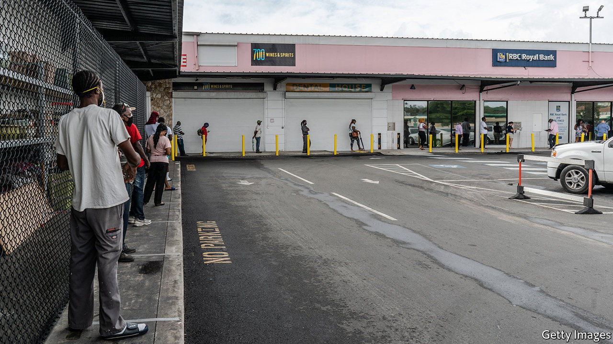

###### Banning bus crawls

# Small slips in Barbados cause a big spike in covid-19 

##### What happened when an island with few infections let its guard down 

 

> Jan 9th 2021 


BARRACUDA, BLUE MARLIN and red snapper were for sale before Christmas at Millie Ifill fish market, but only to those who observed pandemic protocol: “No Mask No Service”, said a large sign. Local discipline and tests on travellers kept covid-19 cases in Barbados to a trickle. After a lockdown, bars and boutiques were doing brisk business. Reservations at restaurants such as the Fish Pot at Little Good Harbour were becoming hard to get. Locals said the island was in its own little bubble.


The bubble has burst. On December 31st the government scuppered “Old Year’s Night” fireworks parties. A curfew extends from 9pm to 5am, to contain a surge in infections. Nearby St Vincent has declared Barbados a “high-risk country”.


Two things went wrong. First, cracks appeared in the controls on travellers. Passengers to Barbados must test negative for covid-19 before flying and remain in quarantine until their second negative test. As holiday traffic picked up, so did the numbers testing positive after arrival.


A few have broken the rules. On December 29th Zara Holland, a former Miss Great Britain who was also a contestant on “Love Island”, a reality-TV dating show, and her partner, Elliot Love, allegedly removed the red warning bracelets put on them after Mr Love tested positive. They were apprehended trying to board a flight to London. Ms Holland has apologised “to the entire country of Barbados”. She has been sentenced to pay a fine of B$12,000 ($6,000).


Second, the virus has spread locally. On December 26th several prison guards took part in a “bus crawl”. These are advertised with raunchy names such as “brandy &amp; punanny” (pussy), and involve open-sided buses and stops at bars and rum shops. The Boxing Day jolly seems to have been a super-spreader. At least 170 staff and inmates at Dodds Prison have contracted covid-19.


The opposition blames the government for failing to close the border to people from high-risk countries. Grenada and Jamaica stopped flights from Britain, because of its rampant new strain of the virus.


Barbados depends more on visitors from Britain than do most other islands. Its prime minister, Mia Mottley, has urged Barbadians to get “more serious”. Bus crawls are now banned. Tamper-proof bracelets are replacing cloth ones. Quarantine rules are tighter. Barbados has learned that bubbles and bus crawls don’t mix. ■


Editor’s note: Some of our covid-19 coverage is free for readers of The Economist Today, our daily . For more stories and our pandemic tracker, see our 

