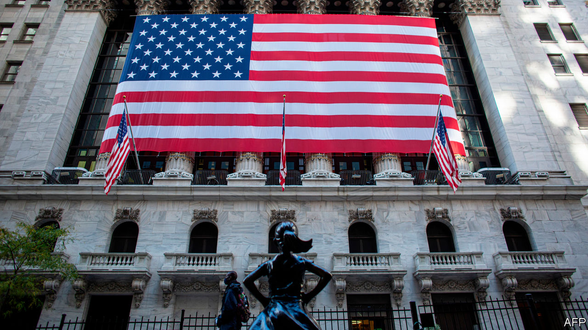
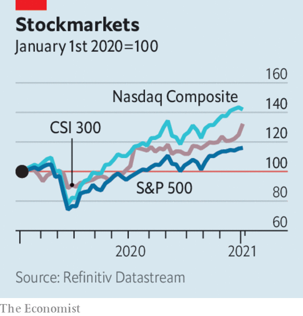

###### 

# Business this week 

#####  

 

> Jan 9th 2021 

 


American stockmarkets swiftly recovered from their drubbing on the first trading day of the year, their worst decline since October. Share indices had fallen amid the news about rapidly spreading virulent strains of covid-19, but investors soon shrugged off those concerns. The S&amp;P 500 gained 16% over the whole of last year, and the NASDAQ—bouyed by tech firms—44%. (The big losers were energy shares, which dropped by almost 40% in 2020.) China’s stockmarkets are also on a roll. The CSI300 index of shares listed in Shanghai and Shenzhen closed this week at its highest point since the global financial crisis in 2008. See .


The share prices of Alibaba and Tencent fell amid reports that the Trump administration is considering delisting the Chinese digital stars from American stockmarkets. Donald Trump has issued an executive order forbidding American investors from holding shares in companies with suspected links to the Chinese armed forces. Earlier the New York Stock Exchange got itself in a muddle about delisting three Chinese telecom companies, reversing its decision to remove them. It eventually said it would strike the three from the market, after receiving a stern lecture from the Treasury. See .


In the twilight of his presidency, Mr Trump signed an order banning Chinese payment apps, including Alipay, from operating in America because of alleged security risks. The justification was based in part on the Indian government’s ban of 200 Chinese apps, even though that proscription is widely seen as being driven by India’s retaliation against China in a diplomatic spat.


Britain’s Competition and Markets Authority asked interested third parties for their comments on Nvidia’s $40bn takeover of Arm, a chip designer based in Cambridge. The CMA is now responsible for complex antitrust cases involving British firms following the end of Britain’s transition period to leave the EU.

Back to black


Saudi Arabia said it would cut its oil output by an extra 1m barrels a day in February and March, a decision it took unilaterally to counteract Russia’s smaller increase in production. The Saudi’s surprise announcement came after the latest meeting between OPEC and Russia had agreed to keep output steady. Oil prices soared, pushing Brent crude to above $54 a barrel for the first time since March.


The World Bank estimated that the world economy will grow by 4% in 2021. It thinks China’s GDP will expand by 7.9% and America’s and the euro area’s by around 3.5%. The good news was tempered by the fact that by 2022, global GDP is still expected to be 4.4% below pre-pandemic projections. The report stressed that covid-19 vaccination programmes, including in poorer countries, are essential for the health of the global economy.


Announced three years ago to much fanfare about being a transformative moment for the health-care industry, Amazon, JPMorgan Chase and Berkshire Hathaway quietly shelved Haven, a joint venture they set up to lower staff health-care costs. Haven promised to pool technological solutions to provide cheaper insurance, but each company will now work on its own in-house projects instead.


Fiat Chrysler Automobiles and Groupe PSA, the owner of Peugeot, sealed their merger, more than a year after it was announced. The new company is called Stellantis and will list its shares in Milan, Paris and New York. Like its rivals, Fiat Chrysler recorded an acceleration of sales in America in the final months of 2020, which will be a bright spot in the forthcoming dismal annual earnings from carmakers. See .


Tesla also delivered more cars than had been expected towards the end of the year. It fell just shy of its half-million target for all of 2020, which is still up by a third on 2019.


British Airways obtained a £2bn ($2.7bn) loan underwritten by banks and backed by the British government’s export credit agency. Until it pays back the loan BA will not be allowed to pay dividends to International Airlines Group, its parent company.


Just when passengers need them most, emotional-support animals are to be banned on American Airlines, the first big carrier to follow a ruling that says the animals can be treated as pets and barred from the cabin (dogs for disabled people are an exception). Airlines are contending with a rising number of requests from customers to travel with their animals, which have included pigs, turtles, squirrels and peacocks. One former Google employee took her bunny in business class to Tokyo.

Rust never sleeps


Neil Young became the latest rock superstar to make a mint from selling the rights to his songs. Hipgnosis, a music-investment company, paid a reported $150m for a 50% stake in the Young catalogue.

