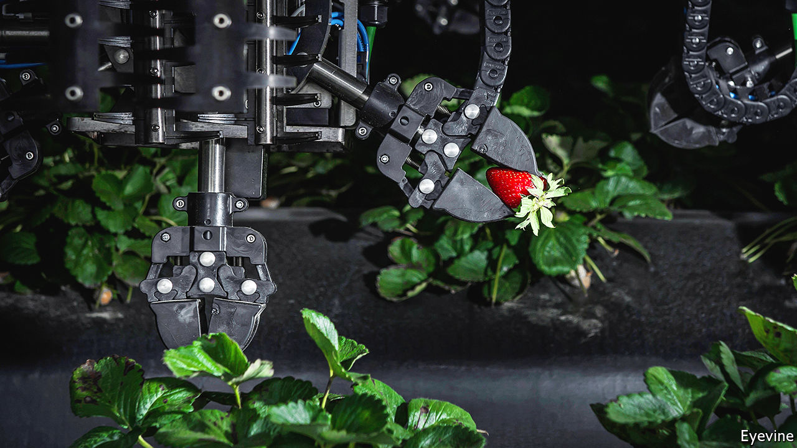
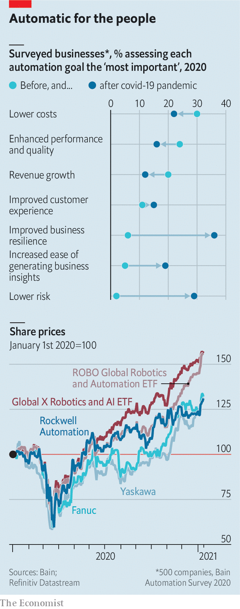
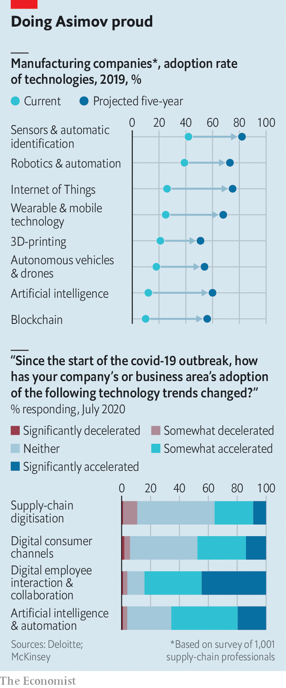

###### Bearing fruit

# After years of dithering companies are embracing automation 

##### The pandemic has ushered more robots into factories, warehouses and back offices. They are here to stay 

 

> Jan 16th 2021 


MARY BARRA, boss of GM, took to the virtual stage on January 12th to launch BrightDrop. The carmaker’s new logistics division will peddle such unsexy things as delivery vans and autonomous electric pallets for use in warehouses (see ). Hardly stuff to set pulses racing.


Suppress your yawn, for Ms Barra’s announcement is the latest sign of a quiet but powerful revolution. “The convergence of software and hardware seen in the carpeted parts of enterprises is now seen on factory floors in every industry we serve,” says Blake Moret, chief executive of Rockwell Automation, a giant of the industry. His firm runs a full-scale manufacturing facility at its Milwaukee headquarters, to prove that automation enables it to make competitive products despite America’s high labour costs. Its share price has risen by 28% in the past year, nearly twice as much as the S&amp;P 500 index of big American firms. Other purveyors have done even better.


Bosses have boasted of automating their operations for years without an awful lot to show for it. Covid-19 has spurred them to put their money where their mouths are. Hernan Saenz of Bain, a consultancy, reckons that between now and 2030 American firms will invest $10trn in automation. Nigel Vaz, chief executive of Publicis Sapient, a big digital consultancy, says that the downturn offers bosses the perfect cover. “The unrelenting pressure for short-term financial results from investors has temporarily been suspended,” he says. “Firms are not just going back pre-pandemic, but completely reimagining how they work,” says Susan Lund, co-author of a forthcoming report from the McKinsey Global Institute, a think-tank. A recent survey by the institute’s sister consultancy found that two-thirds of global firms are doubling down on automation.

Aye, robot


Robots are the most prominent winner. Robo Global, a research firm, predicts that by the end of 2021 the worldwide installed base of factory robots will exceed 3.2m units, double the level in 2015. The global market for industrial robotics is forecast to rise from $45bn in 2020 to $73bn in 2025.


“We have had a catbird seat during the pandemic,” says Michael Cicco, the head of the American operations of Fanuc, a Japanese robot-maker. With supply chains whacked, manufacturers were forced to find ways to build flexibility, he says. Companies reshoring production have sought to offset the high cost of human labour with the engineered sort. And robots are becoming much more capable. The most dexterous can now pick delicate objects such as individual strawberries.


Fanuc has seen a surge in demand for material-handling equipment and “collaborative robots”, designed to interact with people. These “cobots” are particularly useful in e-commerce, which covid-19 has given a huge boost. The pandemic has, on one informed estimate, led consumer-goods firms to increase buffer stocks by around 5%. To counter this, firms are snapping up robots for use in warehouses, made by companies like GreyOrange and Kiva (which Amazon acquired in 2012 to assist its e-commerce fulfilment).

 


Right now cobots help with social distancing. But, says Dwight Klappich of Gartner, a research firm, robots that move goods to workers will be a boon for post-pandemic productivity, too (as well as for the morale of humans, by sparing their weary feet). Luke Jensen of Britain’s Ocado, an online grocer and robotics pioneer, insists that his low-margin industry must find ways of fulfilling the recent surge in online orders with less labour. His firm already serves the bulk of its British customers from just three highly automated sites. Kroger, a big American grocer, is now expanding its roll-out of Ocado equipment both in warehouses and at its retail outlets.


A survey of supply-chain executives published on January 13th by Blue Yonder, another consultancy, found that the share of firms with fully automated fulfilment centres may rise by 50% within a year. And, as Sudarshan Seshadri of Blue Yonder puts it, “Automation is just the table stakes.” The pandemic’s bigger long-term impact may be a fuller embrace by firms of data their operations generate, and predictive algorithms to help guide real-time decisions.


Stuart Harris of America’s Emerson, a big automation firm, says that “pervasive sensing”—which combines AI and clever sensors—helped his company’s revenues from remote monitoring grow by 25% last year. Emerson’s clients range from a Singaporean chemicals factory to a Latin American mine. Peter Terwiesch of ABB, a big Swiss-Swedish industrial-technology firm, also reports a boom in remote-operations systems, from marine vessels to paper mills. His firm’s annual sales of such products have doubled to $400m from pre-pandemic levels. Drishti, an American startup, has come up with a way to apply artificial intelligence (AI) and computer vision to analyse busy video streams of workers on assembly lines. Marco Marinucci of Hella, a big German car-parts supplier, says his firm used Drishti’s kit to analyse and fix problems at a high-volume assembly line. This allowed its throughput to rise by 7% last year. Publicis Sapient automated the inventory forecasting of a division of a big European retailer which found itself repeatedly out of stock amid the change in consumption patterns during the pandemic. The consultancy’s software allowed its client to prevent shortages of its top 100 items 98% of the time.


It isn’t just production floors and warehouses that are being automated. So are back offices. By one estimate, America’s health-care system could save $150bn a year thanks to automation of paper-pushing. Allied Market Research, a firm of analysts, predicts that the global sales of process-automation products will balloon from $1.6bn in 2019 to nearly $20bn in 2027. In December UI Path, a trailblazing Romanian startup in the area, filed for an initial public offering. It may start with a market value of $20bn. On January 12th Workato, an American rival, said it has raised $110m in fresh funding.

 


Last year Alibaba, China’s biggest e-emporium, unveiled the results of a more ambitious project, code-named Xunxi (“fast rhino”). Alain Wu, who runs Xunxi, explains that this involved digitising and integrating whole value chains—from product design, parts procurement and manufacturing to logistics and after-sales service. This allowed merchants on Alibaba’s e-commerce platforms to fulfil customised orders within days while eliminating excess inventory. Time from production to delivery was reduced from several months to a fortnight.


Sceptics note that history is littered with examples of supposedly world-changing technologies that beguiled bosses, only to fail to live up to the promise. (Remember the blockchain?) Once covid-19 has been defeated, companies’ enthusiasm for new technologies may subside. Those that have missed the opportunity to automate—as many have because they were busy trying merely to survive the pandemic recession—will lose the cover that Mr Vaz speaks of.


Optimists counter that this time really may be different. In the past the biggest returns to automation accrued to giant, well-capitalised firms. Today advances in technology and business models allow smaller ones to enjoy similar benefits. That should increase demand for clever systems—and in time reduce their cost further. And so on, in a virtuous, fully automated circle.■

