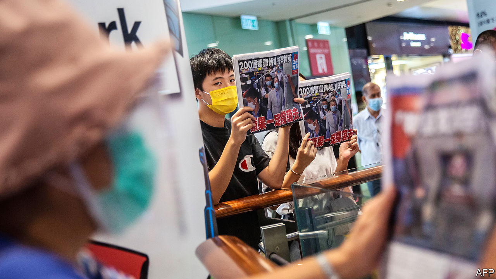

###### Masked defiance

# To show support for democracy, some Hong Kongers don yellow masks 

##### The colour carries risks 

 

> Jan 16th 2021 


ON THE STREETS of Hong Kong, few traces remain of the turmoil in 2019 when tear gas, rubber bullets and stand-offs between police and pro-democracy demonstrators were an ever-present hazard. Especially since June, when China imposed a draconian security law on the city, few people have dared to protest openly. Yet defiance is still visible. On the metro, in wet markets and in trendy cafés, some wear yellow masks.


Yellow is the colour of the city’s democracy movement: during the upheaval, protesters commonly wore yellow helmets or carried yellow umbrellas. Even before the security law was enacted, the pandemic and tighter policing had dampened enthusiasm for mass gatherings. But covid-19 has offered a new opportunity for showing discontent. The government made mask-wearing in public compulsory. Businesses began making and selling bright yellow ones.


Many of them are discreetly printed with the letters FDNOL. This stands for “Five demands, not one less”, which was a popular chant during the turmoil. “I wear yellow masks first and foremost to express my political stance, rather than to protect myself from covid-19,” says Ellen, a piano teacher in Hong Kong.


The yellow-mask industry is part of what is commonly called the “yellow economy”. This refers to businesses that are deemed supportive of the democracy cause. Some people deliberately choose such firms when eating out or shopping. “I like to support pharmacies that sell yellow masks, so if I walk past one, I’ll go in to buy some medicine, cosmetics or masks,” says one 50-year-old woman.


Some companies have banned their employees from wearing yellow masks at work. On January 11th a judge ordered three people wearing them to leave his courtroom. But Hong Kong’s chief justice, Andrew Cheung, defended those who sport yellow. “Hong Kong is a free society,” he said. “There should be absolutely nothing wrong…with wearing clothes or face masks of any colour.”


His words are unlikely to reassure yellow-mask suppliers. In November Yellow Factory, a big maker of them, closed after newspapers backed by the Communist Party accused the business of violating the security law. Yellow Factory’s masks were sold in boxes bearing the words “Get better soon Hong Kong, resist the pandemic of our times.” This echoed the slogan “Liberate Hong Kong, revolution of our times”, a rallying cry of protesters that the government now deems illegal. Many say yellow masks are becoming harder to find.

