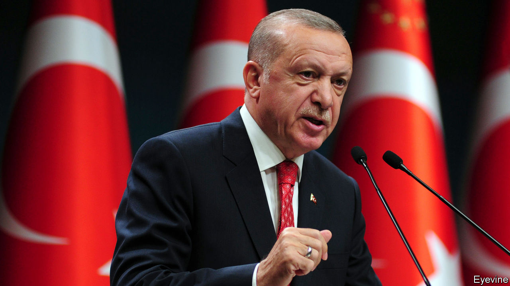

###### One man’s terrorist

# Covid-19 and repression in Turkey 

##### The president is silencing covid critics 

 

> Jan 16th 2021 


SEBNEM KORUR FINCANCI, a forensic physician, and many other doctors had long insisted there was something dodgy about Turkey’s covid-19 figures. Excess deaths across the country far surpassed officially reported deaths from the virus. Case numbers seemed suspiciously low. Vindication came at the end of November, when the government revealed it had stopped reporting asymptomatic infections months earlier. Once it resumed doing so, the case-count rocketed from about 7,000 to over 30,000 a day. (The numbers later dropped, after new lockdowns were imposed.) For her troubles Dr Fincanci, who turned 61 last year, was labelled a terrorist by none other than Turkey’s president, Recep Tayyip Erdogan. The head of the Nationalist Movement Party, the president’s coalition partner, called for the group she heads, the Turkish Medical Association, to be disbanded.


Mr Erdogan and his nationalist allies now have a convenient weapon against pesky doctors and other such subversives. Under a law passed by parliament on December 27th, the government will have the power to overhaul or shut down civil-society organisations, including local branches of foreign groups like Human Rights Watch or Amnesty International. The law allows the interior ministry to remove board members who face terrorism charges, freeze their assets, replace them with its own appointees and carry out inspections, all in the name of “combating terror financing”. In case that is not enough, the government can ask the courts to ban the organisations altogether.


Few countries have suffered as many terrorist attacks as Turkey in the past five years. But few governments have invented as many terrorists as Mr Erdogan’s. Tens of thousands of people, including Kurdish politicians, teachers, journalists and senior members of Amnesty have been arrested on spurious charges since an abortive coup in 2016. More than 600,000 have been placed under investigation for alleged links to a movement led by Fethullah Gulen, an exiled Islamist preacher, that spearheaded the coup. Hundreds of academics were sacked from their jobs and charged with spreading “terrorist propaganda” for signing a petition urging the government to suspend security operations against Kurdish insurgents in Turkey’s south-east. Most recently, Mr Erdogan has accused students at one of the country’s best-regarded universities of links to terrorist groups, after they had the nerve to protest against the president’s appointment of one of his loyalists as their rector. Police have detained at least 45 of the protesters. Some of them say they were beaten and threatened with rape while they were in custody.


Dr Fincanci, who has also faced terrorism charges over the Kurdish peace petition (she was sentenced to 30 months in prison, pending appeal, and has been forced to retire from academia), says the government needs the new law to continue ruling by fear and to act with impunity. “Civil-society groups are supposed to be a check on state power,” she says, speaking after a vigil for the roughly 300 Turkish doctors who have died of covid-19. “Now the state has become a check on civil society. The state is no longer accountable.”


The doctor seems undeterred, and continues to be a thorn in Mr Erdogan’s side. His government, she says, is still covering up the scale of the pandemic. According to the health ministry, the virus has killed just over 23,000 people in Turkey, including over 1,319 in the week ending on January 10th. She believes the true number may be at least twice as high. ■


Editor’s note: Some of our covid-19 coverage is free for readers of The Economist Today, our daily . For more stories and our pandemic tracker, see our 

