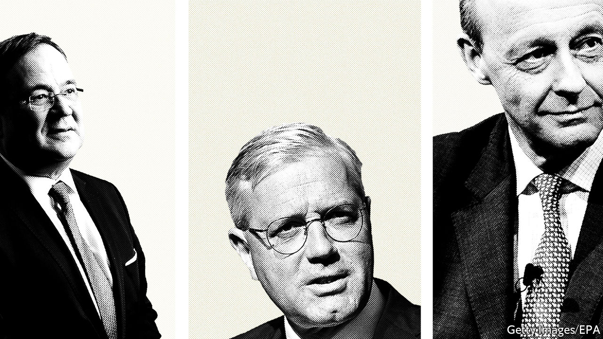
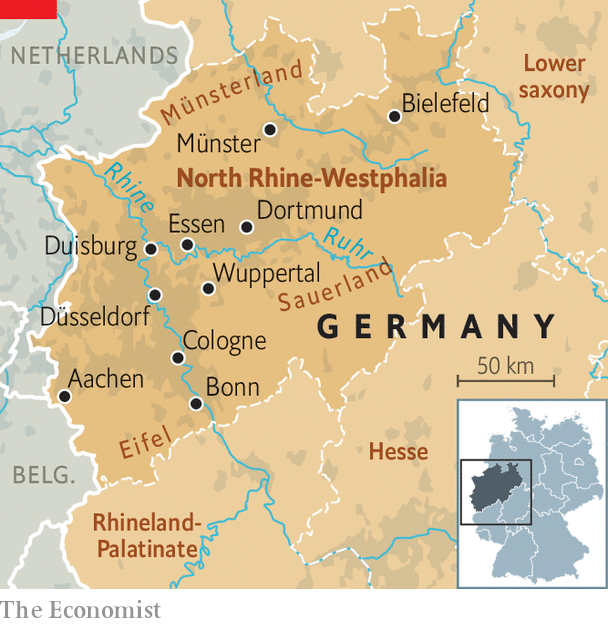

###### Three men in a Rhineland boat

# Germany’s next chancellor is likely to come from North Rhine-Westphalia 

##### The country’s biggest state is a microcosm of the country 

 

> Jan 14th 2021 


ON JANUARY 16TH 1,001 parliamentarians, party functionaries and small-town mayors will open their laptops, log into a virtual congress of Germany’s ruling centre-right Christian Democratic Union (CDU) and elect their party’s new leader. The winner will instantly become the favourite to succeed Angela Merkel as chancellor once she steps down after an election in September. Yet on the face of it the delegates do not have much of a choice. The three candidates—Armin Laschet, Norbert Röttgen and Friedrich Merz—are all Catholic trained lawyers aged between 55 and 65. Each has struggled to find a distinct message during an interminable campaign drawn out over almost a year by the pandemic. And all three come from the same state: North Rhine-Westphalia (NRW), the most populous of Germany’s 16 Länder.


NRW’s 18m inhabitants—over one-fifth of Germany’s total—would make it the seventh-largest country in the European Union. Its 34,000 square km (13,000 square miles) span the urbanised Rhine-Ruhr region, rural Münsterland, the mountainous Eifel and much more. Walloped by deindustrialisation, its rustbelt cities have reinvented themselves as hubs for retail, logistics and other services. Farther east, the small and medium-sized firms of the Mittelstand in Westphalia rival anything in Bavaria or Baden-Württemberg for technical specialisation and export prowess. The traditional gulf between carnivalesque Rhinelanders and dour Westphalians has been complicated by high immigration that has turned NRW into one of Germany’s most cosmopolitan states. “NRW is a miniature Germany,” says Dennis Radtke, a CDU member of the European Parliament from the Ruhr. “If you can run the state, you can run the country.”


For decades NRW was a stronghold of the Social Democrats (SPD), thanks in part to the large coal-and-steel workforce in Ruhr conurbations like Dortmund. But it has mattered at least as much to the CDU. It was partly in what was to become this multi-denominational state that its founding fathers agreed that post-war Germany needed a big-tent Christian Volkspartei (people’s party) that could overcome the class and religious differences that had bedevilled Weimar-era politics.

 


Early meetings in Cologne and Bad Godesburg, near Bonn, set the party’s path and determined its name. The “Düsseldorf guidelines”, laid out in 1949, shaped the principles of West Germany’s “social market” economy. This blend of market capitalism, social protection and labour rights underpinned the Wirtschaftswunder (economic miracle) that followed—largely under the leadership of the CDU’s Konrad Adenauer, a former mayor of Cologne elected in 1949 as the country’s first post-war chancellor, and of Ludwig Erhard, his finance minister and successor as chancellor.


In the 2000s the SPD’s grip loosened and NRW started to swing. State elections took on an outsized importance. A crushing loss in 2012 shattered the CDU’s morale; a narrow win in 2017 restored it. These results resonate today among the NRW delegates—almost a third of the total—tasked with choosing their party’s new leader. For it was Mr Röttgen who led the CDU to that 2012 defeat, an ignominy that poisoned his reputation among party colleagues in NRW and saw Mrs Merkel fire him from her cabinet as environment minister. “These are emotions you don’t forget quickly,” says Florian Braun, a CDU member of the NRW state parliament.


After that loss Mr Laschet, a moderate in the Merkel vein, slowly revived the demoralised party and led it to victory five years later, building a national reputation in the process. Today he leads a broadly successful coalition in NRW with the Free Democrats, a small liberal party. Soon after the CDU leadership was vacated last February Mr Laschet recruited to his campaign Jens Spahn, Germany’s popular health minister, yet another North Rhine-Westphalian. As for Mr Merz, he is from the Sauerland, a largely rural part of Westphalia, but has no history in state politics. The most conservative of the three candidates, he draws much of his support from states like Hesse and Baden-Württemberg.


All this helps explain why Mr Laschet ends the CDU campaign as the narrow favourite, ahead of Mr Merz. After a wobbly performance during the covid crisis he polls poorly with voters, but the delegates are a different bunch, often elected officials who want a leader they think will help them keep their jobs. His is a pragmatic conservatism, shaped by the needs of a complex state, focused on bread-and-butter concerns, and with an ear—too acute, say some—for the concerns of industry.


Mr Laschet’s backers praise his ability to build bridges and meld opposing points of view, while rivals acknowledge his skill in working across party lines. His jocular, modest Rhenish bearing contrasts with the silky erudition of Mr Röttgen or the flinty arrogance of Mr Merz. If it is hard to spot any fundamental beliefs in Mr Laschet beyond a staunchly Catholic pro-life attitude, that may be no great sin. After all, Mrs Merkel has run Germany successfully for 15 years and no one is quite sure what she stands for either. ■

