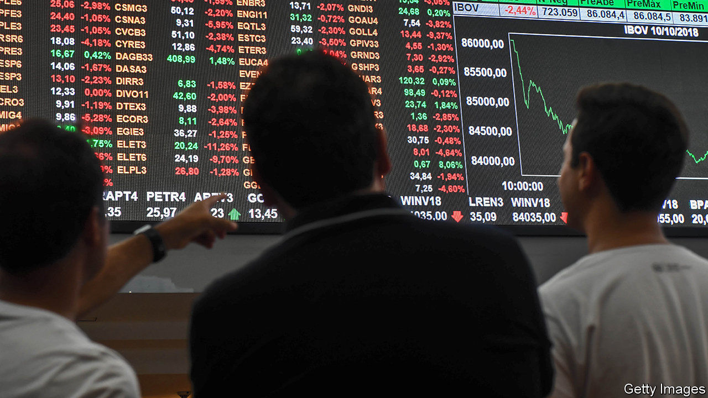

###### Joining the fray

# First-time investors are flooding Brazil’s stockmarket 

##### But fiscal uncertainty threatens the boom 

 

> Jan 16th 2021 


“MY PARENTS NEVER talked about investing,” says Arthur Lira, a university student from Olinda, a city in Brazil’s poor north-east. In March, after hearing on YouTube that it was a good time to buy stocks, he set up an account with an online brokerage and bought shares in airline companies with 400 reais ($75). Every month he puts a sliver of his scholarship into the Brazilian stockmarket, the B3. His shares have gained 30% on average.


Retail investors are diving into the stockmarket in Brazil, much as they are from America to South Korea. Since 2017 the number of retail investors in the B3 has quintupled to more than 3m, thanks to a dramatic fall in interest rates—the central bank’s policy rate has fallen from 14.25% in 2016 to 2%—and the rise of affordable brokerages, notably XP Investimentos. Fully 1.5m piled into the markets in 2020 alone.


Some investors were undoubtedly lured by the 28 initial public offerings (IPOs) during the year, more than in 2014-19 combined and the most since 2007. Individuals made up a fifth of the 25bn-real demand for shares in Petz, a pet-shop chain that listed in September. They have helped fuel a rally in the Ibovespa, Brazil’s main index, which has returned to its pre-pandemic levels.


Brazil used to be “addicted to high interest rates,” says Bruno Constantino of XP. People parked their savings in fixed-income accounts run by one of five banks that sold everything from bonds to dental insurance. Decent returns masked high fees. Lingering trauma from hyperinflation in the 1980s made many Brazilians risk-averse. “I thought stocks were for the rich,” says Umberto Dissenha, a 43-year-old computer programmer who worked for the B3 in his 30s but didn’t invest until 2017. Despite recent growth, less than 2% of Brazilian adults directly own stocks, compared with around 15% of Americans in 2019.


Domestic investors more broadly are playing a bigger role in the stockmarket. In 2007 most of the financing for listings came from foreigners seduced by “national champions” pumped with loans from the government of Luiz Inácio Lula da Silva. Brazilian investors may have been right to be wary: a recession in 2014-16 led to dozens of listed firms failing.


After Lula’s successor, Dilma Rousseff, was impeached in 2016 for breaking budget rules, the market-friendly administration of Michel Temer reined in spending. That lowered interest rates and restored confidence among Brazil’s financial institutions, which then invested more in the B3.


Retail participation has jumped to 15% of the B3’s total volume, from 10% in 2016. Like first-time investors elsewhere, Brazil’s novices tend to be younger (the average age is 32), poorer (investments average in the hundreds of reais) and more risk-tolerant (most invest directly, rather than in funds) than other punters. Their reliance on tips from social media has led to concerns. XP has faced criticism for its compensation model, which charges fees for each transaction and links brokers’ pay to sales.


The real threat to the retail craze is fiscal uncertainty, says Paulo Bilyk of Rio Bravo, an asset manager. A hint of that came in the second half of 2020. Generous stimulus, amounting to about 8.5% of GDP, has fuelled a better-than-expected recovery. But when in September Paulo Guedes, the economy minister, suggested funding new spending by postponing court-ordered payments to citizens—creative accounting of the kind that got Ms Rousseff into trouble—investors got jittery. The Ibovespa fell by 2.4% that day. A handful of firms have since cancelled listings.


Long-term interest rates are creeping up and the central bank has signalled that it may raise its policy rate. For now, though, an informal survey by The Economist of more than 60 Brazilians who bought their first stocks in the past two years found that most plan to keep investing. Mr Dissenha, the programmer, says his earnings helped him afford a house and spend time with his infant daughter. He opened accounts for his wife, her mother and her sister. “I could do this as a job,” he says, half-joking. ■

