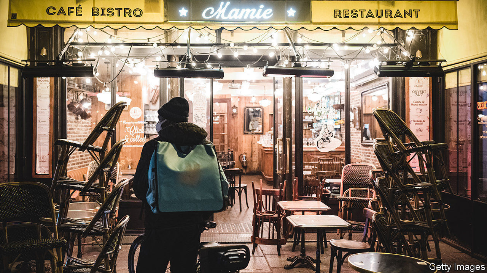
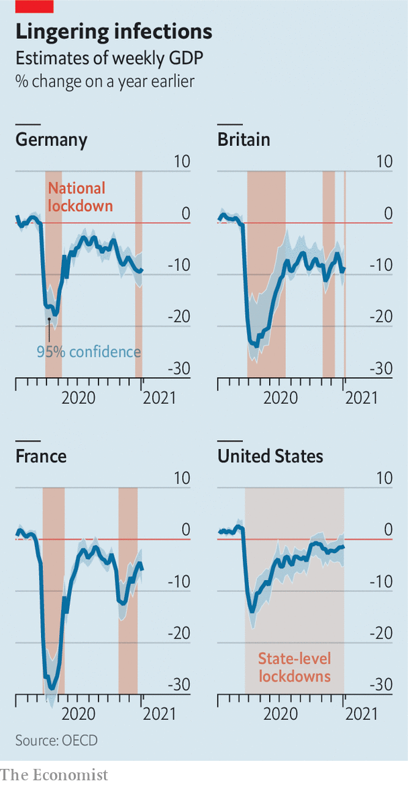

###### Relapse and recovery

# What is the economic impact of the latest round of lockdowns? 

##### The rich world has become better at mitigating their economic cost 

 

> Jan 13th 2021 


THE LOCKDOWNS of the spring, which at their peak covered more than half of the world’s population, provoked an almighty downturn. In April global economic output was 20% below where it would have been otherwise. As cases of coronavirus have soared again, rich countries are imposing another round of lockdowns. France was in confinement in November, Italy locked down over Christmas, and England went into a national lockdown on January 6th. Parts of Japan have entered a state of emergency. The situation in America, where state and local authorities, not the federal government, are mainly responsible for stay-at-home orders, is more complicated. But one measure of lockdown stringency suggests that restrictions there are about as tight now as they were in the spring.


The latest round of lockdowns will hit the economy again—but, perhaps, not as hard. Analysts at Goldman Sachs, a bank, have argued that in Britain’s case “the sensitivity of economic activity to covid-19 restrictions has diminished significantly since the first lockdown.” In research published on January 8th HSBC, another bank, noted that German industrial output “extended its recovery in November, undeterred by the renewed lockdown”. America’s jobs report for December, released on the same day, showed that employment fell for the first time since April—a depressing result when millions of people are still out of work. Yet other high-frequency economic indicators, such as those for consumer spending, are in better shape than they were in the spring.


It will be some time before official GDP figures confirm the rich world’s growing resilience to lockdowns. But in a recent paper Nicolas Woloszko of the OECD, a rich-country think-tank, uses Google-search data to construct a weekly estimate of GDP for large economies. In April they were operating at about 80% capacity. Now they are running at over 90% (see chart). Three main factors explain the improvement: less public fear; better calibrated government policy; and adaptation by businesses.

 


Take fear first. In March and April the coronavirus was an unknown quantity, and many people responded by barricading themselves inside their houses. Analysis of a survey by YouGov suggests that in April more than 60% of respondents in rich countries were worried about catching the virus. Yet a better understanding of what they can do to avoid falling ill, and perhaps lockdown fatigue, mean that people may now be willing to go out and about more.


The share of people expressing concern about catching covid-19 fell to around 50% in November. Data from Google suggest that in many countries, people are moving around in public spaces more than they were at the start of the pandemic. That has led some public-health authorities to tear their hair out. The “current lockdown has not had nearly as much impact on mobility (and likely contacts) as...in March,” reads a presentation from scientists in Ontario in December. British and American newspapers mention the words “illegal rave” five times as frequently as in the spring.


The greater willingness to defy government orders probably worsens the spread of the virus, whatever its economic benefits. But the second factor that explains the resilience of economies this time round, the calibration of government policy, presents less of a trade-off. Officials have worked out what lockdown measures come at the least economic cost—so there is now less appetite for, say, closing schools than in the spring, but more appetite for mask-wearing directives and the testing of international arrivals, neither of which impose much hassle on anyone. Many have followed the example of Germany, where many construction sites were allowed to stay open during the first wave. France has kept manufacturing going; output in the sector barely shrank in November and grew in December.


The third reason for resilience relates to adaptation by businesses. The sudden shift to remote working was a shock for many of those who usually labour in an office, stuck as they were with old computers and not much else. Companies have since invested in making themselves more productive even under lockdown (see ). From March to October Britain imported £4.7bn-worth ($6bn) of laptops, 20% more than in the same period in 2019. A recent paper by Nick Bloom of Stanford University and colleagues analyses American patent filings and finds that the pandemic has “shifted the direction of innovation towards new technologies that support video conferencing, telecommuting [and] remote interactivity”.


Consumer-facing businesses have done even more to cope. New York’s best jazz clubs now offer live-streams direct to living rooms. While staying on a farm in eastern England your correspondent bought a meal from Gujarati Rasoi, an Indian food stall 92 miles away in London, which like many restaurants has started to offer nationwide delivery. In Britain the share of firms open for business was no lower at the end of last year than it was in the summer, when restrictions were far looser, according to official data. That is not the case for small businesses in America, but a larger share remains open than last spring.


This resilience of the economy in the face of the latest wave of lockdowns has several implications. When the virus first began to spread, governments were intent on freezing the economy in place. But over time it has become clear that activity has adapted to the shock of the pandemic. This means that governments should have to do less by way of fiscal support—which, indeed, is precisely their plan in 2021.


Moreover, as fewer resources are left unused during this latest round of lockdowns, it should inflict fewer scars. That could allow production to ramp up more quickly once restrictions are lifted. Analysts at Morgan Stanley, a bank, expect American GDP to return to its pre-pandemic trend by the end of this year. Plenty could still thwart that forecast. Whatever happens, though, the economy that went into the pandemic will look very different from the one that leaves it behind. ■


Editor’s note: Some of our covid-19 coverage is free for readers of The Economist Today, our daily . For more stories and our pandemic tracker, see our 

