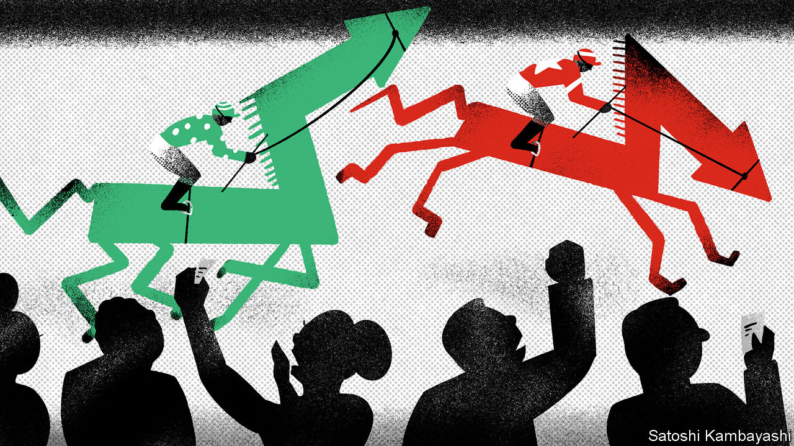
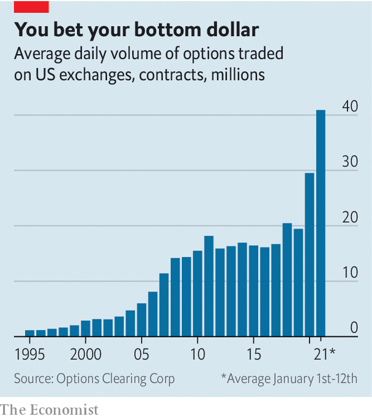

###### Bucket list

# Why everyone is now an options trader 

##### On average last year almost 30m equity options changed hands each day 

 

> Jan 16th 2021 


IN THE BUCKET shops of early 20th-century America, ordinary punters could bet on the direction of share prices with a tiny down-payment. The punters liked this, because it gave them a lot of notional exposure for a minuscule outlay. The bucket shops on the other side of the wagers loved it, too, because hour-to-hour fluctations in the price meant punters often got wiped out. No stock certificates ever changed hands. This was betting, pure and simple.


This brings us to the rapid growth of the present-day options market. On average last year almost 30m equity options were traded each day on American exchanges, a rise of more than 50% from 2019, according to OCC, the world’s largest clearer of such derivatives. In recent weeks, the volume has regularly risen above 40m a day (see chart).


It is customary in polite society to discuss options in the language of insurance. The price of an option is known as a premium, for instance. And the need for insurance is one rationale for the growth in options. But impolite society, the natural habitat of Buttonwood, has a big say, too. Much of the surge in demand for options comes from small investors seeking long-odds bets on single stocks. The bucket-shop punter is back.

 


To understand the connection, start with the idea that options are rights that carry no obligation. A financial option is the right to buy or sell an asset—a basket of stocks, say—at a specified price (the strike price) on or before a specified maturity date. Call options are rights to buy; they are profitable to own if the price of the underlying asset rises above the strike price. Put options are rights to sell; they pay off when the price of the underlying asset falls. The owner is not obliged to exercise the option; she will do so only when the option is “in the money”: ie, when the strike price is breached.


The key influences on premiums are the gap between the asset’s strike price and its current price, time and expected volatility. A small gap is more likely to be closed than a large one, so options with strike prices close to prevailing prices cost more. Options with a strike price some distance from the actual price are said to be “out of the money” and are cheaper. Similarly, options with a more distant maturity are more expensive than near-dated options. The key variable, though, is volatility. The more violently the price of the underlying asset fluctuates, the more chance there is that an out-of-the-money option will move into the money. When you own options, volatility is your friend.


The range of options you can trade on a stock is a function of investor demand, says Hugh Selby-Smith of Talaria Capital, a Melbourne-based asset manager. If you want an option on, say, a Mexican retailer, you may have to ask an exchange to list an option series for you. But a high-profile stock, such as Tesla or Apple, will have 57 varieties of contract already listed. Tesla calls expiring on Friday January 15th were available this week at $5 intervals. The positions are staggering. There were some 27,000 contracts with a strike price of $1,000, for instance. (Tesla’s share price was around $860 on January 13th.) This kind of call option—deeply out-of-the-money and close to expiry—is favoured by the new cohort of retail investors that has rapidly emerged in America and elsewhere (see ). It has the features of a long-odds sports bet. For a small outlay a call option can pay off handsomely if the stock price suddenly surges. If not, the option expires, worthless, like many a bucket-shop bet.


There are two sides to a market, of course. The specialist traders and hedge funds on the other side of these trades are content to take the premiums from options buyers and to manage the risks of occasional big losses should the punters’ bets pay off. One hedge for a call option is simply to own the stock, which is why long-only equity funds are increasingly being drawn into the market to juice up their returns. “A lot depends on your book,” says a seasoned options trader. If you’ve taken in a lot of put-option premiums, you might write some call options to even things out. Or you could balance the risk from an expensive-looking option—with, say, a round-number strike price of the kind favoured by retail investors—using a cheaper-looking option with a nearby strike price.


This new wave of options trading seems unlikely to recede. Technology has made access to financial markets ever easier for small investors. Equity options are like bucket-shop bets. Institutional investors are increasingly being drawn in to act as bookmakers. One way or another, everybody is an options trader now.

