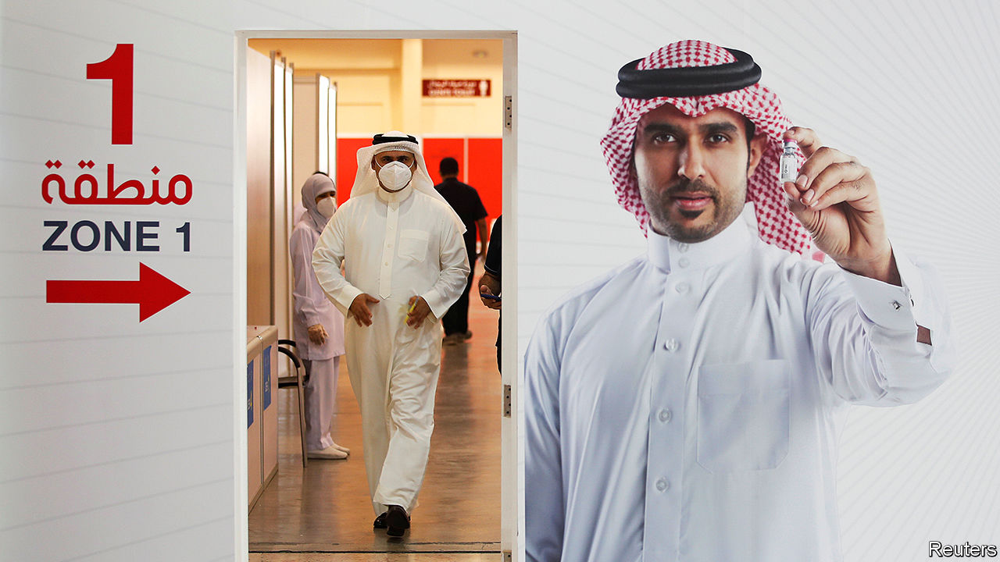
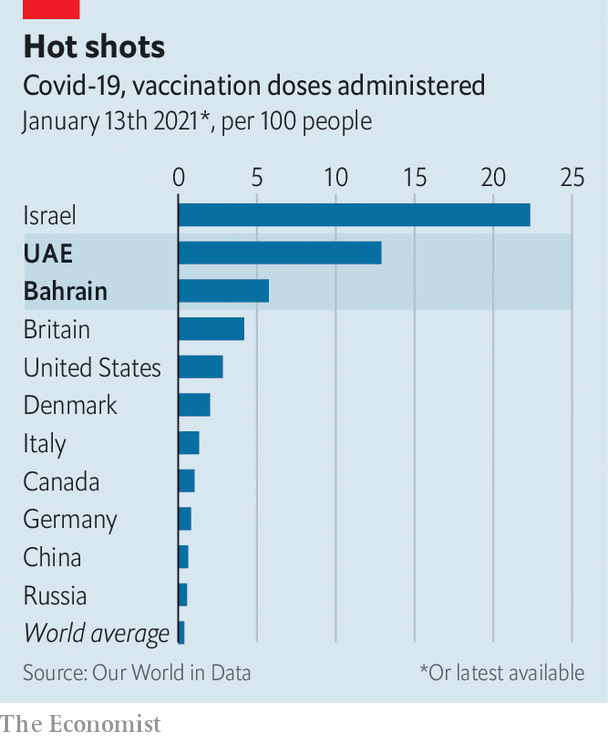

###### Take the Chinese jab

# Bahrain and the UAE are relying on a Chinese-made vaccine 

##### They are hoping for both political and public-health benefits 

 

> Jan 13th 2021 


ASIDE FROM the ubiquitous masks, visitors to Dubai would be hard-pressed to know there was a pandemic raging. Bars and malls are busy. Hotels that were four-fifths empty last spring hit 70% occupancy in December. Tourists have flocked to Dubai to escape lockdowns at home. A recent spike in daily infections—they have more than doubled since November—has not dented the sense of normality. By spring that perception may be a reality: Dubai seems well on its way to widespread covid-19 immunity.


The United Arab Emirates (UAE), of which Dubai is part, ranks second in the world in vaccinations per head. By January 13th it had administered almost 13 doses for every 100 residents, behind only Israel (see chart). Since the vaccines require two doses, the number of people fully inoculated is lower. Still, the UAE aims to inoculate half the population by April. Bahrain, another Gulf country, ranks third, with almost six doses per 100 residents. Even that is double the rate in America.


There are obvious reasons for their early success. Both are small countries: Bahrain has fewer than 2m residents, the UAE fewer than 10m. Centralised, well-staffed health-care systems have coped well during the pandemic. Residents of both countries can register for a jab by app. Many Western states have detailed rules that set a pecking order for vaccinations, which can slow distribution; Bahrain and the UAE offer them to all-comers. “We have enough available for everyone,” says Dr Waleed Khalifa al-Manea of Bahrain’s health ministry.

 


Perhaps the biggest difference is that Bahrain and the UAE rely on a vaccine made by Sinopharm, a state-backed Chinese firm. Early on they adopted a product that elsewhere has met scepticism. The move has speeded up their push for herd immunity. It will also pay political dividends, deepening ties with China and positioning the UAE, a regional power, for an ambitious sort of vaccine diplomacy.


Known as BBIBP-CorV, the vaccine is one of two developed by Sinopharm. China broke with protocol last summer by offering its citizens the experimental jab, unlike Western vaccine-makers, which waited for trials to show their products were safe and effective. Many countries have been reluctant to approve BBIBP-CorV because it lacks reliable trial data.


Despite an inauspicious beginning, it is gaining credibility—largely thanks to Gulf countries. The UAE began late-stage trials in July with 31,000 volunteers. Bahrain started its own trial in August. Both authorised it in December after declaring it 86% effective. Yet they have not published data to support their findings; officials in the Gulf say it is Sinopharm’s decision. “We’re part of this study, but we don’t actually have the right to disclose this type of information,” says Dr al-Manea.


It seems unlikely that Sinopharm will submit its vaccine to a stringent national regulator. Instead it is being scrutinised by the World Health Organisation (WHO), which could grant it emergency authorisation by March. Some countries remain sceptical: in the Philippines, for example, there are reports of reluctance to take the vaccine. Scientists in Brazil announced on January 12th that another Chinese vaccine, manufactured by Sinovac, was only 50% effective, far below the 78% initially reported. The data, the first from late-stage trials, had been delayed for weeks.


There are few reservations in the Gulf about BBIBP-CorV. Partly this is due to public trust in governments with a reputation for being well-run. Scores of Emirati officials, among them the health minister and the ruler of Dubai, have posted photos of themselves receiving the vaccine. Both countries have fared well during the pandemic. The UAE has logged 723 deaths from covid-19, and Bahrain 356, which (as a share of population) ranks them well below countries both in the West and in the Arab world. Testing is widespread and fast.


It helps to be a police state with little tolerance for dissent. The Emirati government has condemned “rumours” about vaccines and warns of punishment for spreading them. Local newspapers carry stories about happy residents queuing up for jabs; there are rather fewer articles asking questions about vaccine-trial data.


Bahrain and the UAE are also offering the Pfizer-BioNTech vaccine, which has won approval from Western regulators. But they have much less of it. In Dubai it is available only to the old and to key workers (the rest of the population should be eligible by April). Still, that could assuage any concerns from expats. Some residents, though, say they prefer the Sinopharm jab because it is based on an inactivated strain of the SARS-CoV-2 virus, a long-established way of making vaccines, rather than the new mRNA technology used by Pfizer and other Western manufacturers.


Abu Dhabi, the UAE’s capital, aims to be a hub for distributing vaccines across the region. It has opened a big new storage facility and is in partnership with SkyCell, a Swiss firm, to produce refrigerated shipping containers that can keep doses cold in transit. Dubai’s Emirates airline is working with Pfizer to distribute that company’s vaccine. The UAE is also conducting trials for Russia’s Sputnik V jab, which so far has little to recommend it beyond President Vladimir Putin’s endorsement.


But the UAE’s closest relationship is with China. Later this year it will move from administering Sinopharm’s vaccine to manufacturing it. That has fuelled talk of vaccine diplomacy in a region where access to inoculations will be uneven. Egypt needs enough jabs for its 100m people, twice the population of the entire Gulf. Lebanon, which is in effect bankrupt, expects to receive just 60,000 doses of vaccine from Pfizer next month. A surplus of Sinopharm doses in the UAE could lead to its adoption widely across the Middle East (in December the government donated 100,000 doses to Egypt).


That would please China, a desirable outcome for the Emiratis. Long a Western partner, they have sought in recent years to diversify their relationships, particularly with China. State-run telecoms firms in the Emirates have awarded 5G contracts to Huawei, which is blacklisted by America. Military ties are growing as well, with the UAE fielding Chinese-made attack drones in Libya. The UAE’s embrace of Sinopharm will bring them closer still: in this relationship there is no social distancing. ■


Editor’s note: Some of our covid-19 coverage is free for readers of The Economist Today, our daily . For more stories and our pandemic tracker, see our .

