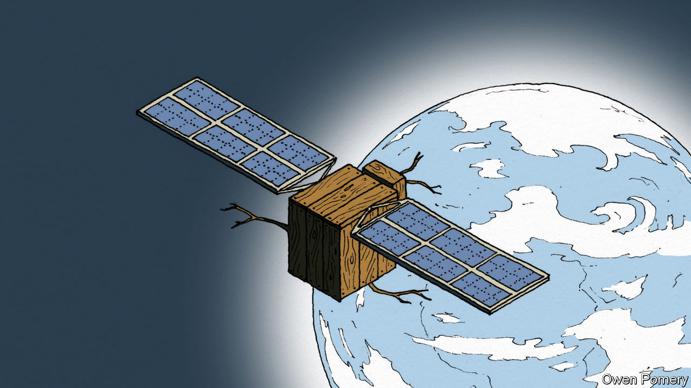

###### Space flight

# A Japanese forestry firm wants to put wooden satellites into orbit 

##### In space, wood has advantages over artificial materials 

 

> Jan 13th 2021 


THE SPACE age was built on clever materials. The business ends of rocket engines are composed of Inconel, a family of heat-and-corrosion-resistant nickel-chromium alloys developed in the 1940s. The “gold foil” adorning many satellites is, in fact, a form of insulation made from layers of Kapton and metallised Mylar, a pair of artificial polymers from the 1950s and 1960s. SpaceX’s Dragon spacecraft use a heat shield made of phenolic-impregnated carbon to protect astronauts during atmospheric re-entry.


But it is not just humans in lab coats who can come up with whizzy substances. Sumitomo Forestry, a Japanese firm, and Kyoto University are pondering the idea of building satellites out of an advanced, high-performance composite made from cellulose and lignin, a pair of complex polymers which are strong in tension and compression respectively. This material is both cheap and abundant. It is self-assembling and requires only simple chemical inputs. Manufacture can be entirely automated, requiring no human oversight. Translated from chemist-speak, they want to make satellites out of wood.


The research team argue that wood offers two advantages. Unlike metal, seasoned timber is easily penetrated by radio waves. That means communication antennas, sensors and the like could be kept inside the body of the satellite. This, they hope, will simplify construction. The second advantage is that, on atmospheric re-entry, the wooden parts of the satellite should burn up entirely, making disposal cleaner.


The researchers hope to launch a prototype version of what they have dubbed a LignoSat by 2023. Space is both extremely cold and very hot, and can switch quickly between the two as a spacecraft moves from shade into direct sunlight. Processing wood to cope with such extremes will be crucial to success. Sumitomo has said merely that its way of doing this is an “R&amp;D secret”.


Sending wood into space is not Sumitomo’s only ambition for the material. It hopes that lessons from the satellite project might assist its plan to build the world’s tallest wooden skyscraper, in Tokyo. This building, dubbed W350, would celebrate the firm’s 350th birthday in 2041, and would, therefore, be 350 metres tall—roughly as high as the Empire State Building without its spire.

