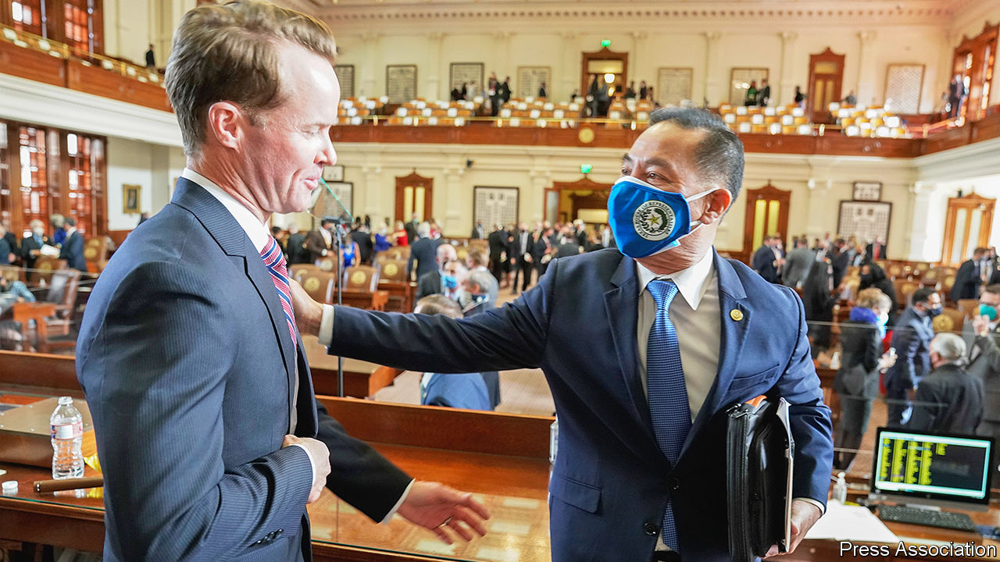

###### Stars and gripes

# What to expect from Texas legislature’s new session 

##### It must deal with challenges that are as large and diverse as the state 

 

> Jan 16th 2021 


WHEN THE Texas legislature convened on January 12th, the state House opened its first session with prayer, the pledge of allegiance to the American flag, and the pledge of allegiance to the Lone Star flag. The 140-day session, which takes place every other year, will be filled with plenty more prayers and promises. Texas, like other states, is grappling with the human and economic toll of the pandemic, but also faces challenges of its own.


The stark economy will rule out new, ambitious proposals. On January 11th the state comptroller estimated that Texas faces a $1bn shortfall, stemming from falling sales-tax revenue and its ailing oil-and-gas industry, which has contributed to a higher unemployment rate in the state than in the nation. However, the $1bn hole is five times smaller than predicted over the summer. Quick cuts to state agencies and tax collections from online sales have helped, but the biggest saviour has proved to be Washington, DC. Already Texas and its local governments have received $13bn through the CARES Act, and more state aid is likely with Democrats controlling the Senate. Texan leaders like Governor Greg Abbott, who made a habit of railing against the Obama administration, may find it wise to be less hostile this time round.


The state’s troubles can be put into three buckets: those that legislators will take up and are essential priorities, those they will not address but should, and those they will address but shouldn’t. The main priority is public education. In 2019 the legislature passed a popular public-education bill, committing $6.5bn to education. It also passed a $5.1bn to lower property taxes, which are often used to pay for schools.


The newly elected speaker of the Texas House, Dade Phelan, insists that public education will not be given short shrift. That is good news. Measures such as more funding for full-day pre-kindergarten, incentivising teachers to work in poorer schools, and extending the school year, are even more necessary than they were when passed in 2019, says Todd Williams of the Commit Partnership, an education non-profit. A year of learning has already been lost with the pandemic, according to Michael Hinojosa of the Dallas Independent School District. In the autumn of 2019 only 46% of Texas 8th-graders (13- to 14-year-olds) were proficient in maths, and by last autumn it had dropped to 33%. Another priority will be the expansion of broadband, whose patchiness the pandemic has underscored. Texas is one of only six states that lacks a statewide broadband plan, which deprives it of valuable federal funding, according to Tom Luce, the founder of Texas 2036, an economic policy non-profit.


Then there are the issues that the legislature should address, but won’t. The most glaring one is an overhaul of health care. Texas has the highest uninsured rate of adults and children in the country—nearly 20%—because it declined to extend Medicaid under the Affordable Care Act. “We had a public-health crisis prior to the pandemic,” says Evan Smith of the Texas Tribune. “And because coverage is tied to employment, the number of people without coverage has spiked.” The pandemic has underscored the hardship in rural areas. In the past ten years, almost one in five of the nation’s rural hospital closures took place in Texas, complicating treatment for covid-19 and vaccine distribution.


Although conservative Oklahoma and Missouri expanded Medicaid last year, Republican-controlled Texas has resisted, arguing that the cost is too great (although the federal government would pick up 90% of it). “The state’s top leadership is not showing a real openness to an expansion of Medicaid,” reckons Joe Straus, the Republican former speaker of the House, who now supports the change. State Republicans may feel that the fact they kept their grip on the legislature in November, despite many predicting that the Democrats would take the state House, is proof that they do not need to take dramatic action.


Finally there are the issues that the legislature will take up that would be best left alone. Chief among them is a proposal to ban taxpayer-funded lobbyists, such as those representing mayors’ officers and city councils, which is aimed at Democratic cities and counties. “The power of state government…is being used to strip power from local government,” says Jason Sabo of Frontera Strategies (a lobbying firm). In past legislative sessions, the Capitol has also seen epic battles over social issues—from abortion to transgender bathrooms—and divisive proposals could flare up again this spring, as Republican politicians try to score points before next spring’s primary run-offs. Yet these would distract from the many problems ordinary Texans are facing.


The coronavirus has brought the state plenty of challenges, but it has also presented it with an opportunity. “Texas’s relative positioning has improved meaningfully as a result of covid,” says Robert Kaplan, president of the Federal Reserve Bank of Dallas. Businesses and individuals, including Elon Musk, have moved in from higher-tax states, including California. Yet future population growth will also require investment in order to become even more competitive long-term. Texas Republicans still seem loth to invest more in areas such as education and health care. That is a conversation that this legislature is unlikely to want to have this session. Put it in the category of “won’t, but should.”■

