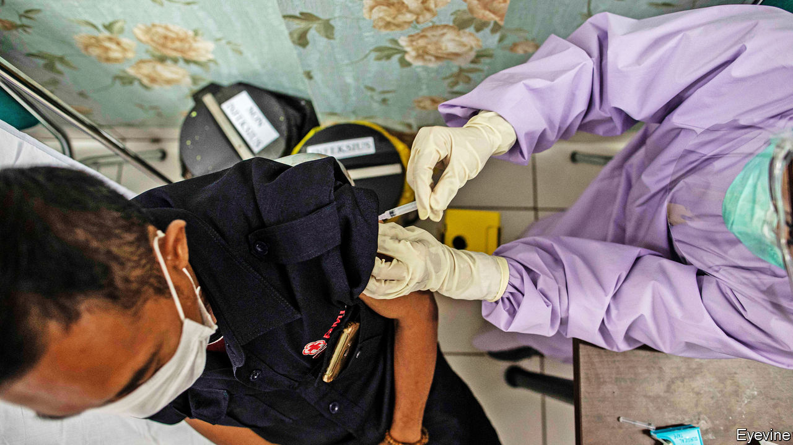

###### A call for arms

# Asian governments are needlessly hampering vaccination drives 

##### Nationalism and geopolitics, among other things, are slowing inoculations 

 

> Jan 23rd 2021 


INDONESIA’S PRESIDENT took the first shot. A doctor with trembling hands jabbed Joko Widodo on live television on January 13th, just two days after the national regulator approved the vaccine. India followed soon after, poking nearly 200,000 people on January 16th, starting with Manish Kumar, a cleaner at a hospital in Delhi. But it was the Philippines, where the first shipment of vaccines is not due until late February, that stole a march over its bigger neighbours. Members of the Presidential Security Group, an elite unit, inoculated themselves with smuggled, unlicensed shots as far back as September—“so that the president will be safe,” the squad’s commander said.


Few countries have handled vaccine procurement as shambolically as the Philippines, which dithered over signing a deal with Pfizer, an American firm, and ended up scrambling to secure shots from Sinovac, a Chinese one, at what many suspect are inflated prices. But even countries with more competent leaders have made decisions that appear to prioritise factors other than public health in their vaccine roll-out, eroding public faith in the process.


India, which has suffered the world’s second-highest number of infections, is a good example. It has done a lot right. Its health ministry devised special software to target and track vaccine recipients, and held dry-run trials at dozens of locations across the country. Its pharmaceutical firms, already the world’s largest makers of vaccines, licensed foreign shots and developed their own. And its drugs regulator was quick to act, approving Covishield, as AstraZeneca’s shot is known locally, for immediate emergency use on January 3rd.


At the same time it gave the green light to Covaxin, a home-grown vaccine that has not completed the final phase of testing. This puzzled many health professionals, leading to speculation of political interference to promote an indigenous product, or of a clumsy attempt to bargain down prices by widening competition. Reports also emerged that the vaccine was being tested on poor, illiterate slum-dwellers who had participated in the trial solely because of the payment on offer, with only patchy checks on efficacy or side-effects. Bharat Biotech, the company that makes Covaxin, denies any misconduct and insists the vaccine is safe. Officials simply note that those who do not want to take Covaxin can refuse to be vaccinated.


That is what people appear to be doing, even though trust in doctors and medicines is typically strong in India. At Delhi’s largest and most prestigious state hospital, the All India Institute of Medical Sciences, just eight of a scheduled 100 recipients showed up for their shots on January 18th.


Indonesian authorities have not been as high-handed or opaque as their Indian counterparts, but their strategy is also unconventional. Unlike many other countries, Indonesia is not putting the elderly—who account for 45% of covid deaths—at the front of the queue for vaccines. Instead, recipients must be between 18 and 59.


The government argues that it cannot vaccinate the elderly immediately because it does not know whether the vaccine produced by Sinovac (the only one approved in Indonesia so far) works on them. Anyway, says Siti Nadia Tarmizi, a spokesperson for the ministry of health, the government believes its youth-first strategy is the best way of reducing transmission, since more than three-quarters of those infected are aged between 19 and 59.


The government also hopes this strategy will revive a battered economy. Indonesia entered its first recession in 22 years last year. The number of unemployed has ballooned by nearly 10m people. Indonesia never instituted a nationwide lockdown for fear of pushing workers—60% of whom have only casual jobs as hawkers, motorcycle messengers and the like—into penury. By reducing transmission among 18- to 59-year-olds, “we do hope that we can start the economic activity,” says Dr Siti. However the data on whether Sinovac’s jab stops people passing on the virus (as opposed to falling ill from it) are just as scanty as those on whether it works on old people.


Problems like deciding whom to prioritise or which vaccine to administer are ones Filipinos would love to have. Instead, they will have to wait at least another month before needles start going into arms. Rodrigo Duterte, the president, was reluctant to pay upfront for Western vaccines. “There is nothing with finality, and you want us to make a reservation by depositing money? You must be crazy,” he said in September. Instead, Mr Duterte was confident that China, to which he has cosied up throughout his tenure, would ride to the rescue. His spokesman suggested that those who prefer Western vaccines suffered from a “colonial mentality”. Yet his government secured enough vaccine from China to inoculate barely a tenth of the population and had to turn belatedly to the Western firms again.


It is not the Philippines’ first vaccine fiasco. In 2016 the government began giving children Dengvaxia, a vaccine against dengue fever developed by Sanofi Pasteur, a French firm. After 800,000 children had had the shot, the company released fresh data suggesting recipients who had not previously had dengue might suffer an adverse reaction, causing mass panic. Confidence in vaccines plummeted: the proportion of Filipinos telling pollsters they “strongly agreed” that vaccines were important fell from 93% in 2015 to 32% in 2018. “The health department is very concerned about a repeat of a Dengvaxia-type controversy,” says Ron Mendoza, dean of the school of government at Ateneo de Manila University. “They are trying to lay low. They know it’s being politicised.”


No country perfectly insulates public health from extraneous considerations, and none has a spotless record fighting covid-19. The government of South Korea, which has been more successful than most at slowing the disease’s spread, initially eschewed foreign vaccines, assuming that local firms could develop an indigenous one. Its confidence, unfortunately, was misplaced. All over the world, politics and health make poor bedfellows. ■

