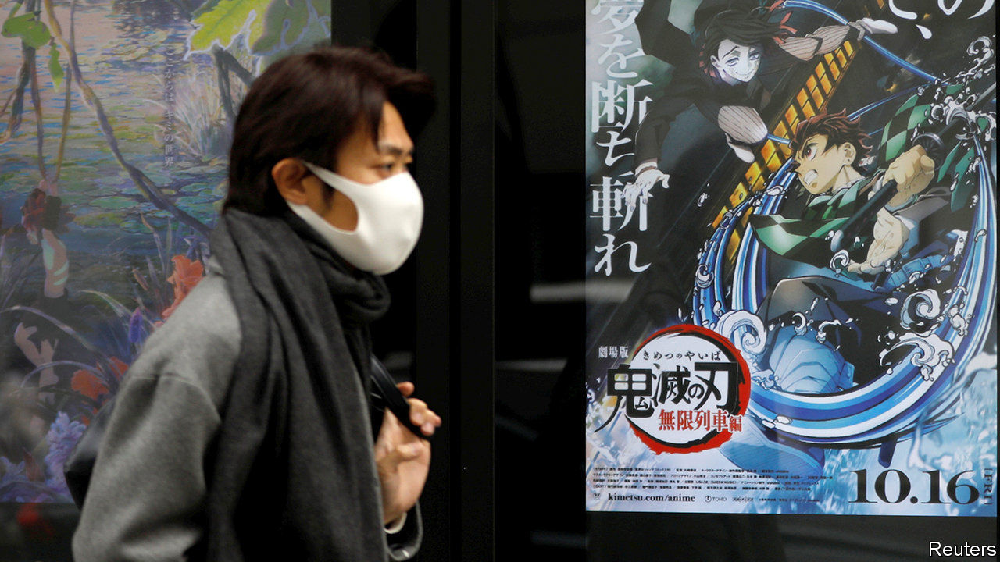

###### Record slayer

# “Demon Slayer” is the most successful Japanese film of all time 

##### Its subject—battling against the odds to overcome adversity—has struck a chord 

 

> Jan 23rd 2021 


FOR NEARLY 20 years “Spirited Away”, an Oscar-winning animation, reigned unchallenged as Japan’s highest-earning film. But in the last days of 2020 the title was, well, spirited away by “Demon Slayer: Mugen Train”, an adaptation of a hit manga (comic book). Set in the early 20th century, “Demon Slayer” follows a young boy, Tanjiro, as he and his comrades battle a band of demons who have killed his family and turned his sister into one of them, as demons do. “Spirited Away” took more than eight months to reach ticket sales of ¥30bn ($247m at the time); “Demon Slayer” passed that mark in less than two (there was hardly any inflation in the intervening period). Box office receipts currently stand at ¥36bn ($349m).


The film is one of several hits from the same storyline. The original manga series ran in the popular Weekly Shonen Jump from 2016 until 2020. Subsequent compilations have sold over 100m copies. A television show based on the series was named anime of the year in 2020 at the Tokyo Anime Awards Festival, an animation industry powwow. The series’ theme song topped the pop charts. Marketing tie-ups saw “Demon Slayer” characters deployed to sell everything from rice balls to toy swords. Products linked to the series have brought in ¥270bn, according to the Dai-ichi Life Research Institute, a think-tank.


The series has permeated all walks of life. Suga Yoshihide, the 72-year-old prime minister, reportedly referred to one of its signature phrases—“total concentration breathing”—during a cabinet meeting. Primary-school pupils named Tanjiro their most admired person in a survey in November, just pipping their mothers (who came second) but well ahead of their fathers (who came a lowly fifth).


In part, “Demon Slayer” has covid-19 to thank for its success. The manga concluded in the early days of the pandemic, as many Japanese hunkered down at home. That fuelled fresh interest in earlier issues and in the television series released in 2019. Unlike longer-running series with daunting tomes of back issues, such as “Dragon Ball” or “Doraemon”, the new and relatively compact “Demon Slayer” proved perfect for quarantine-era bingeing. The film’s release, in turn, coincided with the lifting of restrictions on audience sizes at Japanese cinemas. Moreover, Hollywood studios were holding off releasing blockbusters at the time. “It launched when entertainment was limited, so people flocked to it,” says Sudo Tadashi, an anime critic.


The story itself also carried a moral suited to the pandemic: good triumphs over evil, but only after great hardship. Some commentators even argued that the oni, or demons, in the series evoke those associated with plagues in the past, making their defeat especially sweet.


The success of the series also reflects big changes in the manga and anime business. For one thing, its creator, who uses an alias, is thought to be a young woman, a rarity in a largely male industry. The female characters are less passive than in many other manga, says Ijima Yuka of Daito Bunka University: “In the past, women and girls were to be protected, not portrayed as fighters; in “Demon Slayer” women and girls fight.” The more varied protagonists appeal to a wider range of viewers. “There are lots of characters and each one had individual flair, so everyone could find someone to empathise with,” Mr Sudo says.


“Demon Slayer” also heralds a turn away from the all-controlling directors and closed distribution networks of old, argues Matt Alt, author of “Pure Invention: How Japan’s Pop Culture Conquered the World”: “Streaming is unsettling the traditional giants.” The anime version of “Demon Slayer” launched simultaneously on 20 television channels and 22 streaming platforms, including Netflix, Hulu and Amazon Prime Video, which helped it build a broader fan base, says Mr Sudo. It was not the creation of a single, driving figure, unlike “Spirited Away”, which was written and directed by Miyazaki Hayao. He is one of the dwindling ranks of Japanese who have yet to see “Demon Slayer”. ■

