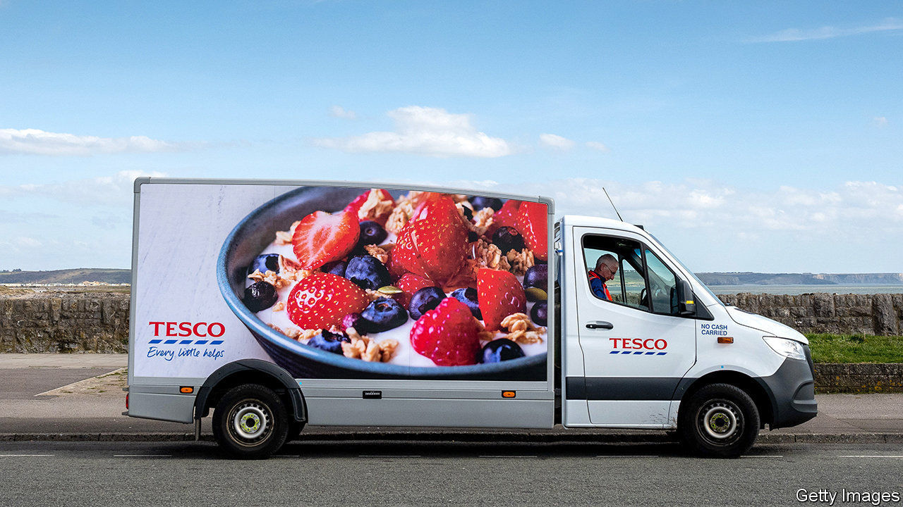

###### Retail

# An online sales boom is killing supermarket profits 

##### The chains are victims of their own pandemic success 

 

> Jan 23rd 2021 


LOCKDOWN IS BOOMTIME for supermarkets. Restrictions on the hospitality trade and working from home means consumers are getting more of their calories from their kitchens so, although overall GDP has shrunk by around a tenth in the past year, supermarkets’ sales have grown fast. Tesco, the biggest chain, reported a 7.2% increase in like-for-like sales in the past quarter, the fastest rise in decades. Sainsbury’s, second by market share, saw sales rise by 8.6%.


But a booming top line is not feeding through into higher profits. Sainsbury’s expects profit for this financial year to be “at least £330m” ($450m), down from £586m the year before. Tesco expects profits to be about the same this year as last. Staff absences and the cost of ensuring stores are covid-compliant, alongside the impact of Brexit, have squeezed margins, but the biggest hit to profitability has come from a switch from physical to online sales. Online grocery orders have risen by 128% at Sainsbury’s and now account for 18% of grocery sales. At Tesco they rose by 80%.


Britons have long been among Europe’s most enthusiastic online grocery shoppers with a pre-pandemic share of around 7% compared with 5% in France and under 2% in Germany, Italy and Spain according to McKinsey, a consulting firm. That is partially because the country is densely populated, but it also reflects industry structure. Food retailing in Britain is relatively concentrated and deeply competitive. Price competition between the established players and the German discounters, Aldi and Lidl, has squeezed margins.


Amid fierce competition, the big firms have been happy to subsidise online delivery fees to build market share. They charge as little as 99p for deliveries on orders over £40 and even offer them free on larger orders. That was sustainable when the internet was a relatively small sales channel that was growing at a reasonable pace, but the step change in its growth has had a commensurate effect on the cross-subsidy. An analysis in 2020 by Bain, a professional services firm, found that, though in-store sales had an operating margin of 2-4%, online deliveries usually lost money. Ocado, a delivery-only grocery business which charges up to £6.99 (well above the industry norm) per delivery has been losing money for three years, and reported an operating margin of -3.6% in 2019.


“It’s a much trickier business to get right than Amazon,” says a supermarket boss. “It isn’t just dropping off a package. It’s carting over two or three pallets of food and waiting while they get unloaded. You can rarely manage more than four deliveries an hour.” In the online-sales market, grocery firms have even less pricing power than they do with bricks-and-mortar sales. Although customers might favour a local store for convenience, their choice online is unconstrained by distance.


For the customers, there’s probably no going back. McKinsey reckons it takes two months for consumer habits to be formed; after nine months of the convenience of online shopping many Britons are unlikely to return to the weekly trek to the supermarket. The industry, as a result, is in a bit of a bind. All the players reckon that charges for online deliveries will have to rise eventually, but none wants to risk losing market share by making that decision. “In this game no one wants to move first,” says a supermarket boss. The customer, therefore, is winning.■

