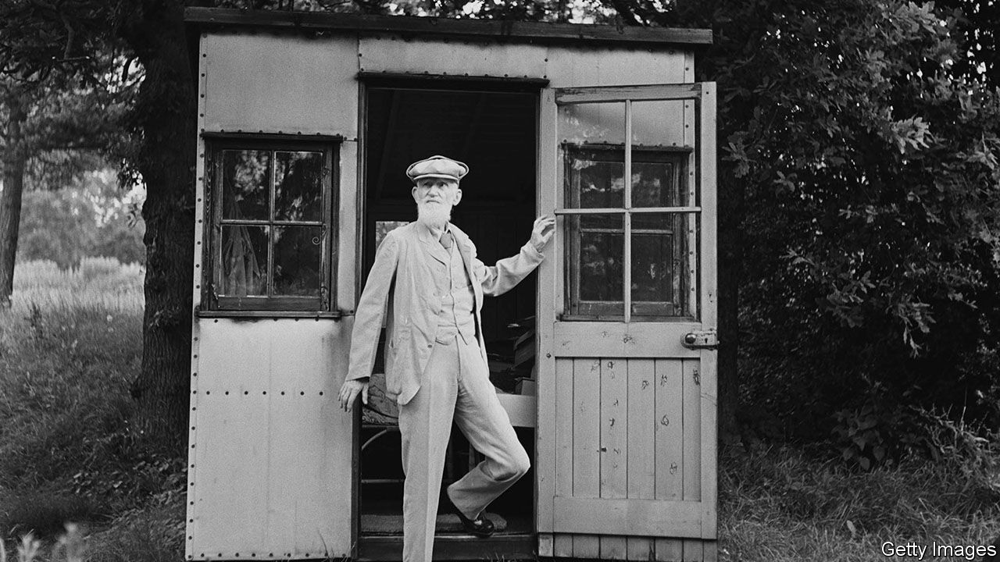

###### Working from home

# How the spread of sheds threatens cities 

##### Small buildings with big implications 

 

> Jan 23rd 2021 


ACROSS THE gardens of Britain, in cities and suburbs, people are building sheds. “We have never seen such an increase in orders,” says Paul Deary of the Garden Shed Company, whose family has been in the business for 35 years. “People have gone shed crazy.” The Timber Trade Federation reports that in October, the last month for which statistics are available, imports of softwood were 34% higher than a year earlier. With stocks running low, what wood is available is quickly snapped up.


A garden shed used to be mostly a place to store a lawnmower, or, if it was on an allotment, a place to discuss brassica problems and “dole out the tea and Hobnobs whilst the rain falls outside,” in the words of Michael Rand, an expert allotment gardener. But the odd brain-worker (especially the irascible type) has long put it to more productive use. Roald Dahl and Dylan Thomas wrote in sheds. George Bernard Shaw had one in his Hertfordshire garden that rotated to face the sun.


The structures now being built are also often intended for work, although they are grander than the ones those pioneer shed-writers used. Green Retreats, which mostly builds garden offices but also garden gyms and the like, says that overall sales grew by 113% between 2019 and 2020. Larger, fancier structures with things like plastered walls are especially popular.


This has important implications for cities. Urban scholars like Richard Florida and Edward Glaeser (who spoke about the future of cities at Policy Exchange, a British think-tank, this week) are busy trying to work out whether the rise in home-working that has occurred during the covid-19 pandemic will endure when the virus ebbs. If it does, many service jobs in cities, from baristas to taxi drivers, will disappear. Public-transport systems will struggle. The value of city-centre property will tank.


The shed boom makes that outcome more likely. A white-collar worker who has tried to work from the kitchen table for the past nine months might be keen to return to the office. A worker who has an insulated garden shed with Wi-Fi will be less so. Joel Bird, who builds bespoke sheds, is certain that his clients envisage a long-term change in their working habits. “They don’t consider it to be temporary,” he says. “They’re spending too much money.”

