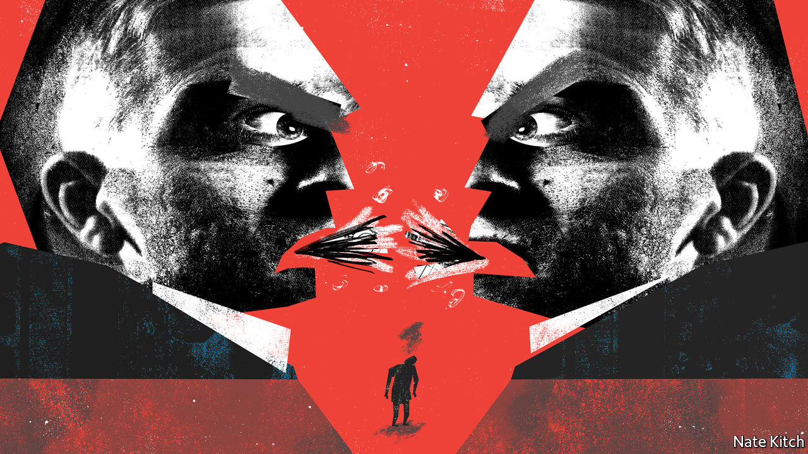

###### Bagehot

# Orwell, Priestley and the politics of the ordinary 

##### The politics of technocracy and ideology have left Britain badly broken 

 

> Jan 23rd 2021 


THE PAST quarter century has witnessed two contrasting approaches to politics. In the Blair-Cameron years an intertwined caste of professional politicians and experts governed from on high: this was the politics of technocracy. In the Corbyn-Johnson era a motley crew of insurgents and opportunists shook up the status quo by appealing to raw political passions: this was the politics of ideology. The status quo is now thoroughly shaken up but there is little appetite for putting the technocrats back in power. The big question hovering over British politics is what comes next.


Marc Stears, a former speechwriter for Ed Miliband, Labour’s leader in 2010-15, thinks he has the answer. The next big thing will be small—what he calls “the politics of the ordinary” or of “everyday life”.


The Miliband years occupied a twilight world between the humiliation of the technocracy by the financial crisis and the rise of Brexit and Corbynism. Mr Stears was troubled by the gap between the Westminster village and regular voters but had no enthusiasm for Jeremy Corbyn’s attempt to fill the gap with left-wing zealotry. Indeed, he was struck by how much technocrats and ideologues have in common. They both focus on grand abstractions rather than the stuff of everyday life and they both look down on regular people, whom they regard as ignorant, wrong or both.


Mr Stears retreated from the hurly-burly of political life to the University of Sydney in order to immerse himself in a group of pre-war writers and artists—D.H. Lawrence, George Orwell, Dylan Thomas, J.B. Priestley and Bill Brandt. The resulting book, “Out of the Ordinary”, uses their work and their times to throw light on today’s politics.


Mr Stears argues that his heroes invented a style of left-wing politics that was different from either the top-down rationalism of the Fabians or the sentimental communitarianism of William Morris. They looked at the country as it actually was rather than through ideological lenses. In “English Journey”, J.B. Priestley explored “the England of arterial and by-pass roads, of filling stations and factories that look like exhibition buildings, of giant cinemas and dance-halls and cafés”. In “Coming Up for Air”, George Orwell chose an unlikely hero in the pudgy form of George Bowling, a 45-year-old insurance salesman who, equipped with a new pair of false teeth, sets out to discover the country.


They believed that Britishness (which in those days was mostly called Englishness) was defined by informal institutions like working-men’s clubs and women’s institutes rather than official ones, and by quiet patriotism rather than noisy flag-waving. They contributed mightily to the war effort by forging a sense of redemptive nationalism, with Britain standing for messy everyday decency against Germany’s well-organised tyranny: Orwell and Thomas were fixtures on the BBC while Brandt photographed people in extraordinary circumstances, such as sleeping in Underground stations during air raids.


A politics based on a revival of these ideas would focus on things people mind about but politicians usually ignore. Mr Stears recalls a conversation with a Labour pollster. Noticing that the polls showed that what people minded about most was being able to spend time with their close friends and family, he asked why the party didn’t focus on this, only to be told that “it’s not the sort of thing that politics is about.” Everyday politics would change the relationship between the state and the people by involving citizens in the design of public services. It would encourage politicians to stop viewing the public as exemplars of this or that “demographic” and school them instead in Orwell’s aphorism that “to see what is in front of one’s nose needs a constant struggle.”


If reviving the politics of the ordinary sounds Utopian, Mr Stears thinks that, in a small way, it is already happening. Local politicians and charities are doing it up and down the country. Every One, Every Day, an initiative in the London borough of Barking and Dagenham dedicated to the proposition that “what people do together every day matters”, has involved more than 2,000 volunteers in projects such as turning an abandoned warehouse into a workshop equipped with sewing machines and do-it-yourself equipment. Marcus Rashford, a footballer who grew up in straitened circumstances, is a master of the politics of everyday injustices. He persuaded the government to provide free school meals in the school holidays during the pandemic.

Who are you calling ordinary?


This approach to politics has champions in both major parties. On the Labour side Jon Cruddas, the MP for Dagenham and Rainham, has been talking about the subject for decades; Morgan McSweeney, Sir Keir Starmer’s chief of staff, is intrigued; Angela Rayner, the deputy leader, has a compelling personal story to tell about growing up in poverty. On the Conservative side a cohort of younger thinkers such as Rachel Wolf, Liam Booth Smith and Danny Kruger are advocates. Allegra Stratton, Boris Johnson’s press spokeswoman, was enthusiastic about these ideas when she moved in Labour circles.


By itself, the politics of everyday life is too vague and incomplete to constitute a political programme. Many of the “everyday” problems that people complain about (such as crumbling town halls and terminated bus routes) were the result of austerity. Fixing them requires making top-down decisions about economic policy rather than just reviving local politics. And the notion of “ordinary people” is problematic: one of Labour’s biggest headaches, for example, is that it is trying to appeal to two groups, working- and middle-class voters, who have different values rooted in different experiences. But it is a valuable part of a broad mix of policies. The politics of technocracy and ideology have both left Britain badly broken. It will need to be fixed from the bottom up as well as from the top down. ■

