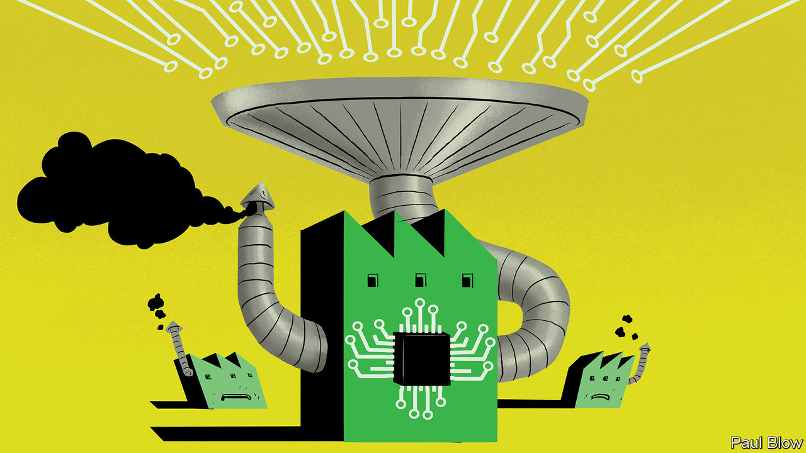
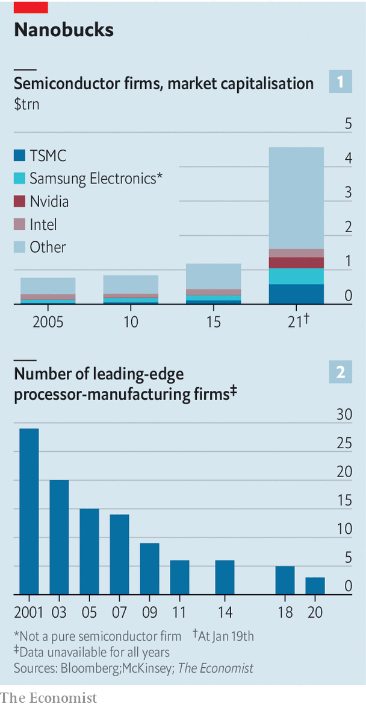
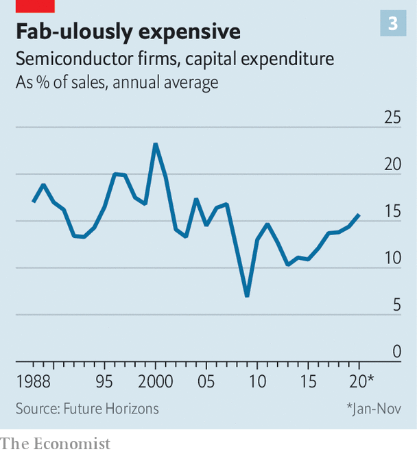

###### A new architecture

# Chipmaking is being redesigned. Effects will be far-reaching 

##### The global semiconductor business is becoming at once more diverse and more concentrated. This brings opportunities—and risks 

 

> Jan 23rd 2021 


ON JANUARY 13TH Honda, a Japanese carmaker, said it had to shut its factory in Swindon, a town in southern England, for a while. Not because of Brexit, or workers sick with covid-19. The reason was a shortage of microchips. Other car firms are suffering, too. Volkswagen, which produces more vehicles than any other firm, has said it will make 100,000 fewer this quarter as a result. Like just about everything else these days—from banks to combine harvesters—cars cannot run without computers.


The chipmaking industry is booming. The market capitalisation of the world’s listed semiconductor firms now exceeds $4trn, four times what they were worth five years ago (see chart 1). Chipmakers’ share prices have surged during the covid-19 pandemic, as work moved online and consumers turned to streaming and video games for succour.


This has propelled a wave of dealmaking. In September Nvidia, which designs powerful chips for gaming and artificial intelligence (AI), said it would buy Arm, a Britain-based company whose blueprints are used in nearly all smartphones, for $40bn. In October AMD, which makes blueprints for graphics and general-purpose chips, announced another megadeal—to acquire Xilinx, a maker of reprogrammable chips, for $35bn.

Silicon splurge


Capital spending, too, is rising. Samsung, a South Korean conglomerate, wants to invest more than $100bn over ten years in its chip business (although some of that will go to its memory chips used in things like flash drives rather than microprocessors). On January 14th Taiwan Semiconductor Manufacturing Company (TSMC)—which turns blueprints into silicon on behalf of firms like AMD and Nvidia—stunned markets when it increased its planned capital spending for 2021 from $17.2bn to as much as $28bn, in anticipation of strong demand. That is one of the largest budgets of any private firm in the world.

 


All this is happening amid a confluence of big trends that are realigning chipmaking. At one end the industry is a hive of competition and innovation. Established chip designs, including those from AMD, Nvidia and Intel, the world’s biggest chipmaker by revenue, are being challenged by new creations. Web giants such as Amazon and Google, big customers of the incumbents, are cooking up their own designs. They are joined by a gaggle of startups, eager to capitalise on demand for hardware tuned for the needs of AI, networking or other specialist applications.


All this would be unequivocally great news for everyone, were it not for what is happening at the other end—in the factories where those designs are turned into electronic circuits etched on shards of silicon. The ballooning costs of keeping up with advancing technology mean that the explosion of chip designs is being funnelled through a shrinking number of companies capable of actually manufacturing them (see chart 2). Only three firms in the world are able to make advanced processors: Intel, TSMC, whose home is an earthquake-prone island which China claims as its territory, and Samsung of South Korea, with a nuclear-armed despotic neighbour to the north. The Semiconductor Industry Association, an American trade body, reckons that 80% of global chipmaking capacity now resides in Asia.


The vanguard may soon be down to two. Intel, which has pushed the industry’s cutting edge for 30 years, has stumbled. On January 18th news reports suggested that the company (which was due to report its latest quarterly results on January 21st, after The Economist went to press) may begin outsourcing some of its own production to TSMC, which has overtaken it.


And the world economy’s foundational industry looks poised to polarise further, into ever greater effervescence in design and ever more concentrated production. This new architecture has far-reaching consequences for chipmakers and their customers—which, in this day and age, includes virtually everyone.


Start with the diversification. For years technology companies bought chips off the shelf. In its 44-year history Apple has procured microprocessors for its desktops and laptops from MOS Technology, Motorola, IBM, and finally Intel. Soon after the launch of the original iPhone in 2007, however, the firm decided to go it alone. Later iterations of the smartphone employed its own designs, manufactured first by Samsung, and later by TSMC. That approach proved so successful that in 2020 Apple announced that it would replace Intel’s products with tailor-made ones in its immobile Mac computers, too.


Two years earlier Amazon Web Services, the e-commerce giant’s cloud-computing unit, began replacing some Intel chips in its data centres with its own “Graviton” designs. Amazon claims its chips are up to 40% more cost-efficient than Intel’s. Around the same time Google began offering its custom “Tensor Processing Unit” chip, designed to boost AI calculations, to its cloud clients. Baidu, a Chinese search giant, claims its “Kunlun” AI chips outpace offerings from Nvidia. Microsoft, the third member of the Western cloud-computing triumvirate, is rumoured to be working on chip designs of its own.


Clever startups in the field are securing billion-dollar valuations. Cerebras, an American firm which designs AI chips, has earned one of $1.2bn. A British rival called Graphcore, which has been working with Microsoft, was valued at $2.8bn in December. On January 13th Qualcomm, a firm best-known for its smartphone chips, paid $1.4bn for Nuvia, a startup staffed by veterans of Apple’s in-house chip-design team.


Custom silicon was an iffy proposition a decade ago. General-purpose chips were getting better quickly thanks to Moore’s law, which holds that the number of components that can be crammed into a silicon chip should double every two years or so. Today the Moorean metronome is breaking down, as quirks of fundamental physics interfere with components measured in nanometres (billionths of a metre). Each tick now takes closer to three years than two, notes Linley Gwennap, who runs the Linley Group, a research firm, and offers fewer benefits than it used to.


That makes tweaking designs to eke out performance gains more attractive, especially for big, vertically integrated firms. No one knows better than Apple exactly how its chips will interact with the rest of an iPhone’s hardware and software. Cloud-computing giants have reams of data about exactly how their hardware is used, and can tweak their designs to match.


And whereas designing your own chips once meant having to make them as well, that is no longer true. These days most designers outsource the manufacturing process to specialists such as TSMC or GlobalFoundries, an American firm. Removing the need to own factories cuts costs drastically. A raft of automated tools smooths the process. “It’s not quite as simple as designing a custom T-shirt on Etsy,” says Macolm Penn, who runs Future Horizons, another chip-industry analyst. But it isn’t a world away, either.

 


Although designing chips is now easier than ever, making them has never been harder. Keeping up with Moore’s law, even as it slows, requires spending vast—and growing—sums on factories stuffed with ultra-advanced equipment: plasma-etching kit, vapour-deposition devices and 180-tonne lithography machines the size of a double-decker bus. After falling as a proportion of overall revenue, the chip industry’s capital spending is ticking up again (see chart 3). In absolute terms, the cost of high-tech “fabs”, as chip factories are known, has grown relentlessly—with no end in sight.


Today’s state-of-the-art is five-nanometre chips (though “5nm” no longer refers to the actual size of transistors as earlier generations did). Both Samsung and TSMC began churning them out in 2020. Their 3nm successors are due in 2022, with 2nm pencilled in a few years later.

Intel outside


At the turn of the millennium, a cutting-edge factory might have cost $1bn. A report in 2011 from McKinsey, a firm of management consultants, put the typical cost of an advanced fab at $3bn-4bn. More recently, TSMC’s 3nm factory, completed in 2020, in southern Taiwan, cost $19.5bn. The firm is already pondering another for 2nm chips, which will almost certainly be more. Intel’s stumbles have left it marooned at 10nm—and its boss, Bob Swan, out of a job. His incoming replacement, Pat Gelsinger, will need to decide if the company, which, unlike TSMC, also designs its chips, wants to keep making them. Potential new entrants face enormous barriers to entry. The economics of fabs pushes these up higher with every technological advance.


That matters. Not all chipmaking requires cutting-edge technology. Cars mostly use older, duller semiconductors. Miniaturisation may seem less of an imperative in roomy data centres. But it is crucial: there are some computations that only the most powerful chips can tackle.


And demand for these is likely to grow as silicon infuses products from thermostats to tractors in the uber-connected “Internet of Things”. Between them TSMC and Samsung customers are already a “Who’s Who” of big tech—Apple, Amazon, Google, Nvidia, Qualcomm (and soon, if the news reports are true, Intel itself). As things like cars become more computerised and go electric (see ), the chips that go into them will become more advanced, too. Tesla, an American maker of electric cars, already relies on TSMC’s 7nm fabs to make its in-house self-driving chips.


Asia’s nanoscale duopoly remains fiercely competitive, as Samsung and TSMC keep each other on their toes. The Taiwanese firm’s operating margins have been more or less steady since 2005, when 15 other firms were operating at the cutting edge. But the logical endpoint of the relentless rise in manufacturing costs is that, at some point, one company, in all likelihood TSMC, could be the last advanced fab standing. For years, says an industry veteran, tech bosses mostly ignored the problem in the hope it would go away. It has not.


Those worries are sharpened by the industry’s growing political importance. As part of its economic war against China, America has sought to deny Chinese firms the ability to build leading-edge chip factories of their own. China has put semiconductors at the core of a multibillion-dollar plan to become self-sufficient in critical technologies by 2025—especially now that American sanctions have deprived it of some foreign imports.


The structural forces behind increased concentration are here to stay. America, worried about losing access to the most advanced factories, has given handouts to TSMC in return for a fab in Arizona. Samsung may expand the one it runs in Texas. Another package of subsidies and incentives is awaiting funding from Congress. The European Union, which has pockets of high technology in Belgium and the Netherlands, wants more of them. In December 17 EU countries agreed to spend tens of billions in post-pandemic stimulus cash to try to create leading-edge factories by the middle of the decade. The chip industry’s history suggests these sums will only get more eye-watering with time. ■

