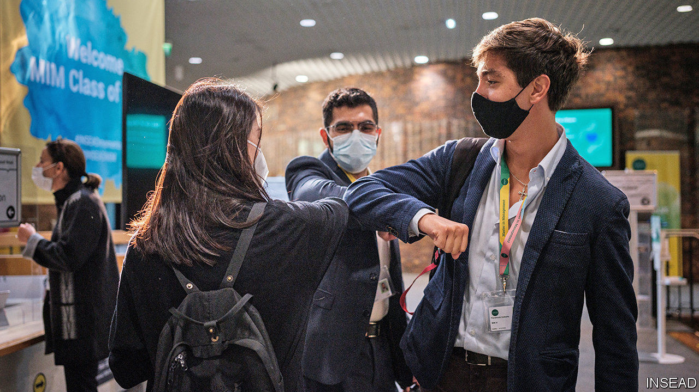
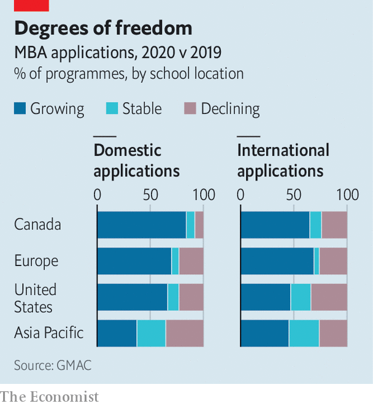

###### Business schools

# The MBA class of covid-19 

##### Once endangered, the venerable degree is emerging stronger from the pandemic 

 

> Jan 23rd 2021 


EDIEAL PINKER, deputy dean of the Yale School of Management, bristles at the suggestion that the MBA, long seen as a stepping stone to corporate success, has been made less relevant by the covid-19 crisis. The traditional two-year degree remains vital, he insists. “Do you think the problems the pandemic created for society and the economy are narrow specialised problems or complex ones that cut across sectors and disciplines?”


His words would have sounded odd a year ago. The MBA was falling out of fashion. With the global economy booming, the opportunity cost of this pricey degree (top schools charge $100,000 or more a year) did not seem worthwhile to many. Some schools could not cover their expenses. In 2019 the University of Illinois said it would end its residential MBA programme. Dozens of middling schools have done the same in recent years.


Surely Mr Pinker’s defence of the MBA seems even odder in the new pandemic reality? On the contrary. “Students held up and schools stepped up,” says Sangeet Chowfla, head of the Graduate Management Admission Council (GMAC), an industry body. GMAC’s latest annual global survey of more than 300 business schools found that 66% of programmes saw applications rise. Has covid-19 saved the MBA?


At first the virus looked lethal. Lectures moved online, team exercises became socially distant and study-trips abroad were cancelled. That diminished the value of the MBA experience, which is “greatly enhanced by the opportunity to expand and diversify one’s professional network through in-person interactions”, says Scott DeRue, dean of the University of Michigan’s Ross School of Business. Covid-19 restrictions hurt what Ilian Mihov, dean of INSEAD, a French school with campuses in Fontainebleau, Singapore and Abu Dhabi, calls “horizontal learning”—working in teams or discussing the day’s lessons over coffee. Ominously, INSEAD’s most popular MBA course last year was “Psychological Issues in Management”. “[I miss] interacting and having fun,” laments a student at New York University’s Stern School of Business. Columbia Business School has disciplined 70 students who violated covid-19 rules on socialising by travelling to Turks and Caicos for the autumn break.

 


Some students, angry about social isolation and online education, demanded refunds. Many foreigners, a cash cow for Western schools, stayed away (see chart). Mr Chowfla points to the “one-flight dynamic”: horror stories about students kicked out of dorms getting stranded on layovers while returning home put many Asians off American schools.


America’s loss was Europe’s gain. With more direct connections to Asia, London Business School, HEC Paris and other top European schools reported rises in applications. Some Asian schools, too, benefited. They kept their doors open to international students, thanks to their countries’ better handling of the pandemic. Hong Kong University Business School (HKUBS) saw a surge in applications from North America and Europe in March. They tended to be students who aimed for MBAs in the West but picked Asia at the last moment, says Sachin Tipnis of HKUBS. Memories of the SARS epidemic of 2003 spurred HKUBS to act early. Rapid processing of visa applications and moving classes to larger lecture theatres allowed 90-95% of students to attend in person.


Travel and visa complications boosted domestic applications everywhere. In 2020 mainland applicants to China Europe International Business School (CEIBS), a top-rated business school in Shanghai, rose by 30%. The wish to stay local is driven by two things, explains Ding Yuan, its dean. The first is China’s economy, which grew last year while others shrank. That has made America and Europe a less attractive destination in general for ambitious managers. The second is a sense that the post-Trump West is less welcoming to Chinese.


Most surprising of all, given all that, American schools look poised for a banner 2021. After a few years of declining applications, MIT’s Sloan School of Management, Columbia Business School, the Wharton School of the University of Pennsylvania and other top American programmes now report double-digit growth. “We enrolled the largest full-time MBA class ever,” beams Madhav Rajan, dean of the University of Chicago Booth School of Business.


MBA applications typically rise in recessions, when a weaker job market means lower forgone salaries. But business schools deserve credit for adapting their business models—as their professors preach others to do. Many delayed the start of semesters, offered generous scholarships, waived exam requirements and liberalised policies on deferrals. Harvard Business School allowed students it admitted to postpone studies for one or two years. GMAC reckons that deferrals globally have shot up from about 3% to 7%.


Schools also boosted online and flexible degrees, which are surging, and integrated digital teaching into core MBA courses. Far from being “giant killers”, says Vijay Govindarajan of Dartmouth College’s Tuck School of Business, digital technology can help a top school “ensure its gold-plated MBA programme shines even brighter”. The Ross School is using tools akin to Netflix’s bespoke recommendations to create “personalised leadership and career development journeys” for students. And to graduates’ relief, recruiters are back. GMAC’s survey of firms that recruit at business schools found that 89% intended to hire MBAs in 2021, up from 77% last year. ■


