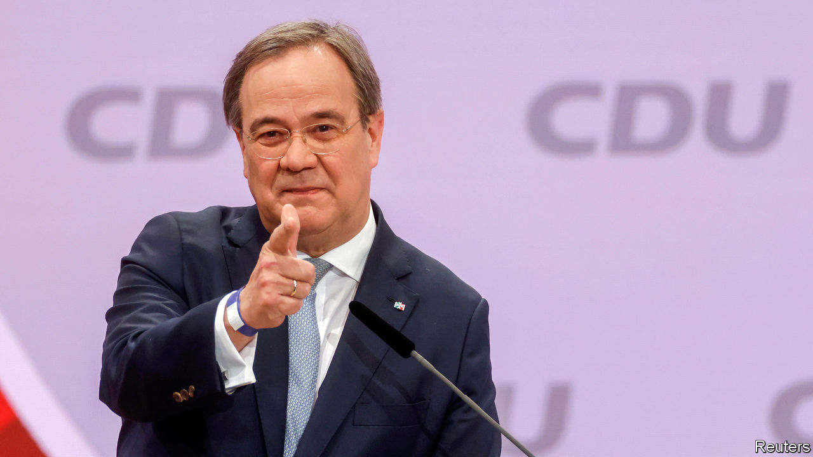
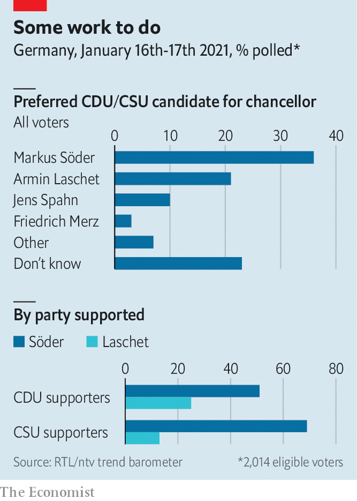

###### Steady, as she goes

# Armin Laschet, the man who might succeed Angela Merkel 

##### Winning the leadership of Germany’s Christian Democrats takes him one step closer to the chancellery 

 

> Jan 23rd 2021 


“I MAY NOT be a great showman, but I am Armin Laschet—and you can trust that.” If the words with which Mr Laschet secured the leadership of Germany’s Christian Democratic Union (CDU) were less than rousing, they encapsulated the appeal of the football-loving cigarillo-chomper who defeated two rivals at a vote of party delegates on January 16th. Now in charge of Germany’s ruling party, Mr Laschet is well placed to succeed Angela Merkel, his CDU colleague, who will step down as chancellor after a general election in September.


Yet Mr Laschet, premier of the hulking western state of North Rhine-Westphalia (NRW), faces several hurdles on his way to the chancellery. His narrow run-off victory by 53% to 47% over Friedrich Merz, a corporate lawyer backed by right-leaning delegates, underlines the first. Mr Merz is a serial political loser who has repeatedly failed to dispel suspicions that he is more interested in his own fortunes than his party’s. But he became a vessel for the hopes of CDU members who saw in Mrs Merkel’s departure a chance to stop its liberal drift on matters like migration. Jana Schminke, a CDU MP who backed Mr Merz, says members have resigned from the party and that disappointment is particularly acute in east Germany. Mr Laschet’s first task is to unite his party’s warring tribes.


A bigger obstacle lies in Markus Söder, the swaggering premier of Bavaria and leader of the Christian Social Union (CSU), the CDU’s sister party there. In March or April, the two parties must decide who will lead them into the general election—and therefore, polling suggests, succeed Mrs Merkel. Thanks in part to a confident performance during the coronavirus crisis, Mr Söder outshines Mr Laschet in opinion polls (see chart). He insists his ambitions do not extend beyond Bavaria. However, should Mr Laschet fail to win the affections of German voters—especially if the CDU struggles in two state elections due in mid-March—the party may turn to Bavaria for salvation, and Mr Söder will surely oblige. “We have to enter the race with the candidate who has the best chances,” says Christian Natterer, another CDU Merz-backer.

 


Mr Laschet’s hopes rest in part on his promise to maintain the stance of the woman he hopes to succeed. Like Mrs Merkel, he is a down-to-earth, risk-averse pragmatist who distrusts grand visions. But the pair differ markedly in style. Mrs Merkel, the phlegmatic daughter of a Lutheran pastor, grew up on the east side of the Berlin Wall, keeps her emotions in check and weighs her words like gold dust. Mr Laschet, a jovial, gaffe-prone Rhinelander of strong Catholic faith, was delighted to win an “award against deadly seriousness” at a carnival in his home town of Aachen.


Mrs Merkel has always remained aloof from the party she led for 18 years. She had to battle its entrenched structures, ruthlessly dispatching internal enemies where necessary (including, back in 2002, Mr Merz) and earning its affection by endlessly winning elections. Mr Laschet is a CDU man through and through. He joined at 18. After dabbling in law and journalism, he represented the party in parliaments at state, national and European level, losing almost as many elections as he has won.


A conciliator by instinct, Mr Laschet pledges to be the CDU’s team captain rather than its CEO. “This is his speciality,” says Serap Güler, who serves in his government in NRW. “He is open to being convinced, open to other views.” In NRW Mr Laschet has stacked his cabinet with figures from across the spectrum, including former opponents who have become firm supporters. His interior minister, Herbert Reul, is a law-and-order bruiser who lends Mr Laschet’s affable bearing a sharper edge.


Mr Laschet was an early and consistent advocate of expanding the CDU’s appeal to minorities in Germany—earning the nickname “Turkish Armin” among sceptical right-wingers but attracting adherents like Ms Güler, the daughter of Turkish immigrants. He backed Mrs Merkel’s decision to keep Germany’s borders open to migrants in 2015-16, as well as her subsequent policies to keep them out.


The Green Party, the CDU/CSU’s likeliest governing partner after the election, would certainly prefer Mr Laschet to Mr Merz. But his closeness to industry could hamper coalition talks. Climate taxes and rules must not be allowed to strangle jobs, he argues. He is a miner’s son from a coal state, and in 2019 helped delay the date when Germany promises to stop burning the stuff to 2038. In 2017, during abortive coalition talks with the Greens, the energy negotiations he led for the CDU nearly collapsed.


Mr Laschet’s upbringing in Aachen, close to the Dutch and Belgian borders, places Europe in his “political heart”, says Moritz Küpper, one of the authors of “Der Machtmenschliche” (roughly, “power with a human face”), a recent biography. He keeps a bust of Charlemagne, the city’s most famous son, in his office. In 2018 he wangled the obscure job of plenipotentiary for Franco-German cultural relations to gain access to Emmanuel Macron. Last year, in a rare rebuke to Mrs Merkel, he said Germany should have been more responsive to Mr Macron’s call for action in Europe. Mr Laschet’s hawkish fiscal views are orthodox for his party, but he once hinted at support for Eurobonds. As the CDU often applies the brakes to Germany’s Europe policy, such views will carry weight.


Yet beyond his western European comfort zone, aspects of Mr Laschet’s foreign policy raise eyebrows. As a teenager he hung a poster of Solidarity, Poland’s anti-communist union movement, in his bedroom. But as an adult he shares Mrs Merkel’s reluctance to confront EU members that undermine democracy. (An early test will be whether he backs moves to expel Hungary’s authoritarian ruling party from the EU’s centre-right grouping.) He belongs to the ranks of Germany’s Putin-Versteher (understanders): he urges dialogue with the Kremlin, questioned whether it really murdered a former agent in Britain in 2018 and has turned a blind eye to its bolstering of the murderous regime in Syria.


Should he secure the chancellor-candidacy, Mr Laschet’s foreign-policy views are unlikely to be much of a handicap. Voters care far more about recovering from the pandemic. But Mrs Merkel’s departure will leave a gaping hole on the global stage. Mr Laschet has yet to show he could fill it. ■

