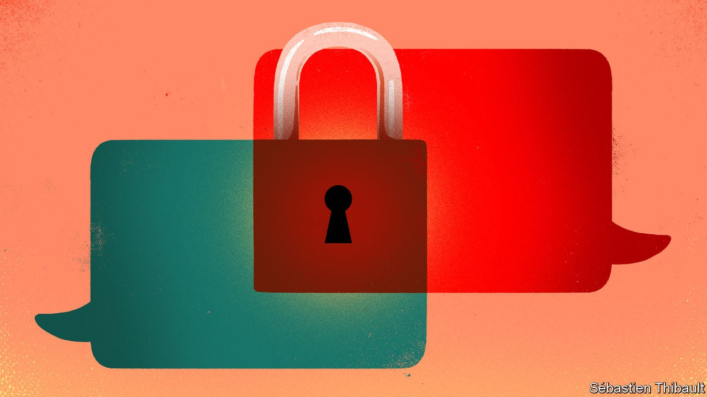
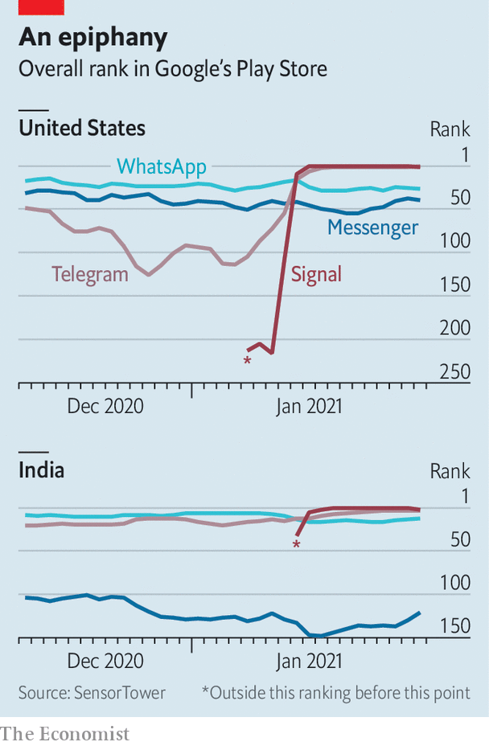

###### Where everybody knows your name

# Messaging services are providing a more private internet 

##### This has advantages—and risks 

 

> Jan 23rd 2021 


WHATSAPP, WHICH 2bn people use to send some 100bn messages a day, is rarely in the news. When it is, the stories are mostly about whether, in order to increase competition, it should be hived off from its corporate parent, Facebook—a company rarely out of the news.


The difference in visibility is basic to the businesses involved. A social-media firm like Facebook exists to get things noticed, because its business model is based on selling attention to advertisers. What and who gain attention, and what can be done to withhold it from particular people and ideas, are contested issues. Messaging services like WhatsApp for the most part simply let people stay in touch with their families and chat with groups of friends and associates. In many places they increasingly offer ways to get in touch with businesses, too. They are of practical use in a way that social media are by and large not (never try to arrange cocktails over Twitter). But because they are removed from the public sphere they provoke far less outrage and controversy, and far fewer arguments over regulation.


That may have started to change on January 6th, for two reasons. One was that Facebook announced a revision to WhatsApp’s terms of service which many took to mean that their personal data would be used for a wider range of purposes. The result was a rush to download Telegram and Signal, two apps with much smaller user bases—around 500m for Telegram, far fewer for Signal—which market themselves on promises of enhanced privacy (see chart). Between January 6th and 19th Signal was downloaded 45m times and Telegram 36m, according to Sensor Tower, a provider of data. Pavel Durov, Telegram’s boss, called it the “largest digital migration in human history”.

 


January 6th’s other precipitating event was the insurrection at the United States’ Capitol. In its wake Apple removed Parler, a Twitter clone on which people expressed sentiments such as “we need to start systematicly assassinating #liberal leaders”, from its app store and Amazon stopped hosting the company in its cloud. As a result groups like the Proud Boys, “western chauvinists” with a taste for violence, flocked to Telegram.


The sort of things which had been said on Parler promptly began to reappear on some of Telegram’s public channels. Telegram removed some of the public channels in question. But that will not have silenced such talk. According to Aleksandra Urman of the University of Bern, who studies the political use of online media, public channels are used to draw new members into private groups where talk may lead to action. And Telegram generally refuses to reveal what goes on in its private channels. Before Joe Biden’s inauguration there was concern that these channels would be used to plan violent attacks. In the event, thankfully, such attacks did not transpire, but the risks remain.


Growth in the use of Telegram and Signal may well strengthen such worries. But the messaging services are also having a much broader and on balance salutary effect on online life. Social media provide a “public sphere” both global and raucous in which what is worst often spreads fastest. In the private worlds of messaging apps it has proved possible to rebuild some of the levees which allow the river of human discourse to flow healthily.


Conversations which cause controversy in public can be carried out in private with more nuance and no trolling. A distinction can be made between performance and communication. In “The presentation of Self in Everyday Life” Erving Goffman, a 20th-century sociologist, distinguished between “front-stage” behaviour, which is observed by all and sundry, and the “back-stage” life of rehearsal and preparation in the company of others who are part of the same project. “For healthy psychology we need back and front stage,” says Carissa Véliz of Oxford University. “[Online] we have been pushing back stage more and more into oblivion. Having more private messaging brings the back stage back.”

I bet you’re wonderin’ how I knew


Messaging services differ from social media like Facebook, Twitter, Instagram and the rest in two fundamental ways. One is addressability. When users post on Facebook the company’s software decides which of their “friends” will see the post automatically (others will find it only by looking). If the post proves popular the software will spread it further. When a user sends a message on WhatsApp, that message goes to only the person or group they designated. In messaging apps, people know to whom they are talking.


The other difference is one of business models. Social-media firms need to know what users are saying, visiting and liking in order to provide the services they sell to advertisers. And to maximise those sales they need algorithms that will offer users more things they will like, or at least be engaged by. Hence their interest in the viral. Messaging services have no cause to read over their users’ shoulders, and in some cases lack the ability to do so even if they wanted to. Some have deliberately acted to suppress virality by limiting the ease with which things can be forwarded.


It is clear that people want what the services offer, perhaps more than they want social media. In 2019 Mark Zuckerberg, Facebook’s boss, noted that “private messaging, ephemeral stories and small groups are by far the fastest-growing areas of online communication.” The number of people in Europe who use Facebook every day (305m) has not increased since the end of 2019, according to the company’s quarterly filings, and in the third quarter of 2020, for the first time, the number of daily users in North America fell—a remarkable development in the midst of a pandemic. Globally, according to Sensor Tower, the time spent using the five most downloaded social-media apps fell by 5% in 2020; time spent on messaging apps went up 2.3%.


Experience, particularly in Asia, shows that messaging services can serve as a platform for a lot of other things. In China WeChat is used for everything from covid-19 contact tracing to making investments; the same is true for KakaoTalk in South Korea. In Japan and Taiwan a service called Line, built around messages exchanged between individuals and in groups of up to 500, can be used to read news, watch videos and call taxis. The companies make money by charging business users, by selling some of their online games and, particularly in the case of Line, from a market in “stickers” that allow messages to be festooned with indicators of every imaginable emotion.


Signal and Telegram, for their part, have no obvious plans for making money; they seek to provide space for private speech as a good in itself. Signal is a Californian non-profit supported by a grant from Brian Acton, the founder of WhatsApp, who made $6.5bn out of the app’s sale to Facebook, as well as by other donors. The service uses “end-to-end” encryption which makes it impossible for the company to see the content of the users’ messages. WhatsApp licenses and uses the same technology. But Signal goes further in its protection of privacy by holding the absolute minimum of data on its users. In 2016 Signal was subpoenaed by a grand jury for information on two of its users. All it could offer was the date and time when an account associated with a specific phone number had been created and the date and time when it had most recently been used.


Moxie Marlinspike, Signal’s pseudonymous founder, has said that he set it up because he wanted a way to talk to friends who were hopping trains and squatting in abandoned houses without fear of compromising them. But he also believes privacy is essential for social progress: there must be spaces in which laws can be broken lest society never move beyond bad ones.


Telegram does not use end-to-end encryption. Its resistance to snooping lies not in mathematics but in the globe-trotting figure of Mr Durov, a Russian-born billionaire who funds the company with his own fortune. There are ways for the company to read the messages that sit encrypted on its servers in Dubai. But Mr Durov refuses to co-operate with all requests for information or censorship from Russia and with most of those made by everyone else. When Apple asked Telegram to stop its users from revealing the personal information of specific Belarusian police officers said to be beating protesters, according to Dr Urman, Mr Durov’s response was simply to stop iPhone users from being able to access that information.


The fact that messaging companies do not know what goes on between their users has knock-on effects. Jonathan Zittrain, a law professor at Harvard University, says the biggest is the degree of community control it makes both possible and necessary for online communities. On social media like Twitter and Facebook discourse is ultimately governed by the corporate host or by agents and authorities of the state in which that host is based. In messaging’s private spaces members play the governing role themselves. Mr Zittrain says that this “could lead to more enduring communities, without calling for extensive terms of service by infrastructure providers”. In other words, private online spaces are good because they allow the individuals who use them to act with greater freedom and a stronger sense of the social.

Plans to make me blue


This comes with obvious risks. Dr Urman says that in the past two years she has seen radical speech disappearing from the public internet. It is reasonable to assume it now takes place in private. Alex Stamos of Stanford University, who used to be Facebook’s chief security officer, says that venues outside the reach of companies or states are certain be used by people wishing to traffic in images of child sexual abuse and to plot terrorist attacks. He also says he is certain law-enforcement agents are already working to infiltrate such groups, though as yet he is unaware of any big busts that have involved activity on Signal or Telegram.


Clear evidence of a serious crime in a powerful democracy such as America being planned on Telegram might test Mr Durov’s mettle more than saying no to the Kremlin does. But if Telegram were compromised, Signal and its successors would persist, as would the almost-equally encrypted WhatsApp. Everyone wants some privacy and some people want a lot of it; people also like spaces which they can run themselves and where they will not be bombarded with ads or the opinions of interlopers. Messaging services give them those things, and many will want to keep them, come what may.■

