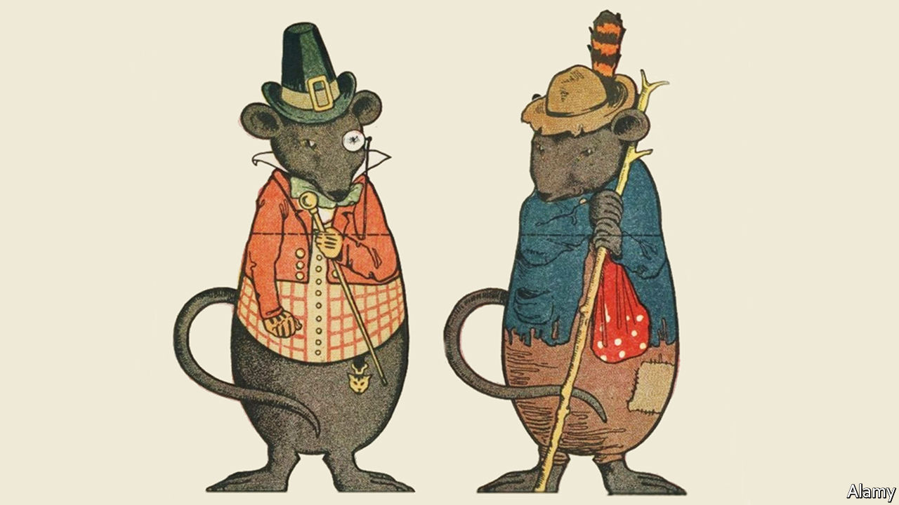

###### Mice

# Where a rodent lives may determine how clever it is 

##### Country bumpkins and city slickers 

 

> Jan 23rd 2021 


AESOP’S FABLE about the town mouse and the country mouse concentrates on the dangers of city living and rather sneers at its advantages. Yet advantages there are, for mice and men alike, as long as those involved are able to grasp them. That, though, requires an ability to respond successfully to novel problems. So a pair of researchers in Germany have looked to see whether urban mice are better at doing this than rural ones. Their conclusion, just published in Animal Behaviour, is that they are.


Valeria Mazza of the University of Potsdam and Anja Guenther of the Max Planck Institute for Evolutionary Biology, in Plön, captured 17 striped field mice from farmland and 14 others from various places in central Berlin. They kept these animals in a laboratory for a year, to acclimatise them, and then challenged them with various tasks which, if performed successfully, would yield a reward of food. Tasks included opening the window panes of a house made of Lego bricks; opening the lid of a Petri dish; and yanking out a wad of paper jammed inside a clear plastic tube. As a control, all the mice were also given a naturalistic task that involved digging through a heap of bedding to find a reward.


Both groups seemed equally eager to participate in the tasks, but the urban mice were better at solving the novel ones. They had a 77% success rate, to the rural mice’s 52%. When it came to the control task, though, both were equally good, solving it 85% and 88% of the time respectively.


The researchers’ next object of investigation is whether the urban mice had learned their smarts prior to their incarceration, or had inherited them, suggesting they were the product of natural selection acting on their city-dwelling ancestors. This will involve raising mouse pups from the two populations in identical laboratory conditions. Dr Mazza and Dr Guenther hope to have the answer later this year.

