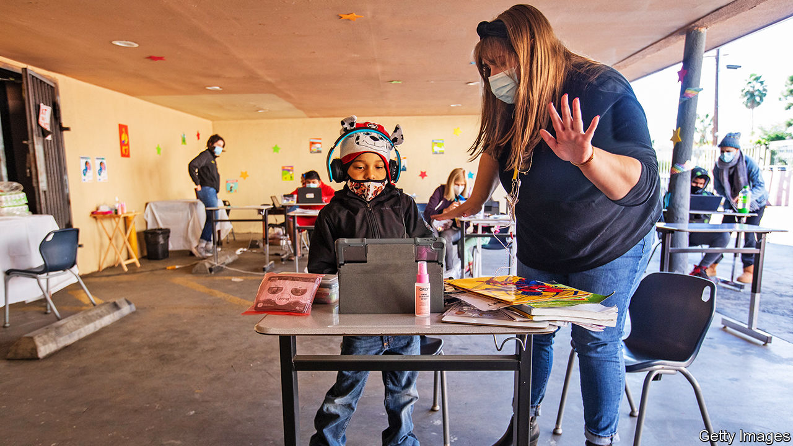

###### Obstacle coursework

# Why reopening schools in minority neighbourhoods is hard 

##### The children who have suffered most from closed schools will be last to go back 

 

> Jan 23rd 2021 


CLOSING PUBLIC-school buildings during the covid-19 epidemic has had clear academic consequences. McKinsey, a consultancy, reckons pupils are likely to lose between five and nine months of learning on average by the end of this school year. Non-white students, the study reckons, will be six to 12 months behind. Many people, including President Joe Biden, want children to return to the classroom. However, the pupils who have experienced the greatest learning loss will probably be the last to return.


According to the Understanding America Study at the University of Southern California, 68% of white parents want their children to return to school this academic year. However, only 36% of black parents and 50% of Hispanic parents feel the same way. Much of this difference stems from systemic problems existing before the pandemic which, if left unresolved, could expose black and Hispanic pupils to covid-19 at higher rates than their white peers.


Black and Hispanic Americans have many reasons to be even more afraid of covid-19 than white families. According to the Centres for Disease Control and Prevention, they are four times more likely to be hospitalised as a result of the virus and three times more likely to die than white Americans are.


This fear is compounded by lingering distrust of the medical system, resulting from past mistreatment of racial minorities and present-day discrimination. Alia McCants, a black parent in a suburb of New York City, says her decision-making was influenced by the “disproportionate impact” of covid-19 on her community. “I am much more cautious about exposure to the coronavirus because I know that the likelihood...that we would get the excellent care that a white family of similar means might get is less because we’re black.” Ms McCants and her husband decided to send their children to school in person in September, but reverted to remote learning when case rates began to rise in December.


As well as these concerns, many racial-minority families must contend with schools that have fewer resources to deal with the virus. Black and Hispanic pupils are more likely to attend low-income schools than their white peers. American schools are supported through a combination of federal, state, and local funding. Higher-income communities can typically raise more money per pupil through local property taxes.


Partly as a result of these funding disparities even before the pandemic, poor schools struggled with overcrowded facilities that lacked proper ventilation for sometimes windowless classrooms. Some teachers struggled to get hold of basic materials such as paper and pencils, with many resorting to their own money and fundraising websites like donorschoose.org to get the supplies they needed.


The epidemic has made these problems more urgent. According to the Learning Policy Institute, a think-tank, 10m pupils and 1m public school employees face heightened exposure to covid-19 as a result of defunct ventilation systems in public schools. Elizabeth Ramos, a teacher and union representative at Public School 72 in the Bronx, describes cold New York winter days when teachers and elementary pupils needed to keep windows open and wear coats to ensure adequate ventilation.


Fortunately, two covid-19 relief packages have provided additional funding for public schools: $13bn disbursed in spring 2020, and $54bn distributed in early January. Michael Griffith of the Learning Policy Institute says this additional funding will cover short-term pandemic needs, such as cleaning supplies and remote-learning technology, but not the long-term needs that have also been exposed. He estimates that schools will need an additional $110bn or so from the federal government to address learning loss: $75bn to pay for extra school days and $36bn for small-group tutoring. He also estimates that schools will need an additional $72bn to repair ventilation systems. Mr Biden has recognised this need, pledging $130bn to support schools.


Future measures may also have to account for state revenue lost because of the virus. Kenneth Shores of the University of Delaware points to lessons from the American Recovery and Reinvestment Act, the bill passed in 2009 which included $100bn for education. The bill worked well for the first two years by providing schools with one federal dollar for every dollar lost in the recession. However, after that, the federal government “didn’t have the political willpower or support to keep funding going”, says Mr Shores. This occurred even though 29 states needed more than six years to recover to pre-recession funding levels, according to the Centre on Budget and Policy Priorities, a think-tank. As a result, school budgets were cut and pupils’ test scores fell.


Throughout the country schools are facing dips in pupil enrolment, which means a significant number of children may have dropped out. Mr Biden has promised to reopen most schools, from kindergarten to 8th grade (ages 12-13), within his first 100 days in office. But this plan must consider the worries of families and teachers, or teachers and pupils may not return. When Chicago public schools partially reopened on January 4th, less than half the teachers required to be there showed up. And the city teachers’ union is threatening to strike. ■

