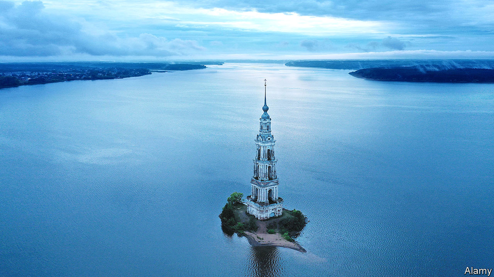

###### Heave-ho

# The grand, tragic history of the Volga 

##### Russia’s greatest river divides and defines the country 

 

> Jan 30th 2021 


The Volga. By Janet Hartley.Yale University Press; 400 pages; $35 and £25.


WITHOUT THE Volga, there would be no Russia. The final words of Janet Hartley’s book sound sweeping. But its 400 pages make the case powerfully.


Like much in Russia’s geography and history, the Volga is on a grand scale. The river basin is Europe’s largest. It is part of a grandiose scheme of waterways (built mostly by slave labour) that link the Baltic coast with the Arctic, the Black Sea and the Caspian. It has shaped the Russian (and Soviet) economy, culture and government. It was a vital barrier against the Nazis, who crucially failed to drive the Red Army out of Stalingrad and across it. Its hydro-electric power fuelled Stalin’s industrial revolution. Centuries before, expansion down the Volga to the shores of the Caspian had made Muscovy into the Russian empire.


Ms Hartley’s history begins with little-known states such as Khazaria (which adopted Judaism for strategic reasons); the Bolgar Khanate (nothing to do with Bulgaria but a distant predecessor of today’s Tatarstan); and the Rus principalities (which were not exactly Russian). Readers unfamiliar with these strands of the European past may find themselves concentrating hard and wishing for better maps.


Over the centuries, rulers in Moscow and St Petersburg took and held the Volga lands by means of force, bureaucracy, ideology and assimilation. Their rule was strikingly incompetent and arbitrary; only the Soviet regime that followed could cast a rose-tinted light on the cruel, capricious tsarist era that preceded it. Mass starvation after the civil war, the agonies of collectivisation, further famine in the 1930s, the cauldron of the second world war and the grotesque environmental injuries inflicted on the river make a depressing catalogue.


Art and literature depicted but also relieved the woes. The Volga—tranquil and picturesque, yet also magnificent and powerful—was a wellspring of early 19th-century Romanticism. It was both a “mother”, emblematic of Russia itself, and the backdrop for vivid injustice and suffering. Poets such as Nikolai Nekrasov, writers such as Maxim Gorky, and painters including Ilya Repin all invoked the river. So does the well-known “Song of the Volga Boatmen”, with its jolly “heave-ho” refrain—less jolly for the forced labourers who actually pulled barges up the vast river, with its wayward currents and sandbanks.


A retired professor of history at the London School of Economics, Ms Hartley is a distinguished Russianist and author of a similarly ambitious book about Siberia. This one is meticulously researched and sympathetically written, even if her austere academic prose may leave some readers thirsting for more first-hand reportage.


A graver flaw is that “The Volga”—like its predecessor—blurs the ethnic, linguistic and religious patchwork underlying Russian rule of the lands on the river’s shores. The Chuvash, Udmurt, Mari, Erzya and Moksha languages, and their speakers, get rather short shrift. The now-vestigial Cossacks and long-gone Volga Germans are afforded more of a look-in than modern Tatarstan’s intellectual and cultural ferment. The nearly-country of Idel-Ural, which united the region’s Turkic and Finno-Ugric peoples for a tantalising few weeks of independence in 1918, gets just one brief discussion. The modernising, liberal “Euro-Islam” that inspired it gets none.


Yet Idel-Ural’s leader, Sadri Maqsudi Arsal, escaped the Bolshevik conquest and became the intellectual inspiration for Kemal Ataturk’s Turkey. During the second world war a Tatar poet, Musa Calil, joined a Wehrmacht unit drawn from the Volga nationalities in order to subvert it, and was posthumously rehabilitated as a hero. Amid a plethora of lesser details, both are ignored here. The history and glory of Russia do not belong only to ethnic Russians, whatever some of them may say, and whatever some foreigners may believe. ■

