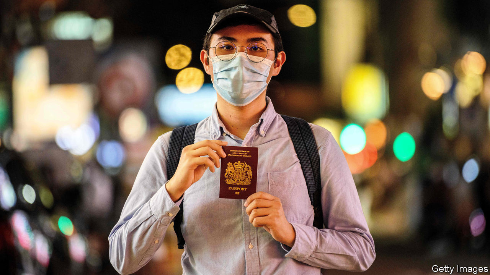

###### Migration

# Hong Kongers eye British citizenship but fear retaliation from China 

##### China voices fury at the opening of a new visa scheme 

 

> Jan 30th 2021 


FROM JANUARY 31st Hong Kongers are invited to apply for a new British National Overseas (BNO) visa that leads to citizenship. Peter Chan (not his real name), a photojournalist horrified by the impact a new national-security law has had on the city’s previously freewheeling press, will be among them. “If I have the opportunity to leave Hong Kong, I plan to take it,” he says.


The BNO passport created when Britain handed over Hong Kong to China in 1997 conferred few rights. But when China clamped down on the territory last year, that changed. The British government has offered a pathway that could lead to citizenship for the estimated 3m people who are eligible for BNO passports, plus their dependants. Before the protests, 167,000 Hong Kongers held BNO passports; by August last year, 612,000 did. Nobody knows how many will apply for the visa. The government’s central projection is 250,000-300,000 over five years, which would be the largest-ever movement of non-Europeans into Britain. By comparison, about 30,000 Ugandan Asians arrived in 1972-73.


On January 29th China’s foreign ministry issued a furious denunciation of the BNO scheme. It said Britain was trying to “turn a large number of Hong Kong people into second-class British citizens”. In London the Chinese embassy said Britain “would be going against its own promises seriously, interfering in China’s internal affairs, and violating international law and the basic norms governing international relations”.


China said it would no longer recognise the BNO passport as a valid document for either travel or identification.The practical effects of this on BNO passport-holders will be limited: they have other documents they can use to leave and enter the territory. But it may deter people from applying for the visa. And Regina Ip, a prominent pro-Beijing politician, argues that anyone who becomes British under the new policy should have to give up their Hong Kong passport. Dual citizenship is currently permitted. The row also marks a further deterioration in Britain’s relations with China.


With no initial English-language requirements or stringent points-based system, the scheme sits outside Britain’s main immigration pathway. “This is a hybrid policy: it’s both a visa route and also humanitarian in motive,” says Johnny Patterson of Hong Kong Watch. It is unusual, too, in that it enjoys support from across the political spectrum. The left approves of its moral content. For Tories, the stereotypical Hong Konger is the ideal migrant—hardworking, entrepreneurial, liberty-loving and loyal to a certain idea of Britain.


Two key groups of Hong Kongers are expected to apply. The first are people with young families and the wherewithal to leave. Some parents don’t want their children to attend school in Hong Kong, where the curriculum increasingly emphasises patriotism towards China and the Communist Party. Astronomical property prices in Hong Kong will ease the settlement of migrants in London, where homes are a snip by comparison. John Hu of John Hu Migration Consulting, which has a Cantonese-speaking team in London that helps resettle people, says that thanks to the BNO visa, business has doubled over the past year. The second group are politically vulnerable people like Mr Chan, though many of those involved in the 2019 anti-government protests were born after 1997 so unless their parents are BNO passport-holders, the new visa policy does not cover them.


People may not be China’s main focus of concern. Bank of America estimates that emigration from Hong Kong could trigger capital outflows of HK$280bn ($36bn) this year. China may not be averse to repopulating Hong Kong with loyalists from the mainland, but it will not want to say goodbye to billions of dollars.■


Editor’s note: This article has been updated after publication to include China’s attack on January 29th on the BNO scheme.

