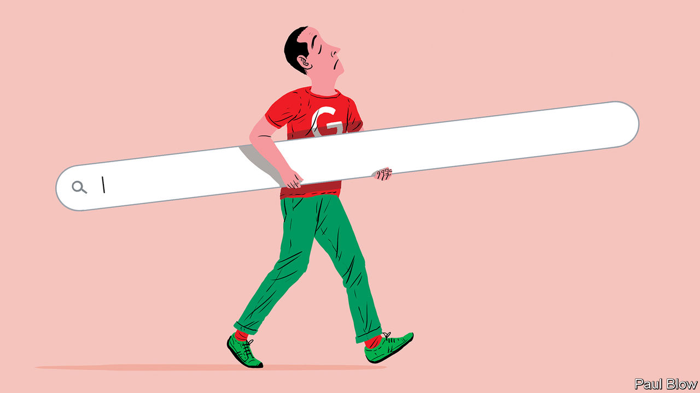

###### Google's Aussie rules

# Big tech down under 

##### Could Google quit Australia? 

 

> Jan 28th 2021 


IT WAS QUITE the dust-up. On January 22nd Mel Silva, Google’s managing director in Australia, claimed before the country’s Senate that a set of laws it was pondering were so damaging that, if they came into force, the firm would have “no real choice” but to withdraw its search engine from the country. Lawmakers condemned Ms Silva’s remarks as “blackmail”. Scott Morrison, the prime minister, headed for the nearest flagpole: “Australia makes our rules for things you can do in Australia,” he said. “We don’t respond to threats.”


At issue are new rules that would force big tech to pay publishers to display their news alongside search results and social-media posts. The argument has been simmering for years. News publishers, in Australia and elsewhere, have struggled in the past two decades as advertising money has flowed out of their pages and onto the internet—most of it to just two firms. Between them Google and Facebook account for perhaps 60% of worldwide digital-advertising revenues.


Publishers argue that news stories are widely shared on Facebook, and are at least one reason why people use Google’s search engine. That, they say, entitles them to a share of the two firms’ spoils. The tech giants retort that, although they do not pay publishers directly, they do send readers to their websites, and that is plenty.


Both sides invoke grand principles. Australia’s government argues that Google and Facebook are monopolies, and that laws are therefore the last resort for limiting their power. It argues that news, which costs money to produce, is vital for a healthy democracy. The tech firms say that paying publishers simply for linking to their stories would break a “fundamental principle” of the web—that anyone is free to link to anything they like. And they claim Australia’s proposed law is so broad as to make compliance unfeasibly fiddly; hence the talk of withdrawing entirely.


With a population of 26m, Australia accounted for $4bn of Google’s $162bn in revenue in 2019. Five years earlier, when Spain, a similarly middling market, passed a law requiring Google to pay for “snippets” of articles that appear in its News search, the online giant decided to yank that service from the country rather than comply.


Despite such ultimatums, big tech has been making concessions of late. In October Google used a folksy blog post from Sundar Pichai, its boss, to launch “News Showcase”, a $1bn scheme to pay some news publishers for their work. Facebook’s News Tab, launched in America in June and in Britain on January 26th, offers a similar revenue-sharing approach (The Economist is a participant). And a few days before Ms Silva addressed Australia’s Senate Google announced a deal with French publishers, after years of browbeating by French regulators. The specifics are private, though it probably involves payments for snippets rather than links.


It may be too late for a backroom arrangement à la française with Australian newsmen; the current row with Canberra is too public. An Australian law looks imminent. Google and Facebook say they are open to it in principle—just not to the Senate proposal’s sweeping specifics.


Whatever precedent the Aussies set is likely to be seized upon by other places and media groups. That may include America, where neither Joe Biden’s Democratic administration nor his Republican opponents are fans of big tech, and the EU, which passed a revenue-sharing directive in 2019 that member states must translate into national law. Google’s threat to flee Australia is just about credible (though $4bn in annual revenue is nothing to sniff at, even if it came at a cost of bigger cheques to the press). Departing America’s and Europe’s huge markets is not an option. ■

