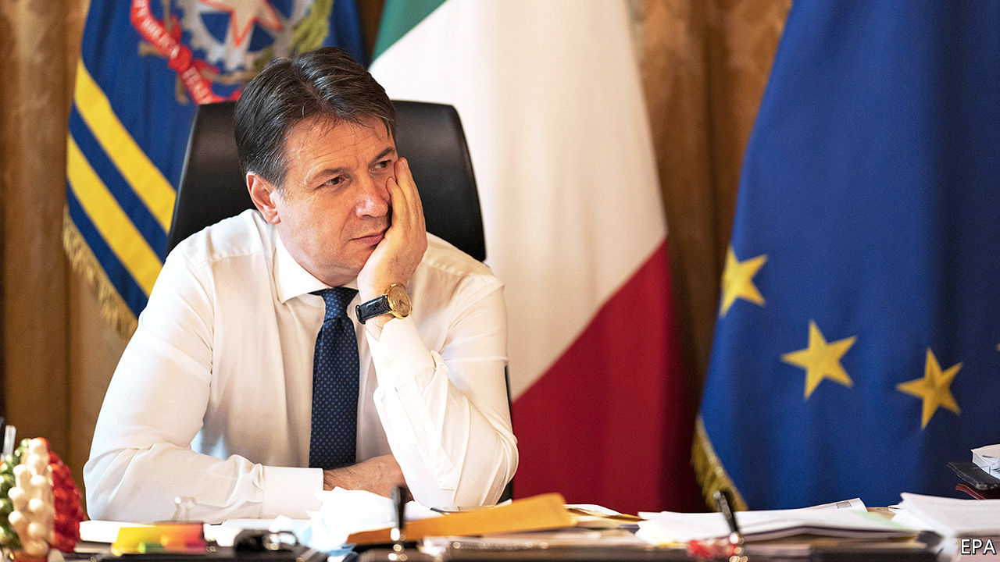

###### Going, going…

# Italy’s prime minister, Giuseppe Conte, resigns 

##### But he may not really be gone 

 

> Jan 26th 2021 


IN THE COLOURFUL jargon of Italian politics, the latest upheaval, which reached its latest turning-point on January 27th. That was when the president, Sergio Mattarella, began formal consultations with the country’s political leaders, is a crisi al buio, or “crisis in the dark”.


Sometimes, everything has been carefully settled in advance. The prime minister steps down, as Giuseppe Conte did the day before, but in the knowledge that he—there has yet to be a “she”—can count on majority support in parliament for a reshuffled cabinet.


No such certainty exists this time. Without the support of one of the smaller parties in his coalition, Italia Viva, Mr Conte no longer has a majority in the Senate, the upper house of parliament. Once he has spoken to the speakers of the two houses and the heads of each parliamentary group, President Mattarella may—or may not—ask Mr Conte to try to form his third government in three years. But even if a solution can be found soon, which does not look easy, the outcome could be a government that is shaky or explosive.


That gives the crisis a Europe-wide significance. Under the EU’s plans for recovery from the pandemic, Italy will get the biggest allocation, of more than €200bn ($240bn) in grants and loans, to be raised mostly by borrowing underwritten jointly by member states. Already doubts existed about Italy’s ability to put its windfall to good use. Its track record for taking advantage of European funds is dismal.


By September 30th, three months before the expiry of the EU’s current budget, Italy had yet to find an acceptable use for 14% of the “Structural and Investment” funds to which it was entitled. Portugal, Romania and Croatia had all, by contrast, allocated their respective quotas. “There is a great deal of fear with respect to the crises that could affect [Italy],” said David Sassoli, the Italian speaker of the European parliament. “The European recovery plan should be getting under way and all the countries ought to be concentrated on that.”


Mr Conte’s coalition, which includes the ideologically eclectic Five Star Movement (M5S), the centre-left Democratic Party (PD) and the more left-wing but smaller Free and Equal movement, had been in trouble since January 13th. That was when the ministers from a fourth coalition party, Italia Viva, left the cabinet, mainly in protest at the plans for spending Italy’s recovery funds.


Though polling a mere 3%, Italia Viva, led by a former prime minister, Matteo Renzi, still has enough senators to deprive the government of a majority in the upper house. And they were expected to defeat it in a vote on a key reform, of the justice system, on January 27th. Mr Conte decided to jump before he was pushed.


That should boost his chances of being asked by Mr Mattarella to try either to woo back Italia Viva or to replace it with independent or opposition lawmakers. A first snag is that Mr Conte has reportedly said he wants nothing more to do with Mr Renzi. And the same is true of some in the PD and M5S. That could, of course, be a bluff. But a second snag is that Mr Renzi’s many criticisms of the government’s performance suggest he may not be content with a reshuffle that gives his tiny party more clout. He may genuinely want Mr Conte’s head.


If so, Mr Conte’s only resort would be to construct a new majority. Silvio Berlusconi, whose conservative Forza Italia party occupies 54 of the seats in the 321-seat Senate, has signalled his backing for a broader coalition. But then another snag arises: the Five Stars refuse to ally with a party they view as incorrigibly sleazy. Mr Conte had hoped to lure over a posse of Christian Democrats. But—yet another snag—their party secretary was put under formal investigation earlier this month, suspected of helping the Calabrian mafia.


So another way out of the crisis could well be a new prime minister, heading either the previous coalition or a new one. But he or she would need to be acceptable to all concerned. If no such candidate were found, and with all alternatives exhausted, Mr Mattarella would have to call a snap election in the midst of a pandemic. That, polls suggest, could lead to a government of the hard-right Northern League and the Brothers of Italy, heirs of the neo-fascist movement. But an election is still the least likely solution. A reform, approved by a referendum last year, cut the number of seats in parliament by around a third. The current lawmakers’ instinct for self-preservation will surely mean that everything possible is done to avoid a ballot. ■

