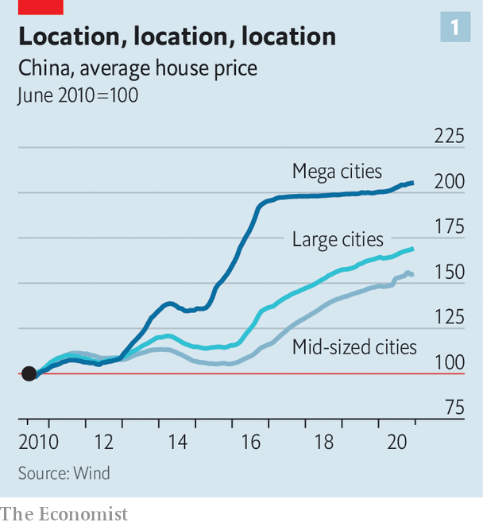
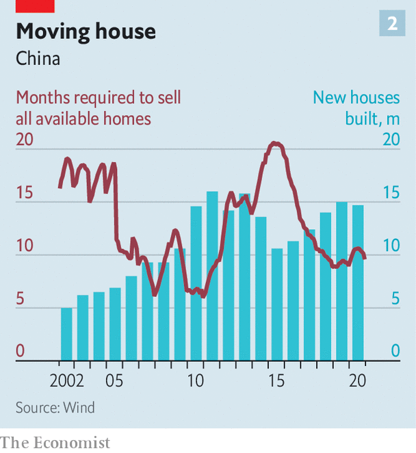

###### The great escape

# Can China’s long property boom hold? 

##### The country is building five times as many houses as America and Europe combined 

 

> Jan 25th 2021 


LOTTERY WINNERS normally win money. In China the big prize is being allowed to spend it. Demand for new homes in good locations is so high, and supply so limited, that several cities use lotteries to allocate them, some with odds as low as one in 60. When his number was chosen, John Chen, an engineer in Shanghai, had two minutes to decide whether to drop 9.6m yuan ($1.5m) on a house. “It emptied my bank account. But I did not hesitate,” he says. Yang Yang, a 38-year-old businessman in Hangzhou, lost out in three draws before finally winning one last spring. “It was even more nerve-racking than my university entrance exams,” he jokes.


Even being able to enter the housing lotteries is a matter of good luck, because entrants must be registered as residents of the booming cities, which places them on the right side of China’s wealth gap. By contrast, large swathes of the country have the opposite problem: overbuilt apartment blocks, sputtering economies and few people buying property. Hegang, a town near the border with Russia, briefly found itself in the spotlight after homes there were advertised for just 20,000 yuan, less than the cost of a square metre in Shanghai. It was an extreme example of the glut of empty homes in many small towns.


Similar splits are common around the world, with prices high in large cities and low in small towns. But the degree of the divergence in China, multiplied by the sheer size and growth of its market, means that understanding property is essential if you want to get to grips with what is happening in the economy. Every year China starts building about 15m new homes, more than quintuple the amount in America and Europe combined. The property sector—both the direct impact of construction and its indirect effect on everything from concrete to curtains—makes up a quarter of China’s GDP. The financial implications are profound, too. In 2021 Chinese developers are on the hook for more than $100bn in bond repayments, according to Moody’s, a rating agency. For the world as a whole, roughly a tenth of outstanding bank loans to non-financial clients have gone to China’s property sector, whether as financing for developers or mortgages for homebuyers.


One commonly heard view is that all this adds up to a ticking time-bomb. And some of the facts are alarming. Fully one-fifth of Chinese homes are vacant, finds a widely cited survey. Housing investment equates to about a tenth of GDP annually, higher than the prodigious levels reached in Japan before its bubble popped three decades ago. Debt has soared for buyers and builders alike. Evergrande, China’s biggest developer, has borrowed a cool $120bn, a 56-fold increase in the past decade alone.


Yet it is only fair to note that such concerns are nothing new. As far back as 2009 Jim Chanos, a hedge-fund manager, said China was “Dubai on steroids”, predicting that its property sector would implode spectacularly. Since then prices have doubled, and enough homes have been built for 250m people. The longevity of the boom suggests that the market is more complex than its depictions as a bubble suggest.


The main explanation for its success—or, put differently, its failure to collapse—is the skein of regulations aimed at forestalling the prophesies of doom. Some have long been in place, such as the rule that down-payments for mortgages must be at least 30% of the purchase price for a home. With so much equity in their houses, homeowners are strongly incentivised to make their monthly mortgage payments, limiting the risk of a vicious cycle of defaults, forced sales and collapsing prices. In many of the most populous cities demand is also tightly restricted, because a hukou—a local residency permit—is a prerequisite for buying a home.


As the property sector has swollen, the government has pledged to develop what it calls “a long-term mechanism” for stabilising prices and investment. The property market is, in its view, too important to be left to the market alone. In practice this has meant layering on ever more rules. Cities such as Shanghai and Hangzhou started requiring developers to run lotteries for new flats, with priority given to people who do not own homes. Many others have all but barred people from buying second homes. These often make for cat-and-mouse games. Since the second-home ban applies to families, not just individuals, some couples have obtained fake divorces in order to buy another house. On January 21st Shanghai ruled that divorcees must wait three years to count as first-time buyers if they had owned a home when married.

 


The government is also now reining in the most indebted real-estate firms. Late last year the central bank and the housing ministry said they would start assessing developers’ leverage on the basis of “three red lines”—one, for example, is that their liabilities should not exceed 70% of their assets. Only 11 of the biggest 100 developers would be given a passing grade on all three measures, according to Plenum, a consultancy. The others need to find a way to get inside the lines; if not, they will face strict caps on future financing.


The resulting dynamic offers a case study in how regulation changes the shape of the market. Some developers are working to pare their leverage by attracting new investors or by spinning off subsidiaries, such as their property-management arms. For many, though, the obvious first step is to boost cashflow by selling more houses more quickly, leading them to cut prices.

 


R&amp;F is one of the big developers feeling the pinch. At one of its new developments in Jiangmen, a city in the southern province of Guangdong, it has cut prices by 20% in recent months. Sales, once slow, have soared—averaging about 15 homes per day. Even on a weekday afternoon a steady flow of prospective customers walks gingerly around construction debris to check out the flats still being built. One agent, his hair coiffed like a South Korean pop idol, boasts that he alone sold 18m yuan worth of units in December, though that was only enough to rank third among his colleagues.

Beneath the placid surface


Viewed narrowly, the many interventions have worked. In the biggest cities prices have basically been flat in inflation-adjusted terms over the past four years. Annual property sales nationwide have remained at the same level during that time, while new starts have been broadly in line with sales. A scheme to demolish old rickety homes and give their owners cash to buy new ones helped mop up unsold units in small towns. It would take just about ten months to clear all inventory at the current sales rate. “The property sector really is healthier than it used to be. The government has so many levers now,” says Zhang Sisi of Jinan University in Guangzhou.


But this calm engenders a different kind of concern. The many rules have not just made for a healthier market; they have made the market. Take the price stability. When developers win land auctions in big cities, they must set prices within a range prescribed by the government. A perverse outcome is that new homes can be a third cheaper than second-hand ones in the same neighbourhoods. Hence yet another rule: to stop people flipping their new homes for a tidy profit, several major cities have slapped a penalty on owners who sell within five years of buying. The lotteries, meanwhile, act as quotas to dictate the size of the market. Prices may be under control, but much demand is simply going unmet.


From this vantage, the becalmed market begins to look less like a success story and more like a pressure cooker. So in yet another intervention, officials are trying to let steam out of the biggest cities by guiding people to smaller ones—specifically, in the clusters of satellite towns being built up just outside metropolises. These towns are linked to the cities by high-speed trains but have much lower thresholds for newcomers wanting a hukou. To make them attractive, the government is also investing more in hospitals and schools. “Sometimes it takes the education ministry, not the housing ministry, to fix problems in the housing market,” says Ms Zhang.


Developers seem to be responding to this policy push. The most fertile ground for the city clusters are four prosperous coastal provinces (Guangdong, Fujian, Zhejiang and Jiangsu). Last year these made up 34% of all property investment in China, compared with 26% a decade ago. Developers are “no longer buying up big parcels of land anywhere in the country”, says Xiao Wenxiao of CRIC Research, a consultancy. “Now they are focusing on smaller plots in prime areas.” The flow of new homes in China, in other words, appears to be better situated than the stock.


A key question, then, is just how much scope there still is for China’s housing stock to grow. A 22% vacancy rate—the result of a well-respected survey by the Southwestern University of Finance and Economics in 2017—would suggest that the market is more than saturated. China’s demographics also point to weakening demand. The working-age population, the cohort that buys the most homes, is already shrinking. And the pace of rural-to-urban migration, another big source of demand in cities, has started to slow, too.


Nothing about the Chinese housing market is ever so straightforward, though. The 22% vacancy rate largely reflects the overbuilding of small towns. In and around big cities vacancy rates may be less than 10%, low by international standards, according to China International Capital Corp, an investment bank. Much of the housing stock is still shabby. A tenth of flats in cities do not include their own toilet. And many among the growing middle class, having spent a good portion of the past year locked down, are deciding that they want slightly larger homes.


Totting this all up, the baseline forecast of China Index Academy, the country’s largest property-research organisation, is that housing sales will fall by 4% or so annually in the coming half-decade, going from roughly 15m units sold in 2020 to 13m in 2025. That would be a challenge for China; long a pillar of growth, the property sector would become a drag. At the same time, it would be a gradual slope down, not a collapse, for the once-vertiginous market. If you listen closely enough, the ticking of the time-bomb sounds a little fainter. ■

