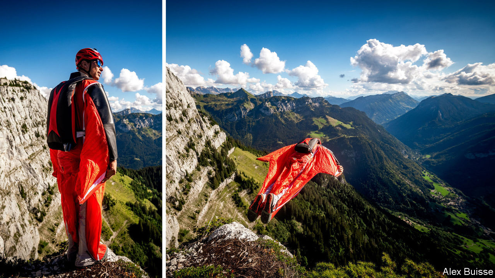
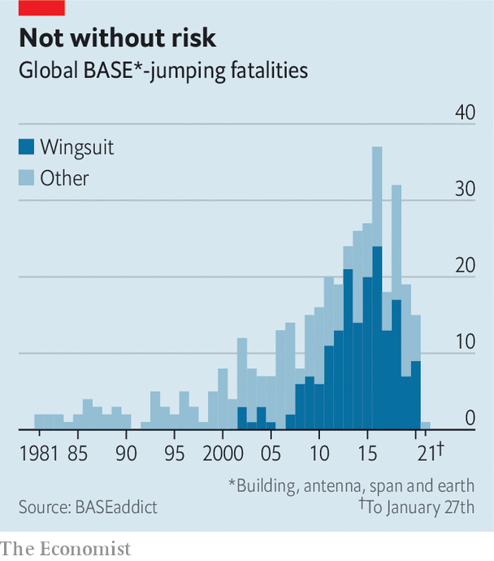
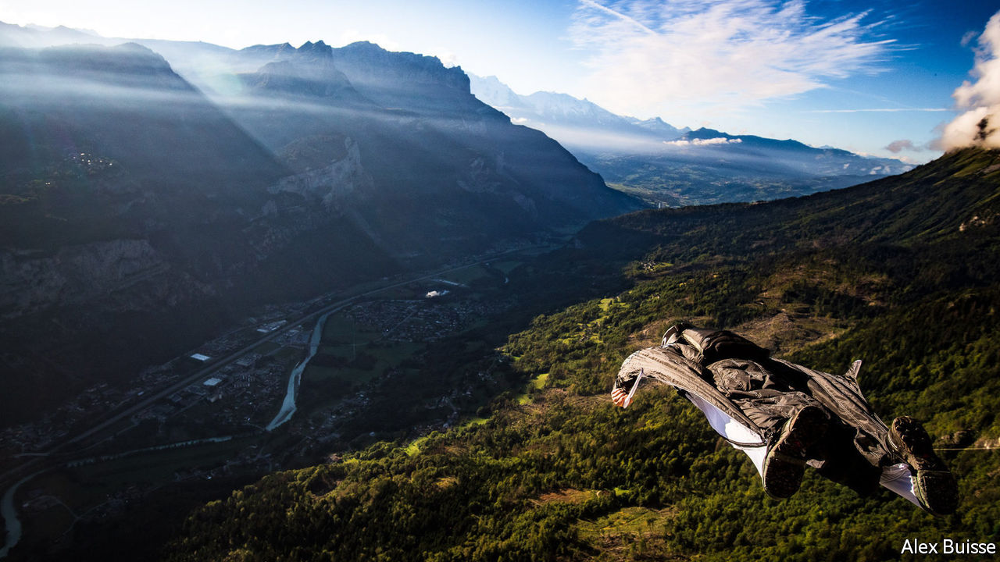

###### Last of the daredevils

# Why do some people risk their lives for fun? 

##### The pandemic has shown how risk-averse humans usually are. But there are always outliers 

 

> Jan 30th 2021 


LAURENT FRAT is standing on top of a ridge line in the French alps, preparing to leap down to the valley below. If something goes wrong, he will die. “If I can’t find the landing area it will find me,” he jokes. He claims not to be nervous, although he admits that he tries not to think about his family before he jumps. After checking that the photographer is ready, he is off, arms outstretched, head forward, leaping into the void.


As the air rushes into his nylon suit, it gives him a bit of lift, allowing him to feel as if he is flying (in reality, he is merely falling with style). He will descend 1,500 metres in around a minute before opening a parachute. While flying, he says, he feels “almost invincible”. For a minute or two he feels a sense of freedom that cannot be imagined otherwise: “You think about where you want to go and you go there.” For that minute of invincibility, Mr Frat has risked his life over a thousand times.


Mr Frat is a wingsuit BASE jumper. He jumps from cliffs, bridges and the like (BASE stands for building, antenna, span and earth) while wearing a “wingsuit”—a sort of nylon flying-squirrel get-up. The sport is among the most dangerous recreational activities known to man. Although no reliable figures are kept, more than 300 BASE jumpers have died in the past two decades. As the sport has grown, so has the number of deaths. In the town of Chamonix, though not the area around it, wingsuiting was banned in 2016 after five people died in the space of a few months. They included a Russian who failed to open his parachute and crashed into a building.


Yet the sport is surprisingly popular. Hike in the mountains around Chamonix on a clear, windless day and you are almost as likely to encounter somebody walking to an “exit point” with a parachute as you are to find rock climbers or picnickers. Open canopies are a common sight along certain roads. On a good day, a wingsuiter might make three or four jumps. It is another way to pass the hours; another thing to buy gear for; another way to bond with pals. It just entails a higher chance of becoming what some wingsuiters call a “meat missile”.

 


This past year, thanks to covid-19, humans have faced a radical increase in risk. Governments and individuals have decided to make huge personal and financial sacrifices to protect people from an increased chance of death. Once-unremarkable activities, such as eating at a restaurant or visiting your grandchildren, are suddenly fraught with the fear of death. The response to the pandemic has shown the extent to which humans are risk-averse—it has proved quite how far they are willing to go to avoid a chance of dying prematurely. So why would anyone jump off a cliff, and willingly expose themselves to it?


Risk-taking used to be easier to explain. Annie Edson Taylor was a 63-year-old schoolteacher when she decided to go over Niagara Falls in a barrel in 1901. She hoped to sell a book about the exploit. Evel Knievel jumped motorbikes over ramps, and eventually over a canyon in Idaho, to sell tickets to his shows. But these days there is less money in daredevilry. Red Bull, an energy-drinks company, sponsors many daredevils, but chafes at the suggestion it encourages anything dangerous. In any case its sponsorship is not that generous. Felix Baumgartner, who parachuted from a balloon at an altitude of 39km wearing a Red Bull helmet in 2012, made very little money from it.


Social networks such as Instagram and TikTok have made it possible for anyone to broadcast his or her dangerous exploits. On YouTube it is easy to find footage of wingsuit BASE jumpers “proximity flying” close to rocks (an especially dangerous niche of the sport) and climbers without ropes on sheer faces. Some clips show people taking even more ludicrous risks. Young Russian men dangle from antennae, thousands of feet up, without so much as a rope.

A fickle food


But any notoriety thus acquired is fleeting. Mr Baumgartner made international headlines; TikTok and YouTube daredevils do not, except when they die. In any case, many people happily do their stunts out of the view of cameras. Mr Frat, whose wife also BASE jumps, admits that he likes the reaction he gets talking about his hobby at parties. But he is not interested in becoming a superstar daredevil, and shies away from the extremely dangerous jumps that he would need to do to achieve that. He usually jumps without a helmet camera.

 


What he does is nonetheless very risky, as he knows. “Realistically”, says Mr Frat, “there is no safe wingsuit BASE jumping. There is no magic formula for staying safe.” He has made over 1,000 jumps without serious injury but he points out that nobody has made 10,000 yet. Anything—a slip on the cliff, an equipment failure, a miscalculation of the flight path—might make a jump his last.


Yet it is not the adrenalin rush of evading death that draws him in. “There is a bit of a misconception that we are all adrenalin junkies,” he says. In fact, he says he tries to “down-regulate” adrenalin. A pumping heart, a rush of fight-or-flight reaction, is not thrilling but terrifying. For Mr Frat, it is the joy and control of BASE jumping that is worth the risk that he will die.

 


According to Andreas Wilke, an evolutionary psychologist at Clarkson University in New York, some risk-takers are just foolish. Adolescent males especially, do silly things to show off. One study, in which researchers made young men wear VR goggles and walk across a simulated rickety bridge, found that they tended to cross faster in the presence of female spectators. Mr Wilke suggests that physical risk-taking sends a signal to a potential mate that the risk-taker is fit. (Lest this encourage more men to hurl themselves off cliffs, the research also shows that the value of this can be overstated: men overestimate the extent to which females value their engaging in non-heroic risk-taking, such as bungee jumping or risky sports, says a 2005 study by G. William Farthing, then of the University of Maine.)


BASE jumping does not conform to the pattern of youthful exuberance. The bulk of wingsuiters, as well as free solo climbers, extreme skiers and the like, are indeed men. But they tend to be in their 30s and 40s, possibly because learning to BASE jump is expensive. Many, such as Mr Frat, come across more like monks than hotheads. Before leaping from cliffs they train a good deal, by leaping from aeroplanes. Mr Frat studies maps and carries a laser rangefinder to scope out new cliffs. He studies the deaths of other wingsuiters, trying to understand where they went wrong. He carries a checklist: if a jump has too many sketchy parts, he will walk down the mountain again, even if his friends jump. He says if he dies, he would prefer it to be in a way that other wingsuiters who read the reports would not think that he had made a careless error.


People’s appetite for risk appears to be domain specific. People who enjoy jumping off cliffs will not necessarily be keen to put their money into risky investments, or take risks in their relationships. Even within seemingly similar domains, appetites to risk vary. Financial investment can look rather like gambling, but Mr Wilke’s research shows that professional investors perceive gambling as far riskier than most people do. Put into a Las Vegas casino, hedge-fund managers are more likely to behave like the characters in “The Big Short”—who forsake the card tables to research their investment positions—than they are like those of “The Wolf of Wall Street”, who gamble “like degenerates”.


According to Mr Wilke, what varies is not so much people’s appetite for risk so much as their assessment of it. Wingsuit jumpers and climbers recognise the dangers of what they do, but they trust in their abilities to mitigate the risks, and value the rewards highly. “You do the kind of things you’re not afraid of,” he says. That applies even to wingsuiters. Steph Davis, an American climber and another wingsuit BASE jumper, says that people who take the sorts of risks she takes—climbing a sheer mountain face without ropes, for example—do not see it as scary in the way outsiders do. She reckons her decisions at the top of a mountain are “often very conservative”. In her life outside BASE jumping and climbing, she says she is hardly frivolous. She is careful with money, and would not gamble, for instance. But just as gambling seems less risky if you have plenty of money to lose, so BASE jumping is less risky if you have trained, she says. “It’s a question of how much cushion you have.”

 


Even Ms Davis changed her behaviour in response to covid-19. She lives in Moab, a small, sporty town in Utah, where the local economy shut down in case there was a surge of infections. As the virus spread through America last spring, she quit BASE jumping. With so many people making economic sacrifices to stop the local hospital from being overwhelmed, “I thought it would be a little bit inappropriate to get hurt,” she says.

To know what life is worth


But when summer arrived and the virus seemed to have receded, she went back to the mountains. In the end, wingsuiters like Ms Davis and Mr Frat think that risk is a necessary part of life. “I don’t think that we have evolved to live the way we’re living right now,” suggests Ms Davis. “We have evolved to deal with natural stress. People had to hunt for food, find shelter, defend themselves against threats—taking decisive actions, moving your body,” she says. In general we may try to minimise risk. Yet if we took no risks, and never did anything reckless, we would live less happy lives.


Ms Davis’s hobby has cost her dearly. In 2013 her husband, Mario Richard, another wingsuiter, was killed in a jump in Italy. She briefly quit BASE jumping then. But eventually she decided she did not want simply to endure life—she wanted to enjoy it. Four months later, on New Year’s Eve, she headed to another cliff in Arizona that the pair had previously jumped together on New Year’s Eve before. She was scared, but when she pushed off, she felt a sense of release. “There is no way to avoid risk in life,” she later said. “The real risk is in making your life small.” The coronavirus has shown how interdependent people are. If you catch a deadly virus, you endanger not just yourself but others. But humans crave freedom, not just security. When you jump off a cliff you can believe, if only for a minute or two, that you are on your own. ■


Dig deeper


All our stories relating to the pandemic and the vaccines can be found on our . You will also find trackers showing ,  and the virus’s spread across  and .

