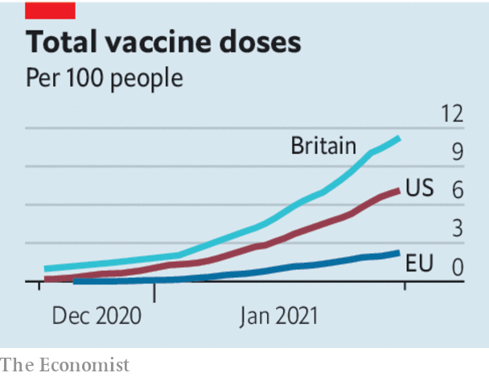

###### Europe’s vaccine roll-out

# Europe needs quicker vaccinations and more stimulus 

##### Vaccine protectionism is not the answer 

 

> Jan 30th 2021 


THE MOOD in the European Union is grim. Only 2% of its people have been vaccinated, compared with 7% in America and 11% in Britain (see ). The slower the roll-out, the more die and the greater the economic harm will be.


Hence news that AstraZeneca (AZ), an Anglo-Swedish vaccine-maker, may supply less than 40% of the doses the EU expected in the first quarter has sparked fury. Amid the recriminations, politicians are arguing that, if AZ refuses to make up some of the shortfall with supplies from its plants in Britain, then the EU should retaliate by stopping exports to Britain from plants in continental Europe. That would be a grave error. There are better ways for Europe to speed up vaccination. They need to be taken as urgently as efforts to stop another economic slump.


Europe’s problems stem partly from bad luck. One of the vaccines it ordered suffered setbacks in clinical trials. Others have hit teething problems in production. But they are also self-inflicted. The European Commission took charge of buying vaccines, but it was inexperienced and slow, signing deals months after Britain. It got bogged down in haggling with drugs firms over liability and price—mere details in a pandemic. The contract with AZ is confidential, but it seems to stipulate only that the firm makes best efforts to supply doses.

 


Threatening drugs firms and nations is a way to vent frustration, but it is dangerous. Were the EU to embargo supplies of the Pfizer vaccine, it would prevent Britons from receiving their second dose, because Britain has delayed the booster. Were every country in the intricate vaccine supply chain to threaten trade in everything from specialised glass to syringes, global vaccine supplies could choke. The EU would be sabotaging its claim to stand for the rule of law, the ultimate source of its authority. It would do better to focus on ironing out vaccine logistics, to offer firms help and to consider adopting the British strategy of delaying the second dose until supplies are more plentiful.


The economic consequences of Europe’s vaccine lag also need to be dealt with urgently. Levels of economic activity will suffer in the first half of this year, and the recovery will be pushed back still further. That will impose more pain on workers and firms, and also raises the risk of prolonged stagnation. Low growth and low inflation could become a permanent feature of the euro area, rather as they are in Japan. The IMF’s new forecasts suggest that the euro-zone economy will remain 6% below its pre-covid trend by the end of this year (see ). Investors expect inflation in five years’ time to languish at a puny 1% or so. By contrast America’s output is expected to be back on track by then, with inflation of over 2%.


You might think that Europe’s leaders would be unveiling big spending plans. Across the Atlantic, the White House hopes to unleash nearly $2trn in stimulus, stoking fears of overheating later in the year. The EU has agreed on a €750bn ($900bn) recovery fund, to be financed through jointly issued debt. But this is being disbursed too slowly, so there is still too little stimulus in the euro area. Its fiscal deficit is forecast to narrow by more than two percentage points this year, in part as temporary measures expire. There is no point in relying on the European Central Bank to step in: it has run out of ammunition and has little capacity to stimulate the economy more.


To avoid becoming like Japan, Europe must spend like America. This is sinking in at last. Helge Braun, an adviser to Angela Merkel, this week warned that Germany’s “debt brake”, which aims to limit public borrowing, may not be restored for years. Bruno Le Maire, France’s finance minister, has called for Europe’s budget rules to be “re-evaluated to take into account reality”. Still, the danger is that Europe takes too long to respond. Ponderous decision-making has already slowed Europe’s vaccine roll-out. That will take a toll in lives and livelihoods. All the more reason to ensure that red tape does not delay the recovery, too.■


Dig deeper


All our stories relating to the pandemic and the vaccines can be found on our . You will also find trackers showing ,  and the virus’s spread across  and .

