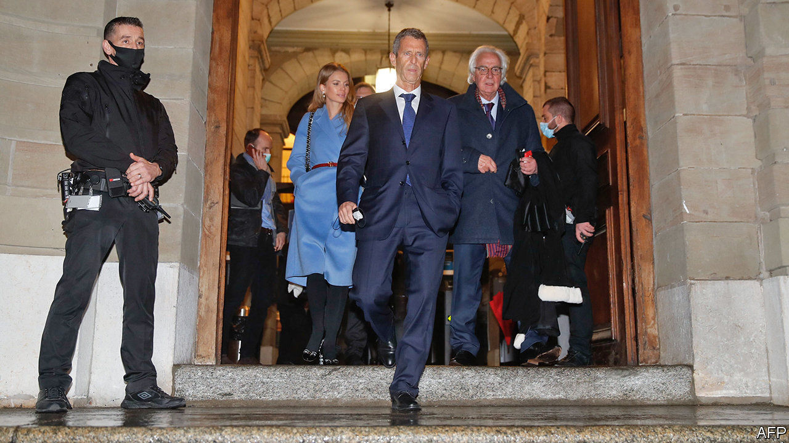

###### A tale of two billionaires

# Beny Steinmetz gets jail, Dan Gertler a reprieve 

##### Two mining tycoons accused of shady dealings meet very different fates 

 

> Jan 28th 2021 


IN DECEMBER 2017 Donald Trump’s administration imposed financial sanctions on Dan Gertler. That came as a shock to the government of Joseph Kabila, who was then the president of the Democratic Republic of Congo. Mr Gertler, who was named alongside several allegedly crooked politicians and businessmen, was one of Mr Kabila’s closest friends. He was also a middleman who had sold much of Congo’s wealth in minerals to the world since arriving there in the wake of war in 1997.


America’s Treasury department said that Mr Gertler had “amassed his fortune through hundreds of millions of dollars’ worth of opaque and corrupt mining and oil deals”. Between 2010 and 2012 alone Congo had “lost over $1.36 billion in revenues from the underpricing of mining assets that were sold to offshore companies linked to” the Israeli billionaire, it said. The sanctions froze Mr Gertler’s bank accounts and prevented any firm from doing business with him in dollars.


In a late Christmas gift, Mr Trump’s administration seems to have undone that work. On January 24th the Sentry, an anti-corruption watchdog based in Washington, revealed that in its last days Mr Trump’s administration had granted Mr Gertler a special licence to do business in dollars. The licence is, legally, a “specific” one which allows only certain activities. But unusually it seems to allow Mr Gertler to do almost anything, for a period of a year. Mr Gertler, who denies wrongdoing, had lobbied hard for the waiver; among others he hired to press his case was Alan Dershowitz, a celebrity lawyer who has also defended Mr Trump.


The news came just days after another Israeli billionaire, Beny Steinmetz, who also has French citizenship, was convicted in a Swiss court of paying bribes to gain access to Simandou, an iron-ore seam in Guinea. His conviction (he is appealing) brings to an end a sordid story that came to light in part thanks to documents collected by Mamadie Touré, the youngest of the four wives of Lansana Conté, Guinea’s president until his death in 2008, through whom bribes had been funnelled. After her husband died she had fled to Jacksonville, Florida, where the FBI acquired the documents.


On the face of it, the two Israeli billionaires, both involved in questionable deals in mining in Africa, seem to have met different fates. But Mr Steinmetz’s conviction will have rattled Mr Gertler, who, despite the sanctions, has never been charged with any crime. Since being put on the sanctions list, Mr Gertler has found it much harder to do business, even if he has managed to keep working. Glencore, an Anglo-Swiss commodities trader, initially stopped its payments to him. When he sued in a Congolese court, the firm decided to pay him royalties—roughly 2.5% of the sales from its Congolese mines—in euros, rather than risk its Congolese mining business being taken away by a court order.


Yet the billionaire’s luck may be running out. His friend and sponsor, Mr Kabila, is losing his grip. When he conceded the presidency in 2019, Mr Kabila kept control of the majority in parliament, and had allies in several key posts. On January 27th Congo’s national assembly voted to eject the prime minister, Sylvestre Ilunga Ilunkamba. This clears the way for the new president, Félix Tshisekedi, to appoint more of his own people to ministries and agencies, including Gécamines, the state mining group that gave Mr Gertler his concessions. If Mr Tshisekedi succeeds in consolidating his grip over Congo’s minerals, he could press Gécamines to take away Mr Gertler’s mines and royalties.


That is why the new sanctions waiver is so useful, reckons Elisabeth Caesans of Resource Matters, a Brussels-based research group. In November Mr Gertler produced a bizarre video in which he proposed to sell some of his royalty rights to ordinary Congolese people (two months later, the details remain unclear). This, said Mr Gertler, is an invitation to “come and enjoy the wealth of the copper and cobalt of the DRC”. It may, in fact, be an insurance policy. By selling a lot of Congolese people a stake in his projects, he reduces the chance of his contracts being cancelled. With his new licence, thanks to Mr Trump, he can now be paid in dollars.


In theory, Joe Biden’s administration could revoke the licence as easily as Mr Trump issued it. Yet that risks exposing the Treasury to a lawsuit, says Brad Brooks-Rubin of the Sentry. Mr Gertler could claim that taking his licence away would be capricious. Yet as Mr Steinmetz’s case shows, losing his licence is not the only risk that Mr Gertler faces if the allegations of corruption persist. The sanctions imposed on him came about after years of campaigning by anti-corruption NGOs. They show no signs of being ready to forgive or forget. ■

