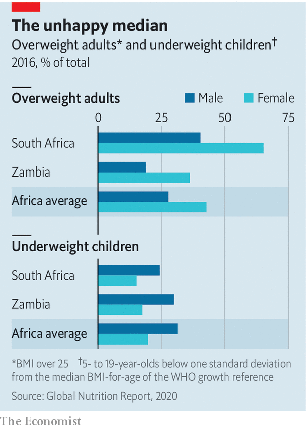

###### Feast and famine

# Why obesity is spreading across Africa 

##### And why it often co-exists with malnutrition 

 

> Jan 30th 2021 


EVERY WEDNESDAY women in villages around Monze, Zambia, meet to swap recipes. Tables are lined up in a shady spot, covered in fluorescent mats and piled with tupperware. Each dish is introduced alongside its health benefits: porridge with moringa powder is perfect for babies, groundnut butter is for “bodybuilding”. When three types of soyabean sausages are presented there is a pause and much laughter. These are to “build the family”.


The meetings aim to prevent undernourishment. Seemingly paradoxically, they also aim to prevent obesity by showing farmers a variety of goods they can cook without venturing to shops stocked with processed food. Allan Mulando, from the UN’s World Food Programme, which helps organise the meet-ups, points to a small tray of local produce. “Everything required is here,” he says.


In the rich world children who do not finish their meals are often scolded and told that there are people starving in Africa. In fact, the number of obese people in the region is growing, too. This is because, before covid-19 struck, average incomes had risen and more people had moved to cities, where they acquired a taste for junk food. Expanding waists are linked to long-term health problems such as diabetes and high blood pressure. The pandemic, which is especially dangerous for the overweight, makes the issue even more pressing.


Development wonks have long worried about middle-income South Africa, where 40% of women and 15% of men are obese, which is defined as having a body-mass index (BMI) of 30 or more. Much of the rest of the region is heading in the same direction, apart from a few of the very poorest countries such as Chad and Mali. In Zambia, for example, 35% of women and 20% of men are overweight, meaning they have a BMI above 25. More children are getting fat, too.


Processed food drives the obesity epidemic in cities. As the hard-up take jobs far from home, they are eating outside their homes as much as the rich do. Many flock to street stalls that hawk chips, sweets and pre-prepared millet and sorghum. Junk food is everywhere. A survey found that 25% of children aged between six months and five years in Niger had scarfed at least one packaged snack or drink in the previous 24 hours. It was 30% in Burkina Faso, and over 40% in Mali and Ivory Coast.


Few people are educated about the risks of junk food. Often poor mothers feed babies fizzy drinks and sugary juices alongside breast milk. They also snack on cheap crisps and biscuits. Junk food is “exciting for people, it’s new, it’s convenient,” says Fathima Abdoola, a nutritionist in Lusaka, Zambia’s capital.


In many cases a healthy diet is out of reach, even in the countryside. In Monze farmers often sell valuable crops like legumes and vegetables for cash and survive on nshima, a traditional maize porridge. A day’s worth of nutritious food, including fruit, milk and meat, costs about 70% of the average daily household income per person in sub-Saharan Africa.


The World Health Organisation reckons that 7% of people in Africa had diabetes in 2014, which was more than double the rate in 1980. The prevalence of high blood pressure has risen too. Chronic diseases not only harm people. They also make them less productive, and therefore poorer than they would otherwise be.


Rising obesity does not mean that hunger has been banished. About 30% of boys and 20% of girls aged five to 19 in Africa are still underweight (see chart). Policymakers warn of a “double burden of malnutrition”, where hunger and obesity co-exist within the same village or even the same household. Joachim von Braun at the University of Bonn takes the example of an overweight mother who saves time and money eating junk food but has an underweight child.

 


In parts of the continent people think corpulence is beautiful and associate it with wealth. A study in Uganda found that fat people find it easier to get credit. Some wealthy city folk reject healthy local produce, such as okra, as “village food”, and gorge on burgers instead.


Tackling Africa’s weight problem will require many approaches. Children need to be taught about nutrition. Packaged food needs better labels. Cities need pavements so people can walk or jog without being run down by buses. Christopher Murray of the University of Washington reckons there is an inverted U-shaped relationship between income and obesity. Millions of people have pulled themselves out of poverty, where their challenge was getting enough calories to stay alive. But they are not yet rich enough to eat healthy food and keep fit. If waistlines are to shrink, economies will have to grow fatter. ■

