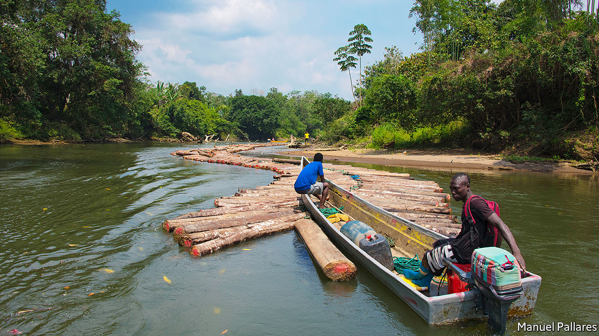
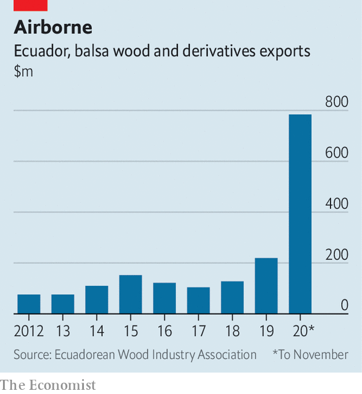
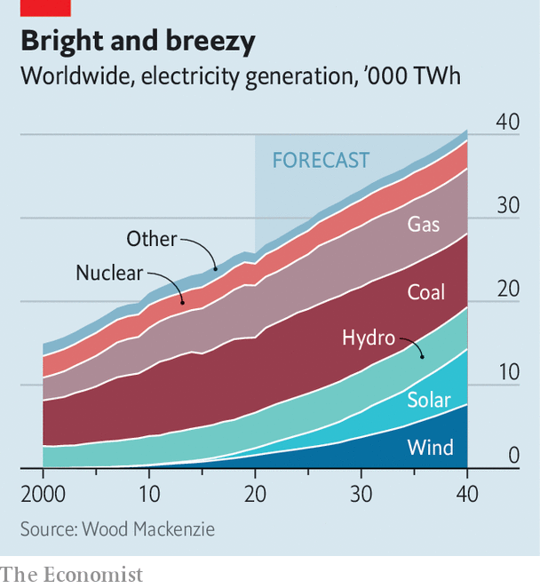

###### A worrying windfall

# The wind-power boom set off a scramble for balsa wood in Ecuador 

##### It has had unintended consequences 

 

> Jan 30th 2021 


IN LATE 2019 loggers started arriving in Ewegono, a village of nine indigenous Waorani families on the Curaray river in the Ecuadorean Amazon. They were looking for balsa, a fast-growing species of tree whose wood is used in blades for wind-power turbines. There was a global shortage. At first, villagers “grabbed chainsaws, axes and machetes to cut it down”, says Saúl Nihua, Ewegono’s leader. The pay could be $150 a day, a fortune in a region where most people have no jobs.


Soon the harvest became a free-for-all. Some loggers got permits with the help of the Waorani, but others forged them and invaded the indigenous reserve. Many took truckloads of wood without paying their workers. People from less remote places cut all the balsa they could find, stacking it along the road to Arajuno, the nearest town, says Mr Nihua. Buyers in trucks paid as little as $1.50 per tree. Uncontrolled logging degraded the forest. “They’ve killed off vegetation tremendously...without respecting legal limits,” says Mr Nihua, who partly blames himself. He encouraged his fellow Waorani to earn money from the coveted timber. The influx of cash and liquor fuelled family violence.


The origin of the crisis lies oceans away, in growing demand for wind power from the world’s largest economies. Thanks to ambitious targets to reduce the use of fossil fuels and technology that is bringing down turbine prices, global wind-power capacity has been increasing by 9% a year over the past decade. In 2020 new installed capacity surged by 24% to a record 78GW. Wind farms in China and the United States, which made up 60% of that demand, were rushing to install them before tax credits and subsidies expired. “It was like the end of a gold rush,” says a China-based representative of a Western turbine maker.


Unlike gold, wind turbines benefit the whole world, not just their owners. They are an indispensable technology for phasing out fossil fuels. But “the sudden surge in demand put enormous strain on the entire wind-industry supply chain,” says Shashi Barla of Wood Mackenzie, a consultancy. Wind fever caused the biggest problems in Ecuador, which provides more than 75% of the world’s balsa. The word is Spanish for “raft”.


A stiff, light wood that is also used in model aeroplanes and real aircraft, balsa goes into the core of a blade, where it is sandwiched between two fibreglass “skins” to add strength. Windmills built in the 1980s had 15-metre (49-foot) blades and could generate 0.05MW of electricity. Now, an offshore wind turbine with blades more than 100 metres long generates up to 14MW. Bigger blades require more balsa. Engineers at the National Renewable Energy Laboratory in the United States have calculated that a 100-metre blade requires 150 cubic metres (5,300 cubic feet) of balsa wood, or several tonnes.


Balsa trees reach optimal density in just five to seven years, which has helped suppliers cope with rising demand. Leading turbine manufacturers like Vestas in Denmark and Siemens Gamesa, in Spain, get most of their wood (along with foam, a less popular substitute) from three core-materials suppliers. 3A Composites, a Swiss firm, has more than 10,000 hectares (25,000 acres) of balsa plantations in Ecuador’s coastal lowlands. Gurit (also Swiss) and Diab (Swedish) depend on independent suppliers and farmers growing balsa along with other crops, to whom they give seeds and training.


It is harder to predict demand for balsa than for, say, Christmas trees. As a result, says Ray Lewis of Diab, “there has always been a bit of a balsa crisis.” Rising demand in the mid-2000s led to new plantations. But in 2011 turbine installations slowed sharply due in part to tighter regulations and a slower economy in China. Balsa prices plummeted. Growers planted less of it in Ecuador.

 


The most recent crisis was different. Demand, which revived in 2018, outstripped the supply of plantation-grown balsa by a lot, not a little. The price doubled from mid-2019 to mid-2020. In 2019 Ecuador exported $219m-worth of balsa wood, 30% more than the previous record in 2015 (see chart). In the first 11 months of 2020, it exported balsa worth $784m. Diab sold balsa for $1,800 per cubic metre in 2020, three times what it had in 2018.

Easterly wind


The main source of new demand was China, which has built more turbines than any other country. In 2006 it had just 2.6GW of installed capacity, compared with 21GW in Germany and 12GW in the United States. By 2019, when Germany had 61GW and the United States had 105GW, China had blown past both, to 236GW. At the end of last year China’s president, Xi Jinping, announced plans to reach 1,200GW of wind and solar capacity by 2030.


Chinese turbine manufacturers such as Goldwind and Envision, founded in 1998 and 2007 respectively, now have nearly 30% of global market share. They have erected turbines in dozens of countries. At first they used the same handful of Western blademakers and core-material suppliers as their competitors, but before long Chinese firms had edged into all levels of the supply chain. Sino Composite bought a stake in Cobalsa, a long-established Ecuadorean balsa firm.


The rising price of balsa also lured middlemen “like bees to a honeypot”, says Mr Lewis. A 40-year veteran of the wind industry, he got emails from companies he had never heard of offering to sell him truckloads of balsa. He ignored them. Chinese firms, though, were aggressive buyers. Some set up roadside sawmills. More than 75% of Ecuador’s balsa exports in the first 11 months of 2020 ended up in China. Despite having one of its best years ever, Plantabal, 3A’s Ecuadorean subsidiary, saw its share of balsa exports drop from 20-25% to 8%, while Diab’s fell from 15% to 5-6%.

 


The balsa boom, and the bust that has now followed, recall the rush to exploit rubber in the Amazon at the beginning of the 20th century. Rubber-tappers employed in slave-like conditions supplied industrialising Europe and the United States until production shifted to Asia, leaving them even more wretched. Indigenous Ecuadoreans have more protections, but are still vulnerable to exploitation. Like miners and oil-drillers before them, balseros “took advantage” of indigenous poverty and naivety, says Mr Nihua. The Waorani have been in contact with society only since the 1950s.


Often payment from loggers was partly in the form of liquor or marijuana; that encouraged drug abuse and violence, which were already big problems. Gilberto Nenquimo, the president of the Waorani Nation of Ecuador (NAWE), says that his brother-in-law was murdered with a chainsaw in a dispute over balsa.


Overlogging was another result. Balsa trees get less regulatory protection than older, rarer trees. Fast-growing “pioneer species” can be chopped down almost anywhere, including in the rainforest, using simplified “collection permits”. Balsa taken illegally—without legitimate permits or from protected areas like Yasuní National Park, which is home to uncontacted tribes—can be “laundered” by mixing it with other wood, says a customs agent. At the height of the frenzy, loggers extracted trees too young to be suitable for blademaking or shipped balsa to China without drying it, which meant it rotted on the way. The environment ministry boasts that it checked 1.4m cubic metres of balsa in 2020, twice as much as in 2019, and confiscated four times as much. But the total amount seized was less than 4,000 cubic metres.


Balsa is not an important store of carbon like bigger trees in the Amazon, but unregulated logging encourages traffic, hunting and extraction of species besides balsa. Denuded riverfronts raise the risk of flooding. The Global Forest Watch, an online platform that uses satellite data to track deforestation, recorded an “unusually high” number of “tree-cover loss alerts” in Ecuador in the second half of 2020, concentrated in the Amazon region. Land is Life, an NGO, says that extraction of balsa is partly to blame.


After several assemblies, the Waorani decided in October to kick out the loggers. The Wampís, another indigenous group that lives on a 1.3m-hectare territory on the border of Ecuador and Peru, made the same decision. When their guests refused to leave, the tribe seized seven boatloads of wood. The loggers retaliated by holding 19 Wampís hostage at a river crossing on December 2nd. They were released later that day, after Peruvian authorities persuaded the tribe to hand over the wood.


To get to Ewegono from Puyo, you zigzag down a narrow road to Arajuno, past two large sawmills. (One, called Hessental, was built in 2018 by a Chinese businessman, corporate records show.) Then, from a tiny port on the Curaray river where all that remains of a logging camp are mounds of sawdust and rubbish, you board a peke-peke, a wooden canoe with a trolling motor. Loggers left Ewegono just before The Economist arrived in December, but signs of the balsa boom were still visible: a new social hall, a satellite dish and sawdust outlining a football pitch.


The bust had clearly begun. Piles of balsa were stacked messily near the river. The price of balsa had fallen by half because Chinese turbine companies halted their work until after Chinese new year in February. Villagers were collecting donations for a man who had burned himself in a drunken domestic dispute. On a scrubby river island stripped of most trees, locals were growing maize. “Three years ago, this was full of balsa,” said Johnny Tocari, of NAWE. A few scrawny balsa stalks, identifiable by their heart-shaped leaves, had started to reclaim the banks.

Fresh blades


There is a chance that last year’s balsa boom will be the last. The shortage accelerated a shift to blade cores made partly or completely of PET, a synthetic foam that is cheaper but was long considered inferior. After Vestas, the world’s largest turbine-maker, introduced the first all-PET blade designs, others began to adopt them. In 2020, “all the CEOs had to do a second bill of materials” that excluded balsa, says Mr Lewis. “Now their success depends on their ability to switch.”


Wood Mackenzie forecasts that the share of PET will increase from 20% in 2018 to more than 55% by 2023, with demand for balsa staying stable. Chinese blademakers will continue to use it in the short term, since they have yet to make PET price-competitive, says the China-based representative. Balsa’s long-term future as a blade component depends in part on whether the problems Ecuador has experienced over the past couple of years can be solved.


Ecuadorean officials and indigenous folk hope so. In November, after news reports about social and environmental damage from the balsa boom, the environment ministry excluded balsa from the list of the fast-growing species that can be logged with simplified permits. It is drafting stricter rules for how it can be harvested from forests.


The Waorani plan to start a co-operative to harvest balsa sustainably and sell it at fair prices to a lumber plant in Guayaquil. Similar initiatives are springing up across the region, some funded by NGOs like the Nature Conservancy, others by balsa exporters like Plantabal. They hope that consumers of green energy will care enough to insist on high social and environmental standards. “Would a person in Stockholm charging an electric car with energy generated from wood bought illegally in the Amazon feel right about that?” wonders Ramón del Pino, Plantabal’s CEO. The answer is probably no. The question is whether drivers in Beijing will feel the same. ■


For more coverage of climate change, register for The Climate Issue, our fortnightly , or visit our 

