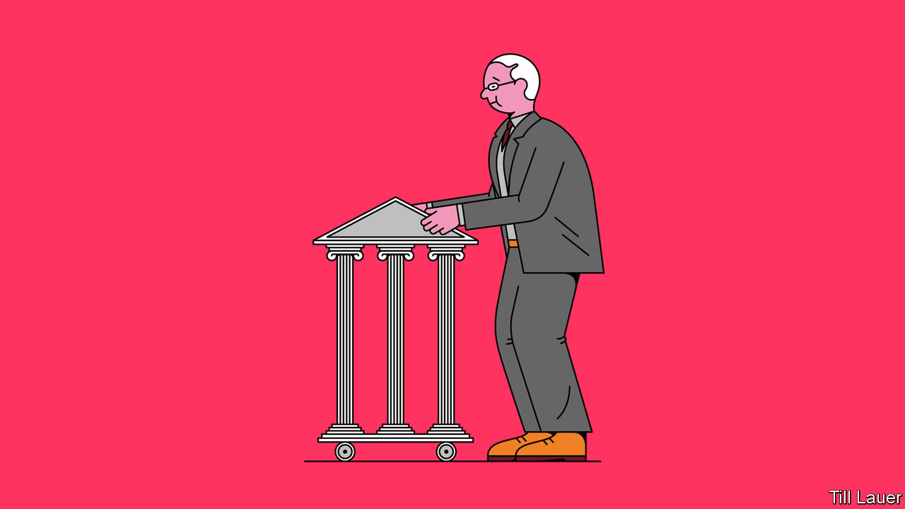

###### Banyan

# The surprising choice to lead Vietnam’s Communist Party 

##### Nguyen Phu Trong wins an unprecedented third term at an unprecedented age 

 

> Feb 4th 2021 


WHEN COMPARED with the vibrant bustle and chaos in the rest of Hanoi—where drag queens perform for rapturous audiences and break-dancers throw down moves on the city’s pavements—the five-yearly congress of the Communist Party of Vietnam could not have stood in starker contrast. The exactly spaced potted palms and bouquets; the serried ranks of 1,600-odd delegates (few of them women) all dutifully raising red cards to vote; even the ban on delegates meeting to chat in the evening: everything was arranged to present a narrative of conformity, calm and consensual order within one of the world’s most secretive political organisations.


And yet the main outcome of the congress appears, on the face of things, anything but orthodox. The party has tended to disapprove of the kind of personal power that Xi Jinping has gathered next door in China. Rather, authority is spread among the four “pillars” of the government: the general secretary of the party, the prime minister, the president and the speaker of the national assembly. At the previous congress in 2016 it was unusual enough that the general secretary, Nguyen Phu Trong, saw off a powerful reformist rival to secure a second term—especially since he was well over 65, the usual age limit for re-election to the Politburo. He then also assumed the position of president on the death of the incumbent in 2018, compressing four pillars to three.


Almost certainly the outgoing prime minister, Nguyen Xuan Phuc, fancied his chances of succeeding Mr Trong as general secretary, the most important of the top four posts. Mr Phuc has overseen an impressive campaign against the covid-19 pandemic, despite a recent spate of infections. He has extensive executive experience and a broad patronage network. Yet Mr Phuc comes from the centre of Vietnam, when all previous general secretaries have hailed from the communist heartland in the north. Moreover, says Le Hong Hiep of the ISEAS-Yusof Ishak Institute in Singapore, that same patronage network, in Mr Trong’s eyes, counted against him. It might have constrained Mr Phuc’s ability to continue Mr Trong’s “blazing furnace” campaign against corruption, which has brought down party bigwigs, business folk and others. Mr Trong maintains that rooting out corruption is the key to the party’s survival.


In the event, Mr Trong and his allies succeeded in blocking Mr Phuc. But Mr Trong’s protégé, Tran Quoc Vuong, also failed to win the job of general secretary. Mr Vuong, a party stalwart and former top prosecutor, heads the anti-corruption campaign. But he lacks his own network of allies, which seems to have diminished his standing among members of the party’s powerful central committee.


A stinging blow for Mr Trong? Think again. For, having ruled out Messrs Phuc and Vuong as general secretary, and lacking a compromise candidate, the congress voted instead for the white-haired Mr Trong to remain for a third term. That is unprecedented, but it may have been Mr Trong’s intention all along. His ability to stay in power is all the more remarkable given that he is thought to have suffered a stroke in 2019. Never, says Tuong Vu of the University of Oregon, make the mistake of underestimating Mr Trong.


Even so, he was no blazing furnace at the congress, appearing frail. Speculation is swirling about whether he might step down midway through his new term. If so, his successor is likely to be either the new speaker of the national assembly, Vuong Dinh Hue, an economics professor and former finance minister, or the new prime minister, Pham Minh Chinh. The promotion of this former police general and head of party personnel and organisation is also unusual. Until now the prime minister has been chosen from among the deputy prime ministers. (The 66-year-old Mr Phuc, meanwhile, has been kicked upstairs to the largely ceremonial post of president, restoring the four pillars.)


For now, the conservative writ of the 76-year-old Mr Trong, a Marxist theoretician, runs in a country of 96m, more than half of whom are under the age of 35. Mr Trong means not only to continue his anti-corruption drive. He also means to crack down further on Vietnam’s relatively open social media. His enduring sway suggests the party’s intolerance of dissent will continue, says Thao Dinh, a prominent young activist. A tight grip, Mr Trong seems to believe, is necessary to keep the country on course. Lighten up, the drag queens and break-dancers seem to be answering.

