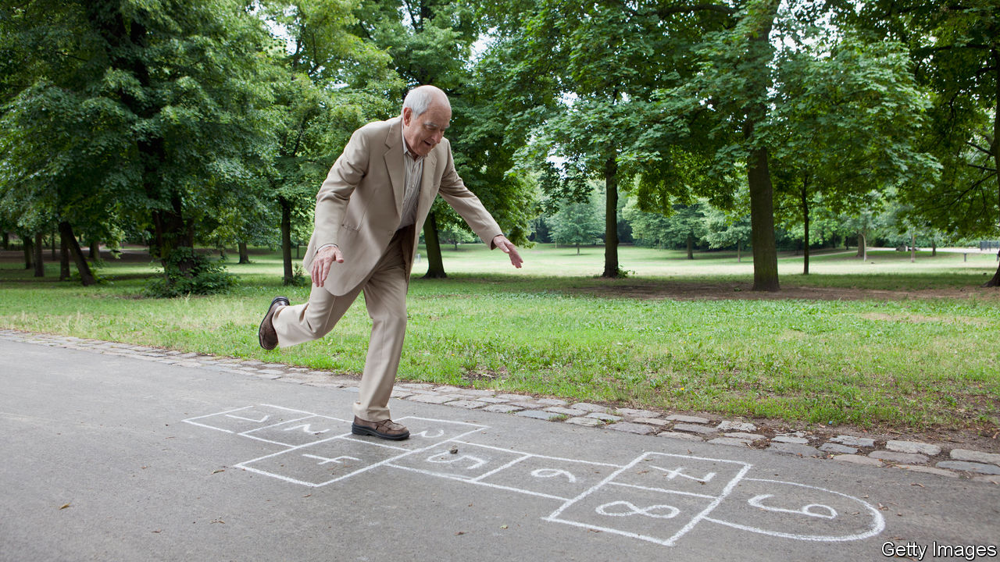

###### Who wants to live for ever?

# Ageing can be cured—and, in part, it soon will be 

##### That is Andrew Steele’s thesis in “Ageless” 

 

> Feb 6th 2021 


Ageless. By Andrew Steele. Doubleday; 352 pages; $29. Bloomsbury; £20


“OLD AGE is a massacre,” wrote Philip Roth, long before the pandemic underscored its hazards. Even those who count as young must often watch the ineluctable drift of loved ones into decrepitude. Andrew Steele has a hopeful message for all those facing this prospect (ie, everyone). Old age needn’t be a massacre; in fact, old age needn’t even be old.


Mr Steele’s thesis in “Ageless” is that ageing can be cured—and, at least in part, that it very soon will be. The giant tortoises of the Galapagos Islands show no age-related decline, in some ways seeming as youthful at 170 as at 30. Mr Steele thinks this phenomenon, known as negligible senescence, is within humanity’s grasp, too.


Whether or not readers are persuaded that ageless humans could ever be more than a theoretical possibility—and it is a stretch—this book will convince them that discounting the theoretical possibility altogether is based on nothing but prejudice. Western art may have something to do with it, bristling as it is with morality tales about the folly of wanting to turn back the clock; but there is actually no good reason to assume an upper limit to longevity, or that ageing must come with decline. And there is quite a lot of evidence to the contrary. Without the rich world’s denizens really noticing, a life that ends after the biblical three score years and ten has already come to seem a life cut short; instead, 90 is now seen as a good innings.


This prejudice held back the field of biogerontology for a very long time, but in the past few decades some scientists have cast it aside. This has enabled them to see that the real folly lies in the attempt to cure the diseases of old age one by one, rather than tackling their underlying cause—ageing itself. Now they are trying to understand that process in all its extraordinary complexity, and to intervene much earlier.


They have many tools at their disposal, and Mr Steele, who has a background in computational biology, evaluates them expertly and with verve. They range from drugs that mimic the life-extending effects of dietary restriction to gene-editing tools such as CRISPR and computer models that simulate whole biological systems. Such models may eventually prove the key that unlocks the inner Methuselah in everyone, by revealing both the limits to these systems and their redundancies: what can be tweaked, and what had best be left alone.


Temporarily—and with a bitter irony—covid-19 has slammed the brakes on this burgeoning area of research. But Mr Steele thinks its first dividends will emerge within a couple of years, perhaps in the form of senolytic drugs that clear the accumulating cellular detritus of a long life. He makes the valid point that if, for every year of scientific endeavour, a year could be added to the average human lifespan, old age would recede into the future at the same rate as today’s population approached it. That would itself be quite a milestone on the road to negligible senescence.


This interim goal is easily within reach, he claims. Many scientists agree—and are among those who have chosen to take experimental anti-ageing drugs. For some of these treatments they have calculated that the risks are small, compared with the potential benefits. The true sign that a scientific revolution is in the offing is that the scientists themselves have bought into it. Whether that revolution is desirable is a different question, which it may fall to a new generation of artists to answer. ■

