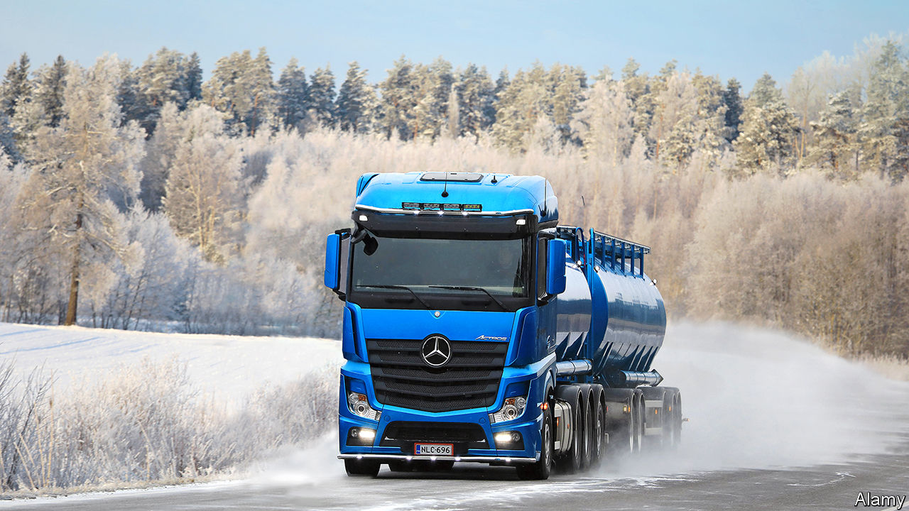

###### Driving apart

# Daimler Truck and Mercedes-Benz part ways 

##### Cars and heavy vehicles are two very different businesses 

 

> Feb 4th 2021 


GOTTLIEB DAIMLER and Carl Benz built the world’s first motor cars at the same time in 1886, not far apart in Germany. Their names have been tied together since a merger of their firms in 1926. Daimler is the parent company of Mercedes-Benz. Yet the two men never met. So perhaps they would not have minded that on February 3rd it was announced that their names would go their separate ways.


A majority stake in Daimler Truck, the group’s lorry-and-bus business, will be spun off to existing shareholders and listed in Frankfurt later this year. The luxury-car arm, to be renamed Mercedes-Benz, will retain a minority stake. The manoeuvre has set pulses racing in the staid lorry business. Ola Kallenius, the group’s boss, called it an “emotional and exciting day”.


The split is an acknowledgement that making cars and lorries are not the same business. Mr Kallenius noted the different “customer groups, technology paths and capital needs”. Car buyers care about brands, styling and plush interiors. Businesses with wares to ferry are concerned with the total cost of ownership, not what the badge says about them as a person. Electric lorries will probably run on hydrogen, not batteries, which are too expensive.


Splitting also has the advantage of giving investors a clear choice between which business they favour. It could unlock hidden shareholder value. Daimler Truck is the last of the world’s biggest lorry-makers to do so. Sweden’s Volvo split apart in 1999. Volkswagen spun off a 10% stake in its lorry division in 2019 and may go further. Bernstein, a broker, reckons Daimler Truck, which delivered around 500,000 commercial vehicles in 2019, more than any rival, could be worth €35bn ($42bn). That is around half of the undivided company’s current market capitalisation. Mr Kallenius hopes that the car business will also “significantly re-rate”.


The car division needs all the help it can get. Operating profits of $6.6bn in 2020 comfortably beat analysts’ expectations in a year blighted by the pandemic. Its has plans for an impressive range of electric vehicles and is on course to cut costs by 20%. But the car industry is changing. Tesla and other newcomers without the legacy of the internal combustion engine will make the business ever more competitive.


Lorries are a different matter. Yes, the challenges of electrification and self-driving remain. Tesla and other startups are snapping at the incumbents’ exhaust pipes. But the big three have a tight grip. Bernstein reckons they control 75% of the market in important regions, aside from China. Martin Daum, current chairman of Daimler Truck, says that by going it alone his business will be more nimble in “shaping its own destiny”. He can build on an illustrious legacy. In 1896 Gottlieb Daimler also constructed the world’s first lorry.■

