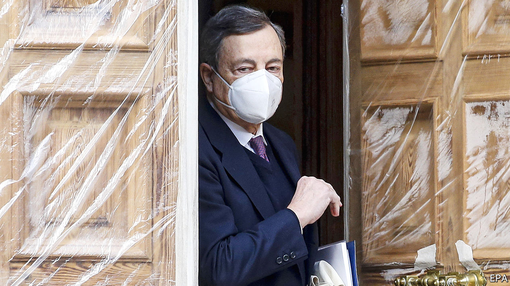
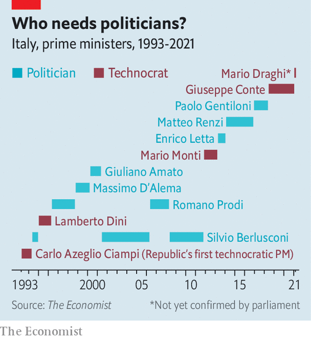

###### Send for the technocrats, again

# Mario Draghi is summoned to form Italy’s government 

##### But can the former central banker win parliament’s support? 

 

> Feb 3rd 2021 


IN CERTAIN COUNTRIES, when the politicians are considered to have failed, it is time for an unsmiling general to appear on television to announce he has seized power. In Italy, the procedure is more benign: a man in a well-cut suit, usually one with a successful career as a central banker behind him, is called to the presidential palace to get the nod.


On February 3rd just such a man, Mario Draghi, arrived at the palace on the Quirinal hill to be asked by the president, Sergio Mattarella, to head a new government. Mr Draghi accepted, conditional on the support of a parliamentary majority. Mr Mattarella called in the former boss of the European Central Bank after Matteo Renzi’s Italia Viva group torpedoed hopes of a deal between the parties that had supported the outgoing prime minister, Giuseppe Conte, and his left-leaning coalition.


Markets rejoiced. The Milan bourse leapt nearly 3% at the opening. The yield gap between Italian and German government bonds, which widens as doubts grow about Italy’s ability to repay its vast debts, shrank by 8% to just over 100 basis points.


The reaction was understandable. As Mr Draghi noted, with bankerly understatement, Italy faces a difficult moment. Not only is it in the midst of a pandemic; in March, a ban on firings is due to be lifted, unleashing a wave of job losses. And by the end of April, the government has to agree on how to spend more than €200bn ($240bn, or 4.3% of GDP) in grants and loans from the EU’s recovery fund; the grants alone are more than half what in real terms it got from the Marshall Plan after the second world war. Other member states want it to use the money in a way that reverses two decades of dismally low growth that has threatened the stability of the EU’s single currency. Few are better equipped to tackle the economic challenge than “Super Mario”, the man whose decisive action saved the euro in 2012.

 


The outcome of the crisis that erupted when Mr Conte resigned on January 26th represents a triumph for Mr Renzi, himself a former prime minister. He has brought down a coalition whose policies, including its plans for the allocation of the EU’s funds, he increasingly deplored. He has unseated a popular prime minister who threatened to challenge him in the middle ground of politics. And both outcomes have been achieved without an election that could have destroyed Mr Renzi’s tiny party. Italia Viva had enough seats in parliament to have been crucial to Mr Conte’s majority, but polls suggest it now has the support of less than 3% of the electorate.


Mr Renzi’s victory was scarcely a win for Italian democracy, however. Something is wrong in a country where a party as tiny as his can oust a government, let alone one that has had as frequent recourse as Italy in the past 30 years to political outsiders.


The first was Carlo Azeglio Ciampi—like Mr Draghi, a former governor of the Bank of Italy. Mr Ciampi took office in 1993 as the country’s post-war order, dominated by Christian Democrats and Communists, was falling apart. He remained at the helm until an election the following year. But after the winner of that election, Silvio Berlusconi, was ousted in 1995, another Bank of Italy alumnus, Lamberto Dini, was tapped to head a government composed mostly of technocrats like himself. The country’s next existential trauma, an effect and a cause of the wider euro crisis, wafted a former European commissioner, Mario Monti, to power in 2011. Then, after the 2018 elections, when the leaders of the hard-right Northern League and the anti-establishment Five Star Movement (M5S) were unable to agree on who should get the top job, they gave it to Mr Conte, an obscure law professor. He survived to lead a second government that yoked the M5S to the centre-left Democratic Party (PD).


The alternative to a technocratic prime minister, and the normal response in most democracies, is the ballot box. Mr Mattarella argued, with some justification, that the challenges facing Italy are too urgent to allow for an early vote. But, in doing so, he highlighted another shortcoming: Italy’s cumbersome procedures for transferring power. The president recalled that it had taken five months to install a government in 2018 and four months in 2013.


Mr Mattarella says he wants a high-profile administration that “ought not be identified with any one political formula”. That does not necessarily mean the next cabinet should be purely technocratic. Italy’s non-party prime ministers have not all headed non-party governments: Mr Ciampi’s cabinet and Mr Conte’s two governments were made up of politicians.


All, however, have suffered from two shared weaknesses. Their leaders have been new to the roughhouse of Italian domestic politics. And, however technocratic, they have depended for their survival on the goodwill of politicians in what are often ill-assorted parliamentary coalitions.


The first signs were that Mr Draghi could win the support of Italia Viva, the PD and Mr Berlusconi’s Forza Italia, but that he faced opposition from the M5S and from the two most radical groups in parliament: the Free and Equal party on the left and the Brothers of Italy on the right. It was unclear whether the League would back him explicitly, or implicitly by means of abstention. But Mr Draghi risks finding himself dependent on the support of two parties, the PD and the League, with fundamentally different ideas on how best to govern Italy. It is a problem with which his technocratic predecessors became wearily familiar and one that helps to explain the brevity of their governments. On average they lasted for a year and four months. ■

