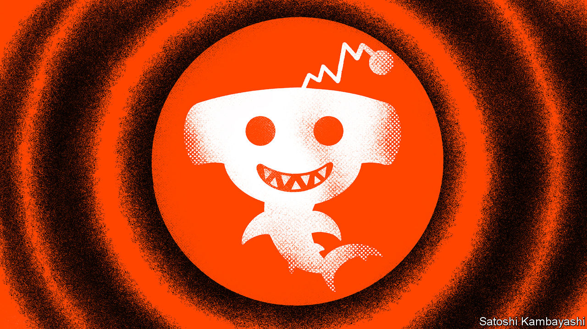

###### Buttonwood

# Why the WallStreetBets crowd are able to profit from predatory trading 

##### Textbooks say it can’t happen. But there are times when front-running distressed traders pays off 

 

> Feb 2nd 2021 


“THERE ARE NO loyalties on Wall Street. When you smell blood in the water, you become a shark.” The sentiment—or lack of it—would not look out of place on r/wallstreetbets, the locus for a new breed of stockmarket hammerheads, which has helped push up the share prices of tech darlings and bombed-out companies to nosebleed levels, crippling professional short-sellers in the process. But the quote comes from a boomer, not a millennial: “Confessions of a Wall Street Addict”, by Jim Cramer, a trader-cum-TV-star. He is describing the remorseless logic of predatory trading.


It is something that is discovered anew by each generation of traders—the dark art of picking off investors who are in distress, for profit. Every big market meltdown is made worse by it. Every melt-up—including the current one—makes prey of those who are brave enough to sell it short. Those schooled in the idea of efficient capital markets will be puzzled by the latest goings-on. The textbooks say this sort of thing cannot happen. They assume there is abundant capital that can be put to work to correct prices that have got out of whack.


But in the real world, and in the right conditions, predatory trading is a profitable strategy. Prices can be pushed to extremes before they are pulled back to sensible levels. All it takes are illiquid markets, traders that are bleeding and other traders who can smell the blood.


To understand how this works, picture a world in which there are two types of investor—fast and slow. The slow-money investors are pension funds. They eschew short-term trading. When they enter the market it is in a measured way, to buy and sell when share prices look unduly cheap or dear. The fast-money crowd are hedge funds, which are happy to trade every day. In this world there are only two hedge funds. Each has ten shares in a company. Each share has an expected value of $150 in the long run, but in the short run can trade at any price.


Say the stock falls to $100 a share—low enough to force one of the hedge funds to rush to sell its entire holding, perhaps because its investors panic. The trouble is the market for the stock is not very liquid. The slow-money crowd will buy two shares per day but the price must get cheaper by $2 a day to induce them to trade. In a world without predatory traders, the distressed hedge fund manages to sell its stock over five days, with the last share going for $90.


But the other hedge fund knows the prey is wounded. So it becomes a predator. It joins in the selling. With only a few buyers, it now takes the distressed seller ten days, rather than five, to get rid of its shares. The final one is sold for $80. The predator is then free to buy back shares at a lower price than he sold them for. He buys the shares as fast as he can, over five days, driving the price to $90.


This example is adapted from the model in “Predatory Trading”, a paper by Markus Brunnermeier and Lasse Pedersen published in 2005 in the Journal of Finance. The model elegantly highlights the key features of financial shark attack. Markets must be illiquid (ie, large trades can move prices in the short run). Traders must have limited capacity, meaning they cannot sustain losses beyond a certain point—for regulatory reasons, because of redemptions by investors or because of the psychological pain.


The authors draw out some implications. The more illiquid the market, the more scope for predators to profit: it takes longer for the prey to escape their positions, so the price falls by more. The quicker the distressed trader sells, the fewer losses it makes. Any delay allows the predator to trade ahead of (front-run) the prey. The more predators there are, the less profitable predation is.


How does the WallStreetBets episode fit this template? The predators are acting in concert, so their strategy may be more effective. Better still, the prey are short-sellers, who bet on stocks falling. They are especially vulnerable: the more the price rises, the more they lose. Their potential losses are unlimited. And their positions are often common knowledge.


This is why a lot of hedge funds put their trades through several brokers in an attempt to mask them. Even so, the incentive for brokers to front-run a struggling customer is hard to resist—and not always resisted, as Mr Cramer recounts in his book. “There was something about a dying client that sent these brokers to go to the untapped pay phone downstairs—all brokerage calls are recorded—and tell their buddies.” There really are no loyalties on Wall Street.

