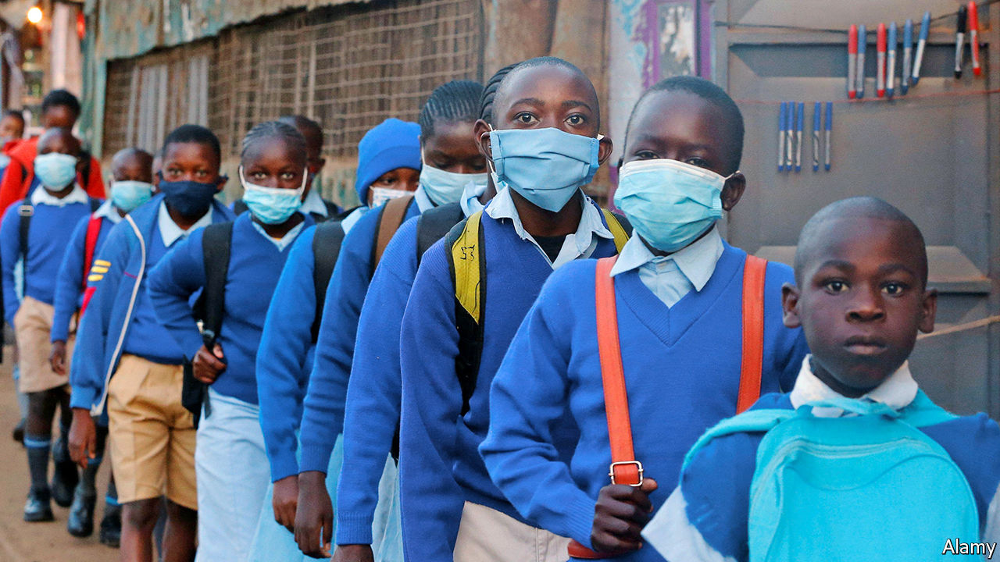
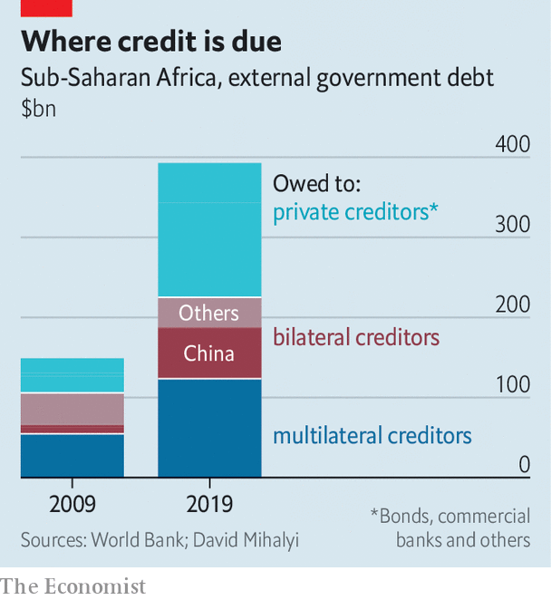
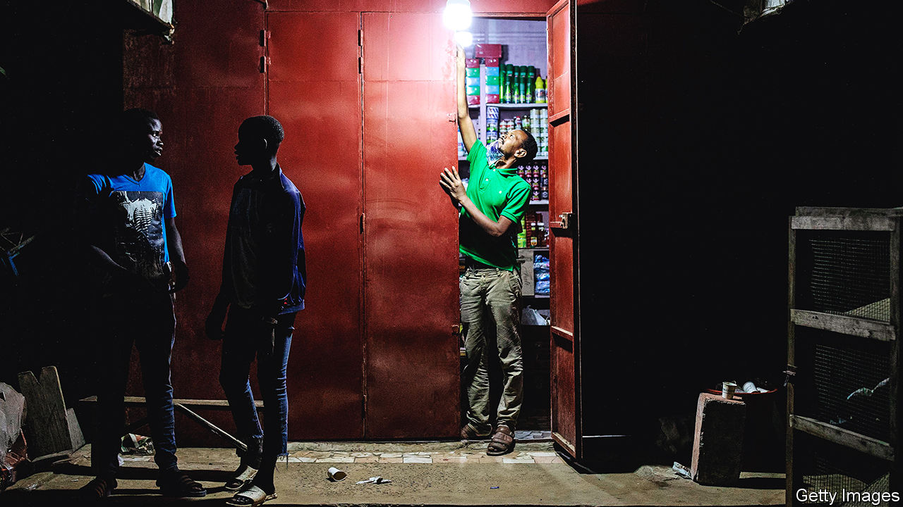

###### At the end of the line

# Africa’s recovery from covid-19 will be slow 

##### A second wave could play havoc with commerce, public finances and schools 

 

> Feb 6th 2021 


AT FIRST GLANCE, sub-Saharan Africa appears to have avoided the worst of the pandemic. It has 14% of the world’s population but, even as it is drenched by a second wave, just 3% of known cases and deaths. In 2020 its economy shrank by less than the global average, estimates the IMF. Eleven of the 24 countries that grew at all last year were in the region.


But try telling the finance minister of one of those, Ghana, that African countries have had it easy. Ken Ofori-Atta worries that Africa is “going to lose a decade”, if nothing is done to respond to the pandemic’s economic shock. He admits to a vertiginous feeling: “It’s like sailing down Niagara Falls in an African canoe.”


Mr Ofori-Atta has reason to worry. The rich world is expecting a rapid, vaccinefuelled recovery. But in sub-Saharan Africa the damaging effects of the pandemic will drag on, causing harm in the short, medium and long term. The IMF forecasts that in 2021 it will be the slowest-growing major region. In many countries it will take several years for GDP per person to get back to where it was before covid-19. Governments face the challenge of procuring scarce vaccines and, in many cases, dealing with financing crises that threaten basic services.


All of this—as well as widespread school closures—will leave lasting scars. Africa has a young and fast-growing population. The median age is 19.5; by 2035 it will be adding more people of working age to the global population than everywhere else put together. A long, sluggish recovery would make it harder for the largest-ever generation of young Africans to find jobs, heaping pressure on ageing leaders.


The shock of the pandemic arrived when much of sub-Saharan Africa was already vulnerable. In 2014 a commodities supercycle driven by Chinese demand for oil, metals and minerals came to an end. In most African countries commodities account for at least 80% of goods exports, so lower prices hurt. From 2000 to 2014 sub-Saharan Africa’s GDP was expanding almost twice as fast as its population. But since then, GDP per head has fallen.


There are big exceptions. Countries that depend less on mining or pumping oil, such as Benin, Ethiopia, Ivory Coast, Kenya and Senegal, have been among the fastest-growing economies in the world. “But the rest had not recovered from the commodities shock when covid hit,” says Albert Zeufack of the World Bank. Since many governments kept spending and borrowing, they had higher debts than they did before the global financial crisis.


When covid-19 spread across the world, African countries felt a triple whammy. Global demand plunged. Trade slowed. Travel and tourism, which are huge generators of jobs and hard currency in several African countries, collapsed. Lockdowns choked domestic commerce.


Having a young population has somewhat protected the continent from the virus. Officially fewer Africans have died of it than Americans or Europeans. The true scale, however, is hard to gauge. In South Africa, one of a few African countries that track whether more people are dying than would be expected, there have been 132,000 “excess deaths” since May—a higher rate per person than that recorded in countries in western Europe.


Even countries that dealt well with the first wave are struggling with the second. In Senegal, for instance, the main public hospital in Dakar, the capital, is asking NGOs for basic items such as masks and gloves. Doctors believe that the case count is many times higher than the official tally. “We are afraid,” says a clinician.


The economic impact is also worse than it looks. Because sub-Saharan Africa’s population is growing at 2.7% a year, GDP needs to grow at least as fast, or people will become poorer. Last year the area’s economy shrank for the first time in 25 years. Some 32m people fell into extreme poverty (earning below $1.90 a day), erasing five years of progress against want, says the World Bank. Millions more may have lost their place in the nascent middle class.


Countries that rely on tourism were devastated. GDP fell by 12.9% in Mauritius and 15.9% in the Seychelles last year, as beach-lovers stayed at home. Botswana’s economy contracted by almost 10% as foreigners went without diamonds or safaris. International bookings at camps in the Okavango Delta fell by 95%. Game-poaching is rising as locals struggle to get by.


Oil-exporting countries were walloped, too. In 2020 their economies shrank by an average of 4%, versus 0.4% among oil importers (excluding South Africa). In Angola, sub-Saharan Africa’s second-largest oil producer, bottles of Château Pétrus costing $3,000 can still be found in supermarkets—relics of the 2000s, when high oil prices made Luanda one of the world’s most expensive cities. But in 2020 Angola’s economy slumped for a fifth year in a row.


Covid-19 has exposed the weakness of Africa’s biggest economies, Nigeria and South Africa, which generate almost half of sub-Saharan GDP. Nigeria, the continent’s largest oil producer and home to one-fifth of sub-Saharan Africans, faces an “unprecedented crisis”, says the World Bank, which seldom uses such blunt language. More than two in three households are poorer than a year ago. By 2022 the number of Nigerians who are extremely poor is expected to rise by 20m, to 100m.


South Africa was in its second recession in two years before the pandemic, as a result of low commodity prices, corruption, power cuts and scant investment. In 2020 its GDP shrank by 7.8%, as joblessness rose above 30%. The poor, women and the least-educated have been worst hit.


Letsha Lekota (not her real name) lost her job in March. In her village she signed up to get government food parcels. They never arrived. She suspects they were stolen—a common problem in a country where even funds for personal protective equipment and tablets to help kids study at home have been looted. “What happened to the food parcels?” she asks. “Councillors tell us a different story every day.”


Not all the news is bad. Some 46 sub-Saharan countries have introduced a total of 166 social-protection policies, such as cash transfers or free electricity, though most are still very small. The pandemic has spurred several to digitise faster. Ethiopia has adopted a law giving electronic documents legal force. Togo has issued welfare payments using mobile money.


Another hopeful development is the African Continental Free Trade Area, which was launched on January 1st. It should eventually ease trade within Africa. That could boost manufacturing, the importance of which the pandemic has stressed. The lack of domestically made surgical masks and drugs made Africa “very, very vulnerable”, says Akinwumi Adesina, president of the African Development Bank. “We must be more self-reliant,” says Amadou Hott, Senegal’s economy minister.


However, when it comes to cushioning the economic shock of covid-19, sub-Saharan governments have fewer options than rich countries do, mostly because they cannot borrow as cheaply. On average they spent just 3% of GDP to respond to the crisis, compared with about 5% in the IMF’s group of “emerging markets” and more than 7% in rich countries. Whereas central banks in advanced economies have pursued radical policies, those in Africa have stuck to orthodox ones, lest they endanger their macroeconomic stability. Only about half have cut interest rates. The difference is between doing “whatever it takes” and “whatever is possible”, argues Abebe Aemro Selassie of the IMF.


In the next few years governments in sub-Saharan Africa will face two huge challenges: vaccines and finance. A few have not fully grasped the urgency of the situation. South Africa, for example, is spending a fortune bailing out the national airline while dawdling over buying vaccines. Tanzania’s president, John Magufuli, casts doubt on whether they even work. “If the white man was able to come up with vaccinations,” he said, “then vaccinations for AIDS...malaria and cancer would have been found.” He told the health ministry not to adopt a vaccine until it has been certified by Tanzanian experts.


Most African governments, however, are eager to get vaccines as fast as possible. The biggest problem is that it will take time for the world’s vaccine-makers to churn out enough for everyone. Under COVAX, a global vaccine scheme largely funded by donors, governments are trying to get enough for 20% of people in poor countries by the end of this year. The African Union has separately secured 670m vaccine doses, roughly enough for a further 25% of Africans, from Pfizer, Johnson &amp; Johnson and AstraZeneca, though it is unclear when they will arrive. Some countries are also negotiating directly with suppliers, including Chinese and Russian ones.

 


Whereas rich countries aim to vaccinate most people by the middle of this year, John Nkengasong, the head of Africa CDC, a public-health body, is aiming for 60% of Africans to be jabbed by the end of next year. Even that may be optimistic. The Economist Intelligence Unit, our sister organisation, estimates that in most African countries most people will not be inoculated until mid-2023 or early 2024 (see map).


So Africa may suffer waves of infection after the disease has ebbed in the rich world. This will cause more death and suffering as well as economic pain. It may also allow new variants to evolve, which could endanger people in rich countries, too.


Repeated waves would worsen the financing crises in many African countries. This is the second big issue in the medium term. To understand the scale of it, the IMF has totted up what the region would need to pay to meet its external debt obligations, fund its current-account deficits and mount a modest response to the pandemic. It estimated a shortfall of between $130bn and $410bn, equivalent to 8%-25% of regional GDP, for 2020-23. If that gap is not filled, it will be hard for some countries to avoid defaulting on debt or slashing spending on public services—or both.

 


Sub-Saharan governments are on average spending more than 30% of the revenue they raise on paying debts, up from about 20% before the pandemic. Public debt as a share of GDP rose by eight percentage points to 70% last year. It will rise higher still in 2021. Over half of low-income sub-Saharan countries are in “debt distress” or at high risk of it, says the IMF. It is hard to get out of these holes. It will be especially difficult in countries that have more dollar-denominated debt to pay back than they have dollar reserves. In January Moody’s, a credit-rating agency, highlighted the risks faced this year by Zambia, Ghana and Ethiopia, in particular. The latter two were among the world’s fastest-growing economies over the past five years. Yet all three face trouble paying their foreign bills—in Ethiopia’s case, aggravated by war.


The picture for the two biggest economies is slightly different. Nigeria’s debts are relatively low, but an acute lack of foreign currency—and a graft-ridden regime of multiple official exchange rates—is pushing inflation up and risks provoking a balance-of-payments crisis.


In South Africa most government debt is owed in rand to local borrowers. But debt service is nevertheless swallowing an ever-larger share of government revenues: 40% by the end of the decade, according to the country’s treasury.


Talk of debt crises in Africa can provoke a sense of déjà vu. Two decades ago 30 African countries had big chunks of their sovereign debt forgiven. This time around, things are more complicated. They owe large sums to commercial creditors (roughly 43% of all government debt) and to China’s government (16%), not just to rich governments and multilateral lenders.


The rest of the world is offering support. Last year the IMF provided $16bn in loans, mostly with few strings attached, to help African countries respond to the pandemic and prevent liquidity crises. The World Bank disbursed another $10bn. But most countries will soon exhaust their emergency allocations. And the Washington-based lenders’ pockets are not bottomless.


The G20, a group of the world’s largest economies, has helped poor countries put off debt repayments until July. Yet this is just “kicking the can down the road”, says Mr Zeufack. This is the year, says Mr Ofori-Atta, to “sit down with the West and China for a much more comprehensive debtrestructuring and debt-cancellation programme.” To pretend otherwise, given the numbers, he adds, “is to be disingenuous with ourselves”.


The reality, though, is fiendishly difficult. Unlike in the 2000s, getting all the interested parties in the same room would require a huge table, or at least a premium Zoom subscription. They need to trust that if one creditor grants debt relief, the debtor will not use that money to pay off another. African governments worry that if their private debt is restructured, rating agencies will downgrade them, making it harder for them to borrow in the future.


Finance ministers may put off asking for help, hoping for a miracle. If so, that will prolong the pain. Around the middle of the decade a wall of commercial-debt repayments looms.


Africa’s fiscal woes could cause long-term harm. When revenues are tight “the first thing to go is the development budget,” says Benno Ndulu, a former governor of Tanzania’s central bank. More than half of African countries cut capital spending last year—a big worry when roads are dire, ports are bottlenecks and more than half of Africans still do not have electricity.


The damage caused by the widespread closure of schools may be even worse. This can be glimpsed in Korogocho, a slum in Nairobi. Outside 13-year-old Grace Emiloyo’s house, the peak of a dump site towers over residents. Every morning, instead of going to school as she did before the pandemic, Ms Emiloyo wakes up, prays, then braves her way through the stench and men’s catcalls to the dump’s summit where she collects plastics and metals to sell.


Last year Kenya closed classrooms for nine months. Ms Emiloyo and her ten-year-old brother, Nurdeen Tawfiq, are among the 40% of students in Korogocho who have not gone back to their books. Ms Emiloyo’s mother, Maureen Kasandi, previously made a living going door-to-door to clean people’s houses. But during the pandemic many families opted for live-in housekeepers for fear of infection. Nobody could take care of Ms Kasandi’s children if she went away to work, so she has sent the older ones out to make money.


When children drop out of school to work, it helps families put ugali (a starchy staple) on the table in the short term. But it blights those children’s future prospects. Without education, they will struggle to escape from a life of drudgery.


Similar stories are playing out elsewhere across the continent. Almost all of Africa’s 253m pupils live in countries that at some point closed schools. About seven months of closures could cost African children $500bn in lifetime earnings, warns the World Bank.


The effects could last more than a generation. Most of the dropouts will be girls, since many families favour sons when they can afford to send only some of their children to school. The girls who drop out will not only earn less but are also likely to start having babies sooner, and to have more of them. In Kilifi County, on Kenya’s coast, only 388 schoolgirls out of the 946 who got pregnant during the closure last year have reported back to school, according to Terre des Hommes, a charity.

 


The link between female education and family size is strong everywhere. Women with no formal schooling tend to have about six children, whereas those with secondary education have roughly two. This matters because better-educated mothers tend to lavish education on their smaller broods. Before covid-19 hit, Africa was in the middle of a demographic transition. Girls were going to school for longer. Wolfgang Lutz of the Wittgenstein Centre for Demography and Global Human Capital in Vienna predicted that this would soon translate into smaller families. That benign shift is at risk if the pandemic disrupts too many young girls’ schooling.


So the stakes are high. By damaging their health, wealth and education, covid-19 endangers the future of Africa’s largest-ever generation. On the plus side, vaccine roll-outs may accelerate once rich nations have inoculated most of their people. Commodity prices may rise again as the global economy recovers. Investors’ appetite for risk may be big enough to enable African governments to keep borrowing.


But the weight of evidence points towards further waves of the virus hitting beleaguered health systems, adding to an economic “long covid” across Africa. Though some economies are well placed to rally as the pandemic fades, more of them, including the biggest, will struggle to recover. Africans have shown remarkable resilience in response to the virus. But the toughest years are yet to come. ■


Dig deeper


All our stories relating to the pandemic and the vaccines can be found on our . You will also find trackers showing ,  and the virus’s spread across  and .

