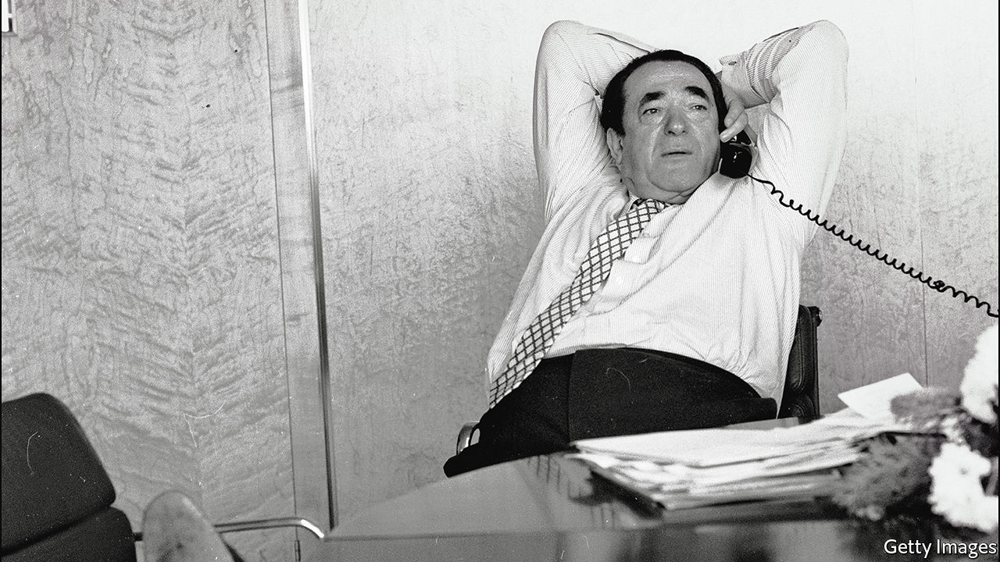

###### Renegade tycoons

# The rise and falls of Robert Maxwell 

##### Even in death, the disgraced businessman was larger than life 

 

> Feb 13th 2021 


Fall. By John Preston. HarperCollins; 352 pages; $28.99. Viking; £18.99


UNUSUALLY FOR him, Robert Maxwell arrived alone on November 1st 1991 to board his superyacht, the Lady Ghislaine, in Gibraltar for an impromptu cruise. Even more unusually, he seemed to be in a good mood, despite the pressure he was under as he feverishly shuffled assets in a vain bid to stave off the collapse of his media empire. Four days later, a Spanish rescue helicopter was winching his bloated body from the sea off Gran Canaria, using a sling meant to save cattle from floods because he was too heavy for an ordinary harness. Even in death, Maxwell was larger than life.


A botched first autopsy fed speculation about how the publishing tycoon had died. Had he simply fallen into the water, or was it suicide? Could he have been bumped off? When it emerged a few weeks later that £350m (then $603m) was missing from the pension fund of one of his two main companies, Mirror Group Newspapers, and tens of millions more from the other, Maxwell Communication Corporation, both the dire state of his wildly over-leveraged businesses and his criminal attempts to hold on to them were revealed. Had he lived, the 68-year-old would have wound up in a prison cell.


There have been many biographies of Maxwell, but the story of this monstrous, enigmatic, bullying, narcissistic crook of gigantic appetites, who at his peak was one of the most recognisable businessmen in the world, may well be largely unknown to anyone under 40. John Preston tells it with great verve and the benefit of extensive interviews with, among others, Maxwell’s one-time rival Rupert Murdoch, who says he always regarded him as “an absolute fraud and a charlatan”, and three of Maxwell’s children—though not Ghislaine, his youngest, who is in jail in New York awaiting trial on charges linked to her relationship with the sexual abuser Jeffrey Epstein.


Maxwell was born in 1923 to a Jewish family in Solotvino, a salt-mining town in what was then Czechoslovakia, where anti-Semitism was institutionalised. Ludvik Hoch, as he was originally called, grew up in desperate poverty with a brutal father. Narrowly escaping death after joining the anti-Nazi resistance, he somehow ended the second world war as a notably ruthless young British officer with a talent for languages, a Military Cross pinned to his chest by Field-Marshal Montgomery, and a new name. With his energy, complete absence of scruple and eye for the main chance—all his subsequent success was based on his insight that, after the war, there would be huge demand across Europe for scientific publishing, which his company, Pergamon, could supply—he realised he could make serious money.


Mr Preston zips through Maxwell’s business and political journey (he was briefly a Labour MP who drove the House of Commons mad with his refusal ever to shut up). His resilience was extraordinary. He powered on despite losing half a lung to cancer, the death of two children and, in 1971, being deemed not fit “to exercise proper stewardship of a publicly quoted company” in a government report. 


The portrait that emerges is more subtly drawn than previous ones. For all his bombast, chicanery and revolting personal habits, and his vile treatment of pretty much everyone who was beholden to him, not least his family, it is hard not to feel a stab of pity for Maxwell as the end draws near. He seems always to have been running away from his terrible childhood, assuming new identities as he went. He abandoned Judaism until late in life, yet was haunted by awful guilt for not having been able to save family members from the death camps. He was incapable of personal friendship (perhaps the only exception was the man who used to dye his hair and eyebrows). Ceaseless activity masked his essential loneliness.


Maxwell left a trail of wreckage: this reviewer’s father was one of the Mirror Group pensioners he stole from. But was he any worse than the cynical lawyers, bankers, politicians—and some journalists—who fawned on, flattered and abetted a man long nicknamed the “Bouncing Czech”? Peter Jay, a former economics editor of the Times and British ambassador in Washington, who spent three miserable years as Maxwell’s “chief of staff”, has perhaps the book’s best insight: “There was something not so much amoral about him, as pre-moral. It was as if he was literally uncivilised, like some great woolly mammoth stalking through a primeval forest wholly unaware of things like good and evil.”


And the mystery of his death? Mr Preston does not rule out suicide, but his family think it more likely that he fell while peeing over the side of the boat in the small hours, as he was wont to do. ■

