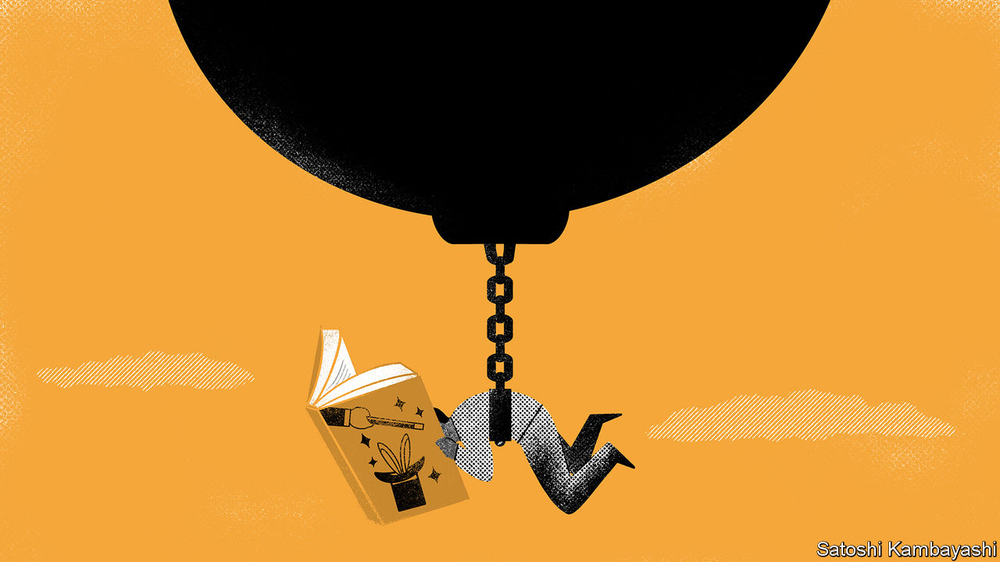
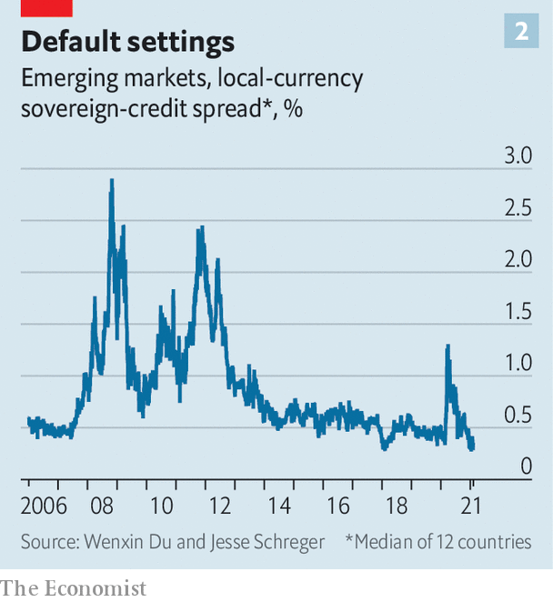

###### Some pleasant fiscal arithmetic

# Should governments in emerging economies worry about their debt? 

##### As in the rich world, interest rates are below nominal growth rates in many places 

 

> Feb 13th 2021 


FINANCE MINISTERS of yesteryear would have been shocked by the amount of borrowing their successors must now contemplate. But they would have been just as gobsmacked by how cheap that borrowing has turned out to be. In many countries, the interest rate on government debt is expected to remain below the nominal growth rate of the economy for the foreseeable future. In other words, the “growth-corrected interest rate”, as some economists call it, will be negative. That will be the case in all rich countries in 2023, according to projections published earlier this month by S&amp;P Global, a rating agency.


This scenario has prompted some economists, such as Olivier Blanchard, a former chief economist of the IMF, to rethink the fiscal limits of countries like America, Japan and the euro members. Governments should not “focus on some magic number for the debt-to-GDP ratio”, Mr Blanchard said last month in a lecture hosted by Ashoka University in India. These numbers “have been counterproductive in the past; they would be even more [so] now”.


It is not only in rich countries, however, that the fiscal arithmetic looks topsy-turvy. In 53 of the 60 biggest emerging economies, the interest rate is likely to fall short of the growth rate. In some cases, spectacularly so. S&amp;P expects the growth-corrected interest rate in 2023 to be -3.6% in India, -6.5% in China and -33.8% in Argentina (see chart 1).

 


That raises an obvious question: should emerging economies also rethink their fiscal limits? Some have been quick to do so. India’s budget this month envisaged a deficit of 9.5% of GDP this fiscal year (the overall deficit, which includes state finances, could reach 15% of GDP, reckons JPMorgan Chase, a bank) and offered no plan to bring it below the 3% limit prescribed by past fiscal rules. The latest economic survey by the government’s chief economic adviser points out that India’s interest rate has been below its growth rate “by norm, not by exception”. Quoting from Mr Blanchard’s work, the survey tries to “provide the intellectual anchor for the government to be more relaxed about debt and fiscal spending during a growth slowdown or an economic crisis”. But although doveish fiscal maths is the norm in many emerging economies, finance ministers must also worry about the exceptions to it.


When interest rates fall short of growth rates, the budgetary algebra becomes a little contrary. Governments can keep debt steady, relative to the size of the economy, even if they consistently overspend, as long as their budget deficits are not too large. If their deficits (excluding interest payments) exceed this limit temporarily, their debt ratio will rise temporarily. But it will then gradually decline to its previous level. If their deficits move to a permanently higher level, the debt ratio also settles at a higher level. But it will not snowball, because the power of compound interest is offset by the power of compound growth.


To grasp the weirdness, ponder the following scenario. Suppose a government can keep debt stable at 60% of GDP with a deficit, before interest payments, of 3%. Then suppose a pandemic strikes, pushing debt to 80% of GDP. You might think that this higher debt is harder to sustain, requiring a tighter budget than before the pandemic. You would be wrong. To stabilise the new debt ratio, the government needs a 4% deficit instead.


Although this fiscal mathematics is peculiar, it is not novel. The growth-corrected interest rate has been less than zero in emerging economies 75% of the time, according to Paolo Mauro and Jing Zhou of the IMF, who have looked as far back as the data allow. Economists have nonetheless been wary of taking this arithmetic too literally. Emerging economies have traditionally borrowed in hard currencies, such as the dollar. If their exchange rate weakens, their foreign-currency debts can increase sharply, relative to the size of their economies, even if interest rates remain modest. The cost of borrowing can also rise quickly if investors fear default, a fear that can become self-fulfilling. And this rise in interest rates may not be gentle or early enough to provide much prior warning. 


In recent decades, most emerging economies have found it easier to borrow in their own currencies. That makes their debt safer because their central banks can, in theory, print the money owed to creditors if need be. But the fear of some kind of default still lingers. Wenxin Du of the University of Chicago and Jesse Schreger of Columbia University have compared the yields on local-currency bonds to those on American Treasuries “swapped” into the same emerging-market currency via derivatives. This allows them to disentangle credit risk from currency risk. They find that emerging-market bonds typically pay a premium, which presumably represents compensation for the risk of default (or some other form of expropriation, such as new taxes or capital controls). This premium spiked in March 2020 before returning to less alarming levels (see chart 2). 

 


Borrowing in rupiah or pesos introduces other dangers. If investors fear a fall in the currency, they demand a higher interest rate. This is especially likely if the investors are foreigners with obligations in other currencies. Countries like Indonesia borrow mostly in their own currency (over 60% of government debt is in rupiah) but not from their own people (over half of its debt is owed to non-residents).


Even if government debt is sustainable, it may not be desirable. Economists have long worried that public borrowing can crowd out private investment (or hurt the trade balance). That is less of a concern if the government spends on investment. (India’s central government, for example, has budgeted a 26% increase in capital spending in the coming fiscal year.) It is also less of a worry if the economy is operating below capacity: public spending can then “crowd in” additional investment by improving incomes and profit prospects.


But before embarking on a spending spree, a conscientious government must bear other considerations in mind. Is the economy below capacity because of a lack of spending, rather than public-health restrictions? Are inflation expectations contained? Is monetary easing unable to revive demand instead? If the answers are yes, governments can spend with greater conviction. But in fact the answers vary across the emerging world. China is probably near full capacity. Inflation is too high in Argentina and Turkey. Most central banks have room to cut interest rates (though India worries that cuts will not work until its troubled banks regain their footing).


Crowding out, if it happens, is probably more damaging in emerging markets. They have less capital per person than richer economies, which should leave them with more rewarding investment opportunities. The low interest rate paid by their governments is not necessarily a sign that the return on capital is low. It may also reflect regulations forcing banks to load up on government paper. This kind of financial repression, once widespread, persists in places like India and Argentina. 


Mr Blanchard seems more cautious about emerging markets than some of those who cite his work. His Ashoka lecture showed a “prudent level of tentativeness that I find very appealing”, said his host, Arvind Subramanian, himself a former adviser to India’s government. Mr Blanchard thinks policymakers in the rich and poor world alike should ask themselves two hard questions: how high might interest rates rise, relative to growth rates, in a plausible stress case? And how tight a budget would be politically possible in response? The answers give a rough indication of the debt ratio a country can comfortably expect to sustain. 


That ratio is likely to be lower for many emerging economies than for advanced ones, he believes. They may find it harder to rustle up tax revenue in a pinch. And their interest rates have a higher possible peak, even if their average is lower once growth is deducted. In the past, conventional wisdom maintained that the safe debt limit was 60% of GDP for advanced economies and 40% for emerging ones. “These were nonsensical numbers,” Mr Blanchard said after his lecture. “But the inequality was right.” ■

