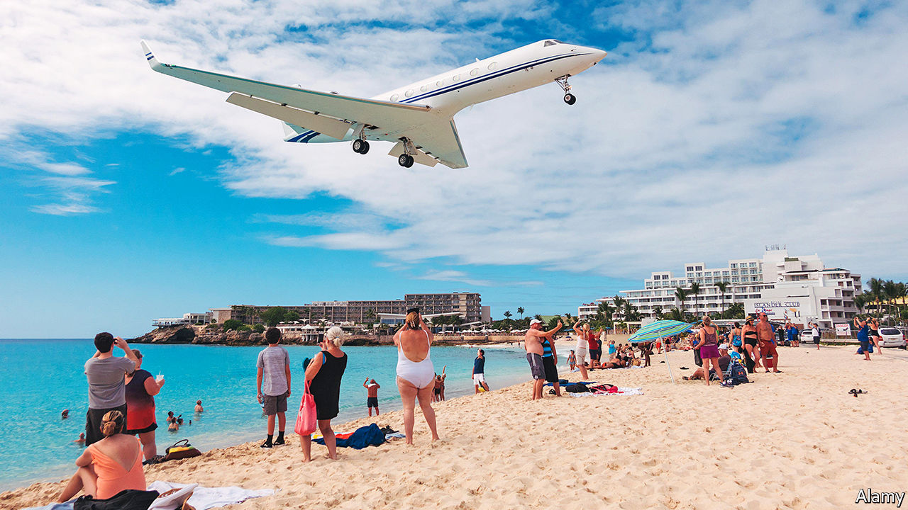

###### High flyers

# The pandemic has hurt corporate jets less than commercial ones 

##### The wealthy are not bound by airline schedules 

 

> Feb 11th 2021 


CORPORATE JETS are emerging from covid-19 in better shape than commercial ones. Bosses of big companies and the super-rich have long relied on owning or chartering their own small jets. As Jim Currier of Honeywell, a conglomerate, points out, business aviation suffered as much as commercial airlines at the start of the pandemic, but recovery has been “steady, consistent and at a higher pace”. The number of flights undertaken by scheduled airlines was down by 49% in 2020 on a year earlier whereas business flights were down by only 24%, according to WingX, a private-aviation data firm. Mr Currier expects a full recovery by mid-2021.


Economic jolts have taken a toll on business aviation, which had barely recovered from the financial crisis of 2008-09. Annual sales of new planes fell by almost half from a peak of 1,200 in 2008 to 700 a year, as the mood in boardrooms turned against corporate jets. But a health crisis is different to an economic one. Chad Anderson of Jetcraft, which sells new and used business planes, notes that second-hand planes have not been dumped on the market as in the financial crisis. With so many international flights grounded, executives and the ultra-rich may be joined permanently by the merely wealthy.


A new class of private traveller has emerged that Mr Currier characterises as those who used to fly first class but, though they can afford it, have not seen any value in chartering a private jet. It is a big step up in price, perhaps five to ten times, says Richard Koe, of WingX. Yet anecdotal evidence suggests that the number of “first timers”, who want to avoid crowds on commercial jets and in airports, has doubled with covid-19.


Charter companies are doing what they can to hold onto these new clients by offering more flexible deals than the long-term commitments usually required. Mr Koe reckons that the outcome will be an industry that provides a more flexible on-demand service in future. But as private jets emit up to 20-times as much carbon per passenger as a commercial flight, the industry will also have to make more effort to introduce sustainable fuels, carbon-offsetting programmes, and hybrid and electric technology.


The mega-rich may also lead the way to the next step change in the speed of travel. Supersonic planes could cut journey times almost in half. Several are on the drawing board. Aerion, an American firm, hopes to have an eight-to-ten-seat supersonic jet on sale by 2025. Boom Supersonic plans a larger 55-seat all-business-class jet.


The latest holiday destination for the ultra-rich may open the door to even speedier jaunts. Space tourism may change travel if the technology to take a few people to the edge of space can be developed into hypersonic flights at mind-boggling speeds. Elon Musk’s SpaceX hopes to use its giant Starship rocket to fly 100 people around the world in the blink of an eye: New York to Shanghai in 39 minutes, and for less than the current price of a business-class ticket.

