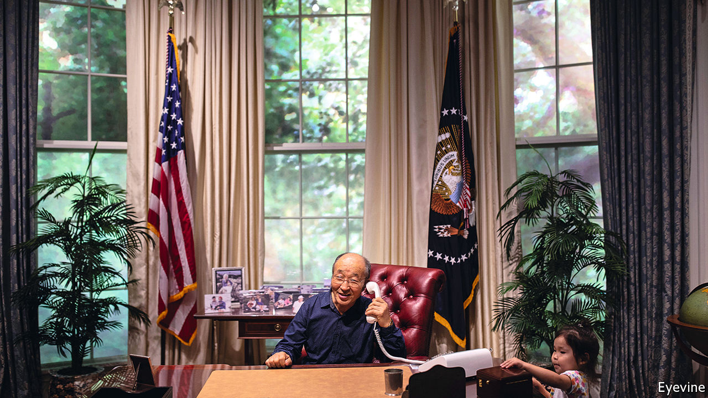

###### The shrining

# America’s strange presidential museums 

##### With the Obama centre greenlit, their number is about to swell 

 

> Feb 13th 2021 


IN AUTOCRACIES, putting up mausoleums for ex-presidents is common. China, North Korea, Russia and Vietnam all encourage visitors to gawp at embalmed bodies and tour museums that glorify their dear, dead leaders. In most democracies that sort of thing is frowned on, making America’s passion for hagiographical presidential museums unusual. Every occupant of the White House since Herbert Hoover has put up a monument to himself. They are built with private cash, but their upkeep eventually falls to the federal government, which spends about $100m yearly on 13 sites. The 14th is coming. Last week federal permission was granted for the Obama Presidential Centre, a $500m complex on Chicago’s South Side. Work starts this summer. It should open in 2025.


Anthony Clark, author of a book on them, notes that over 2m visitors visit presidential libraries in a normal year. After Dwight Eisenhower died, in 1969, 630,000 people made a pilgrimage to his library in Abilene, Kansas. Now it typically fails to draw one-third as many. Fewer still pay homage to Herbert Hoover in rural Iowa. In 2018 George H.W. Bush was buried at his library, in Texas, one of seven presidents interred at their museum grounds.


Mr Clark sees such spots as “partisan shrines”. Their common message—that a few big men, imperial presidents, steer America’s fortunes—looks dated. He dislikes, too, how ex-presidents in their “last campaign” try skewing how history remembers them. Richard Nixon’s library long neglected mention of Watergate, for example. Ronald Reagan’s lets visitors see Air Force One or a reconstructed pub brought from Ballyporeen, Ireland, where Ronnie and Nancy once had a drink. It barely addresses the Iran-Contra scandal.


Jodi Kanter, who has written a book on presidential museums as theatre, is a bigger fan. They offer “romance about individual achievement” she says. Scattered nationwide, they are more accessible than museums in Washington. She expects Donald Trump to announce his own, as he won’t “resist having a monument to himself”. But battles for land and donors could delay it; Nixon took 16 years to compete his.


Unusually, the Obama one in Chicago won’t house his official records (which will be digitised instead). Limited space will go to exhibits on the Obamas’ time in the White House. Mike Strautmanis, who is working on the project, says instead it is to be “a tool” for Mr Obama’s post-presidential work. The centre will host young activists from America and overseas, training them in how to achieve social change. It will include a branch of the Chicago library and let locals grow vegetables in its grounds. Mr Obama “is still a relatively young man” eager to turn ideas to action, says Mr Strautmanis. And growing things beats embalming them. ■

