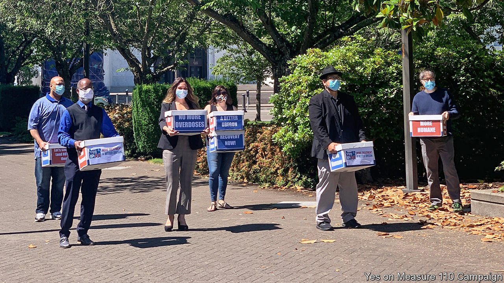

###### Trail blazers

# Oregon decriminalises drugs for personal use 

##### Portugal, the first country to do this, contains valuable lessons for America 

 

> Feb 13th 2021 


GETTING CAUGHT with a small amount of drugs in Oregon is now like getting a traffic ticket. At the beginning of this month, it became the first state to decriminalise possession of even hard drugs for personal use. Rather than face criminal charges, those in possession of small amounts of drugs (defined as having less than 1 gram of heroin or MDMA, 2 grams of methamphetamine or cocaine, 12 grams of psilocybin, 40 units of methadone or LSD, or 40 pills of oxycodone) will face a $100 fine or a health assessment that could lead to rehabilitation rather than jail time. Drug treatment will be funded by state tax revenue from legal marijuana sales, which reached $133m in 2020.


The Oregon Criminal Justice Commission expects the new law to decrease the load on the criminal-justice system. Going by 2019 estimates, they expect arrests for possession of controlled substances to drop from 6,700 to 615 in an average year, a 91% reduction. They also estimate that 1,800 fewer Oregonians will be convicted of felony possession, and 1,900 fewer of misdemeanour possession. “That impact is going to be huge,” says Bridget Budbill of the Office of Public Defence Services. “It’s an opportunity for overburdened public defence systems to see a modest reduction in cases...so that these public defenders can focus their attention on […] more serious matters.” This will have a particular impact on racial minorities, who get disproportionately arrested for possession and then caught-up in the criminal-justice system, says Ms Budbill.


A handful of American cities have already decriminalised drugs harder than marijuana. More states could follow Oregon. The cities focus on psychedelics, psychoactive substances such as psilocybin (also known as “magic mushrooms”) and LSD. Ann Arbor, Denver, Oakland, and Somerville, Massachusetts, have all decriminalised psychedelics. The District of Columbia also passed a referendum to do so in November, though the city’s mayor, Muriel Bowser, has publicly opposed it.


America is inching towards the example of Portugal, which in 2001 became the first country to decriminalise drug consumption for personal use (while continuing criminal prosecution for other drug offences, such as trafficking). The country saw a reduction in drug-induced deaths and reduced rates of HIV infection. But, says João Castel-Branco Goulão, Portugal’s National Co-ordinator for Drugs and Drug Addiction, decriminalisation must be paired with other policies or else it will fail. “Decriminalising without doing anything else does not lead to any improvement of the situation,” says Dr Goulão.


He warns policymakers that any plan to decriminalise drugs must consider four factors: accessible treatment, prevention, harm reduction and reintegration. In Portugal, first-time offenders go before a panel at the Ministry of Health and receive a warning. Subsequent violations within five years of the first offence incur either a fine or other administrative sanction, such as community service. Punishment is individualised. Someone struggling with drug dependency may receive therapy, while a recreational user battling with depression may receive mental-health care.


Nora Volkow, director of America’s National Institute of Drug Abuse at the National Institutes of Health, encourages decriminalisation alongside support policies and prevention programmes to protect children and adolescents from addiction. “We need to be very aware of…how the decriminalisation is going to affect accessibility,” she warns, “…because we know that the more accessible a drug is, the greater the likelihood someone will pick it up.”■

