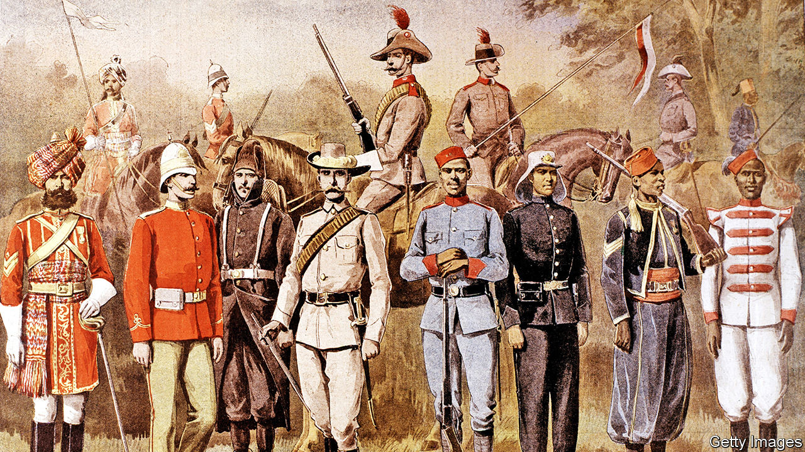

###### The sun never sets

# A nuanced account of the legacy of empire 

##### Sathnam Sanghera contemplates Britain’s imperial past—and haunted present 

 

> Feb 20th 2021 


Empireland. By Sathnam Sanghera. Viking; 320 pages; £18.99


AS BRITAIN’S GLOBAL role has shrunk, so the island’s politics have become increasingly insular. But occasionally wider concerns intrude—as in the Brexit saga, or during the protests that followed the death of George Floyd in Minneapolis last year. Both led to anguished debates about Britain’s place in the world, and over British identity more generally.


In these discussions, the British Empire has been fingered as the culprit for many of the country’s problems and neuroses, from racism to a sense of exceptionalism that fuelled Brexit. Statues have been toppled and punches thrown. If, in the past, much of the thinking about empire was blinkered and jingoistic, these days it is often lacerating. British imperialism is identified as the source not only of militarism and hooliganism, but of the irresponsibility of high finance and much besides. In contrast to such polemics, Sathnam Sanghera’s new book is nuanced, intelligent and even entertaining.


It is also refreshingly honest. The son of Punjabi immigrants, Mr Sanghera was born in the mid-1970s in Wolverhampton, an industrial town in the West Midlands and a focal point of anti-immigrant politics. He learned nothing about the British Empire at school, he writes. But as wrangles about Brexit and racism swirled around him, he resolved to read up. “Empireland” is the result.


As well as chronicling the familiar sins of empire, particularly in India, the author gives a fair hearing to those who emphasise the more positive aspects of imperial rule, railways, courts and all. And just as Britain has an imperial past, he recognises that it also has a liberal, anti-imperialist history—of abolishing the slave trade and spreading democracy, albeit in limited form. The empire is laid bare in all its contradictory complexity.


The same goes for its legacy. Mr Sanghera, a writer for the Times, justifiably criticises Britons for not being more receptive to immigrants, but he is no reflexive admirer of “pure multiculturalism”. He acknowledges that a laissez-faire approach to integration has sometimes allowed immigrant communities to “become isolated and myopic”. He argues that immigrants themselves are sometimes to blame for this—and that the people who suffer most are families like his own: “Too much of my energy as a young adult was expended on getting my family to accept that I wanted to be more British, to change more quickly than they were.”


As for knocking over more statues, he concludes that rather than trying to obliterate imperial history, which will always infuriate as many people as it pleases, Britain should commemorate more of the colonised people who challenged and reformed the empire, or indeed died for it on the battlefield. In short, more, not fewer, plinths and plaques. That would give a clearer and more textured picture of Britain’s imperial past—just like Mr Sanghera’s excellent book. ■

