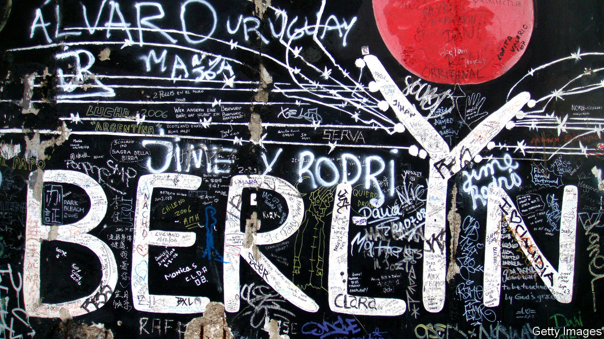

###### Unreal city

# Lost and found in Berlin 

##### The city is a backdrop to two tales of self-discovery 

 

> Feb 20th 2021 


Fake Accounts. By Lauren Oyler. Catapult; 272 pages; $26. Fourth Estate; £12.99


In the End, It Was All About Love. By Musa Okwonga. Rough Trade Books; 132 pages; £11.99


BERLIN OUGHT to collapse under the weight of its past. Its 20th century was scarred by revolution, tyranny, genocide and partition, each remembered in the solemn monuments and museums that dot the city today. But there has long been a second Berlin, this one a blank slate and haven for young Europeans, Americans, Antipodeans and other free spirits seeking cheap rent, like-minded souls and perhaps a second adolescence. This is a metropolis of edgy galleries, smoky bars, empty streets and casual liaisons; of perfunctory efforts to learn German, 30-somethings serving out internships, and soul-sapping battles with the paper-pushers of the Ausländerbehörde (immigration offices). 


This version of Berlin offers almost unlimited creative, recreational and sexual possibilities—albeit usually within a handful of gentrifying neighbourhoods in the city’s east—and is the backdrop for two new books by young Anglophone writers. Neither “Fake Accounts”, a debut novel by Lauren Oyler, an American critic who once lived in Berlin, nor “In the End, It Was All About Love” by Musa Okwonga, a British writer and musician who still does, is really about the German capital. Its tumultuous history barely features in either; nor, with the odd exception, do its contemporary politics. Instead, Berlin offers the protagonists the space they need to examine and discover themselves.


The nameless American narrator of “Fake Accounts”, the more ambitious of the two, finds herself in a bind. Snooping through her boyfriend’s phone, she learns he has been peddling outlandish conspiracy theories to a large following on Instagram. Before she can ditch him, though, he dies in a bicycle accident. Shocked but also frustrated, on a whim she indulges what friends dismiss as the “toolish popular fantasy” of leaving New York for Berlin, where “you could come and go from life as you pleased,” and not be “obligated to act a certain way, or at all”. 


Alienated and aimless, she takes on low-wage work to support what becomes her main recreational activity: inventing fake personalities to try out on unsuspecting dates arranged online, whom she meets in bars in Neukölln or Kreuzberg. Not a lot happens (until, in the final chapter, it does). Social media, especially Twitter, both relieve and intensify her sense of isolation. The narrative begins to flit between the virtual and the “real”, teasing out the ways one interacts with and shapes the other. Berlin leaves her in peace as she pursues her eccentric projects.


“Fake Accounts”resolves the problem of how to render the online world in fiction without falling prey to technobabble or unreadability. Indeed, it is in part a rebuttal of the claim that modern technology has made old-fashioned fiction obsolete—for while it grapples with the contemporary challenges of social media, it also dwells on the traditional concerns of motivation and character. In long, baggy paragraphs, the narrator scrutinises her behaviour and beliefs and invites others to join in, from a smart-alec chorus of ex-boyfriends to the reader, whose approval is sought but whose assumptions are questioned at every turn. 


This playful approach, reminiscent of Twitter’s endless loops of attention-seeking and hot takes, will not appeal to everyone. But Ms Oyler’s writing is sharply observed and often uproariously funny—and behind her very-online jokes and shaggy-dog stories lies a serious account of a modern search for meaning and authenticity, in a city that can seem to offer little of either. From the unadorned harshness of its public spaces to its arresting light—which can turn “everything an eerie slate…like it had always just rained, or you had just cried”—she captures her version of Berlin.


The narrator’s relationship with the city in Mr Okwonga’s carefully crafted novella runs deeper. He left London to be “as innocuous as a cobblestone” in Berlin, and is as successful as “a dark-skinned black man in an overwhelmingly white city” might dare to hope. The racism is persistent, but not disabling. Friendships are powerful, but cannot block out the loneliness. Online dating, this time earnest, turns out to be a “spectacular exercise in humility”. As for social media, the narrator’s therapist recommends that he cut down to reduce his anxiety levels.


Expats in Berlin will find much to recognise in this book, from the ecstasy of the summers to the “friendships which never quite take root”. That is, until the final chapter, when the narrator makes a pilgrimage to rural Uganda, the land of his dead father. This experience, steeped in family and history, seems to fulfil his search for identity as Berlin never could. ■

