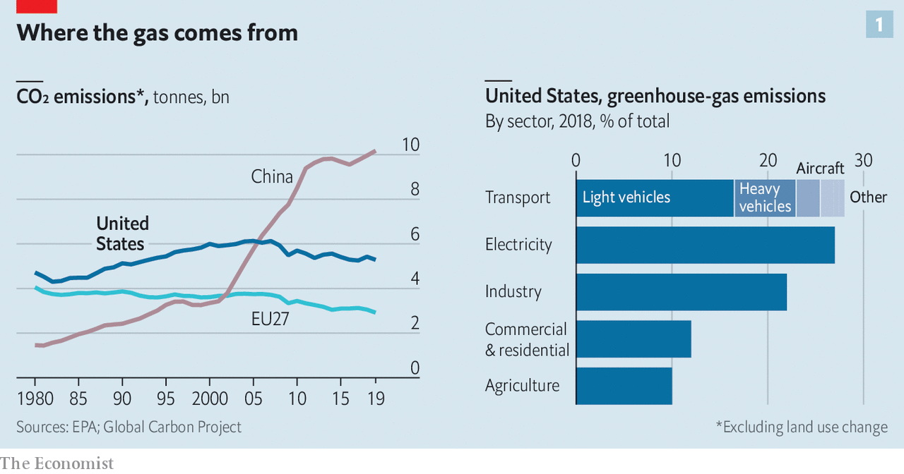
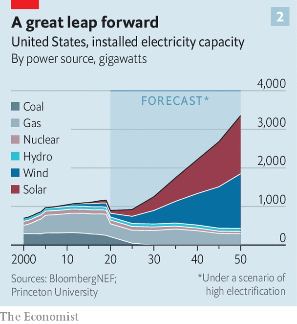
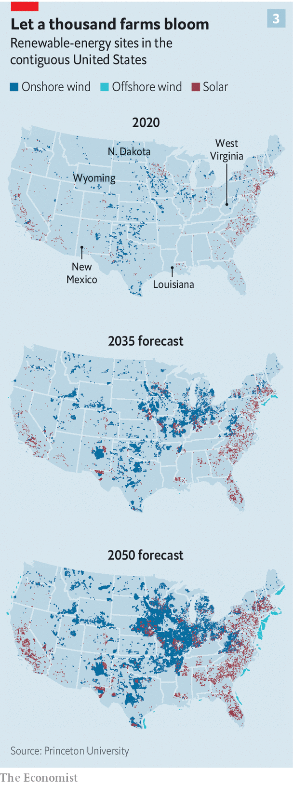
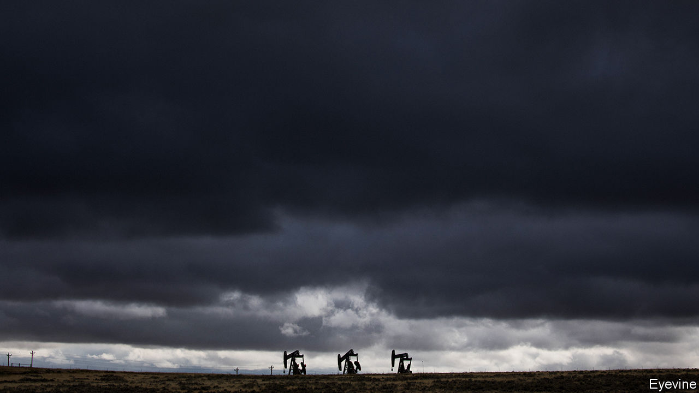

###### Decarbonising America

# Joe Biden’s climate-friendly energy revolution 

##### What it will take to fight rising temperatures 

 

> Feb 20th 2021 


AMID THE dust and sagebrush of New Mexico there are 61 rigs at work. The south-eastern part of the state, which sits over the shales of the Permian basin that spans the border with Texas, has over the past decade attracted shale-oil specialists, oil majors like ExxonMobil and innumerable camp followers fixing pumps, selling pipe and hauling the sand used to fracture the underground strata. About 40,000 people in the state now work in the sector; the taxes it generates pay for a third of the state’s budget; and it accounts for about 1% of America’s greenhouse-gas emissions.


President Joe Biden’s announcement in January of a temporary moratorium on new leases allowing drilling on federal land has not gone down well in this bit of the Permian; New Mexico accounts for more than half of such onshore oil production. The American Petroleum Institute (API), the industry’s main lobby, contends that the moratorium could cost the state 62,000 jobs. But for all the importance oil has in its economy, even New Mexico is preparing for a new energy era.


The Democratic governor, Michelle Lujan Grisham, wants her state’s emissions in 2030 to be at least 45% below their level in 2005, which given the recent oil boom means about 60% less than what they were in 2018. Across the state solar farms are being set up to harness the abundant sunshine and charging points provided for electric cars—just the sort of initiatives Mr Biden is seeking to accelerate as he aims to turn the American economy away from fossil fuels once and for all.


In January the president signed an executive order calling for the country to reduce its net greenhouse-gas emissions to zero by 2050, and to that end he wants the electricity sector to be emissions-free by 2035. Angelica Rubio, a New Mexico state representative who has relatives working on oil and gas projects in the Permian basin, acknowledges local resistance to Mr Biden’s decarbonisation goals. “It is drastic,” she says. “But this is the road map we need to take.” She is sponsoring a bill in the state legislature to ease the transition for oil workers.


Any encouragement from within the shale patch will be welcome to Mr Biden’s team, which needs all the help it can get. In Europe, as in China, politicians are using industrial policy, regulations, carbon prices and other tools to lessen the risks associated with climate change and secure their place in a global clean-energy economy; some have got a fair way already (see ). But despite having played a key role in the negotiations which produced the Paris agreement in 2015—an agreement that it is rejoining on February 19th—America has to date offered no comprehensive outline of the goals and strategies it will use to tackle greenhouse-gas emissions which, in 2019, were equivalent to 5.3bn tonnes of carbon dioxide (see chart 1). Those emissions declined in 2020 by a staggering 9%, according to estimates from BloombergNEF, a data provider. But as the economy recovers they will bounce back quickly.

 


The lack of an ambitious national programme is largely down to the fact that America’s Republican Party couples political power with a climate nihilism to an almost unparalleled extent. Donald Trump called climate change a hoax and withdrew from the Paris agreement; his administration put significant effort into trying to roll back the regulations with which his predecessor, Barack Obama, had tried to lower emissions. That they are subject to such reversals is one of the reasons that executive orders and regulatory stances are a poor substitute for thoroughgoing legislation. But Mr Obama had little choice. The vast majority of Republicans elected to federal office reject policies to cut emissions, which is why Congress has not seriously confronted the issue for more than a decade. The power of Republicans in the Senate made it pointless.


The problem is made worse by the fact that some conservative Democrats have their own reservations. Joe Manchin, a Democrat from West Virginia, says that he supports climate action. But he rejects the idea that coal, the dirtiest fossil fuel, might be permanently removed from the world’s energy portfolio: “Get into reality,” he says. “It’s not going to be eliminated.” The fact that the Senate is split 50-50 between the parties means that, even with Vice-President Kamala Harris’s casting vote, Mr Manchin in effect has a veto over legislation.


Should such obstacles lead to America punting for another decade, it will pay for the privilege. Delaying to 2030 would make the transition to a net-zero emissions economy almost twice as expensive as it would be if started today, with costs soaring to $750bn a year by 2035 and more than $900bn a year by the early 2040s, according to Energy Innovation, a policy group. But today’s urgency comes from greater concerns than fiscal prudence. America’s emissions are not only a problem for the climate in and of themselves. They are also a check on its opportunities to influence the rest of the world’s emissions, which copiously outweigh its own.


A decisive American effort to reduce emissions would be a potent signal of solidarity and a great enabler of change. It is unlikely that poor- and middle-income countries, eager to lift their citizens out of poverty, will try hard to curb their emissions if the world’s richest nation declines to limit its own, which are among the world’s largest per person. A vibrant American programme would also guarantee levels of innovation devoted to the fight for a stable climate that easily exceed today’s. America’s wealth, national laboratories, universities, corporate giants and entrepreneurs, if properly harnessed to the task of decarbonisation, will undoubtedly produce novel approaches and technologies that would benefit other nations.


And it would be a licence to persuade, shame and, where appropriate, bully. Mr Biden has charged John Kerry, who when secretary of state was an important player in the Paris negotiations, with leading efforts on climate change abroad (see ). If he cannot point to progress at home, Mr Kerry’s job will be an unprofitable and thankless one.

Running down a dream


But providing Mr Kerry with compelling backup is a tall order. In December researchers at Princeton University published a sweeping report to show how American emissions might by 2050 be reduced to “net zero”—a state where the amount of greenhouse gas still being dumped into the atmosphere is no greater than the amount deliberately being taken out of it and sequestered in some form. Though the study outlined various paths to that goal, all of them shared the basic foundation of an electricity sector rapidly both decarbonised and enlarged.


Over the past decade America’s electricity industry has become significantly less carbon-intensive despite meagre federal action. This has mainly been down to the replacement of coal by natural gas; coal, which provided 45% of the electricity generated in 2010, provided just 19% in 2020. But truly clean energy has been on the rise too. Though no new nuclear-power plants have been built and brought online, annual installations of wind and solar have rocketed as states have imposed mandates which require a certain amount of renewable or emissions-free generating capacity—mandates which, with the capital costs of renewables tumbling and interest rates low, have not been irksome to meet. In 2010, according to BloombergNEF, America had 42.6GW of wind and solar capacity. Last year it had 213.2GW, about five times as much, with 33.6GW added in 2020 alone.

 


But this progress is mere prologue to what must come in the 2020s. “The pace we are talking about is much faster than what has been done historically,” says Eric Larson, who led the Princeton study. In one scenario, wind and solar capacity would need to expand each year through 2025 by about 40GW before hitting 70-75 GW a year in 2026-30—more than double last year’s record rate (see chart 2). If those targets are met, the Princeton researchers reckon, by 2030 wind and solar farms could be providing about half of America’s electricity, up from 9% in 2019.


One of the reasons for dealing with electricity first is that it opens up possibilities in other sectors. A grid powered by abundant clean energy allows emissions from cars, light vans, trains and buildings to be slashed as they turn to electricity for more and more of their energy needs.

 


Turbines in America’s endless skyways and panels across her diamond deserts are no use if the power cannot get to the people. Lots of clean power means lots of new transmission lines, too—in one scenario, Princeton estimates that high-voltage transmission capacity would need to jump by 60% over the course of the coming decade. It adds up to a big bill. Mr Larson and his colleagues estimate that setting America on a path to net zero will require at least $2.5trn of additional capital investment over the present decade. And that spending requires careful planning, with enough spare power capacity to deal with extreme weather.


The blackouts which hit Texas in this week’s catastrophic cold snap are a case in point (see ). The problem was not primarily one of renewables failing in the freezing conditions, as some have suggested; many gas-fired plants failed, as did one nuclear reactor. But this does not mean that a grid dominated by renewables would necessarily have done better. Jesse Jenkins, one of the authors of the Princeton study, says the outages show both that America needs interconnections that can transmit large amounts of power over long distances and that “firm” generating capacity—be it in the form of thermal plants powered by biomass, natural-gas plants from which the carbon-dioxide emissions are sequestered, nuclear plants, hydrogen or even geothermal generation—needs to be really reliable.


By 2050 the expansion of transmission and renewables would be truly prodigious (see map). At that point onshore wind and solar farms would span some 600,000 square kilometres, an expanse slightly smaller than two New Mexicos but slightly larger than Minnesota, Wisconsin and Illinois combined. And even that is not, in itself, enough. Research must ramp up, too, to explore the best mix of ways to provide the firm capacity such a grid will need.

E pluribus unum


And even if all electricity were carbon-free and all the country’s cars, light-duty trucks, trains and buildings used nothing else, almost half of America’s emissions would still need to be tackled. Dealing with aircraft, shipping and farms is much harder. Many firms have committed themselves to reducing or eliminating emissions; but it will be harder to do so in heavy industries such as cement or steel. In those areas change requires either entirely new technology or technologies not yet deployed at a remotely appropriate scale.


This is not the level of change states alone could bring about, even if all of them were trying their hardest. States cannot on their own drive the car industry and its customers away from internal-combustion engines, or deal with the requirement for emissions-free steel, cement, shipping and aircraft. They cannot foot the bill for the $35bn a year on clean-energy research that Bill Gates, a philanthropist, calls for in a new book (see ). As revenues have plunged during the covid-19 pandemic, some states may struggle to supply even basic services; transforming whole swathes of industry is someone else’s job.


Enter Mr Biden. His executive order setting the 2050 goal signalled his intentions to push hard on climate; his moratorium on new leases and his revoking of the permit for the Keystone XL pipeline from Canada’s oil sands showed he was willing to upset people doing so.


There is a lot he can do simply through forceful leadership and better management of various obscure agencies. The Federal Energy Regulatory Commission, which oversees wholesale power markets, can do a great deal to ease the endlessly fractious construction of transmission lines and support states’ efforts to deploy clean electricity. New York’s plans to develop a whopping 9GW of wind power off the southern shores of Long Island were held up by Mr Trump’s Bureau of Ocean Energy Management. Mr Biden has hired Amanda Lefton, previously New York’s assistant energy secretary, to run the bureau, so that will probably change.


Mr Biden can also try and use his powers under the Clean Air Act to accelerate the shift toward low- and zero-emission cars. GM, a giant carmaker, in January announced that it would offer only electric cars by 2035; the prospect for ever stricter regulations on carbon-emitting cars may lead its peers to follow suit. The Securities and Exchange Commission may push companies to disclose climate risks, thus making things easier for the increasing number of investors and asset managers who care about such things. The federal government’s nearly $600bn in annual procurement can be used to create a huge market for new clean technologies.


There are limits, however, to pursuing green policy through the executive branch. Mr Biden risks litigation and review before a conservative Supreme Court that is more sceptical of environmental rules. And even executive orders that avoid legal action remain vulnerable, as first Mr Obama and then Mr Trump have found. These are all strong reasons for Mr Biden to give his programme the buttress of legislation. But in truth, the fact that Congress controls spending is probably enough; a fair amount of the money needed is going to have to come from the public purse.


The most likely vehicle for action is an infrastructure bill which may come later this year. Such a bill might include charging stations for electric cars, support for transmission and investment infrastructure resilient to rising seas. It could also include money not just for basic energy innovation, but for large demonstration projects. Either as part of that bill or separately, Mr Biden would like to create a national clean-electricity standard that could provide zero-emissions power by 2035, mimicking states’ preference for such targets over broader carbon-pricing approaches. Such a clean-electricity standard would force utilities to decarbonise more quickly.

The power to employ


Central to Mr Biden’s pitch for such a package is the idea that a green transition will create employment. “Climate change at its heart is not a planetary problem,” argues Gina McCarthy, his national climate adviser. “It’s a people problem.” Building new industries is always appealing to politicians who want voters to have good jobs; updating a great nation’s ageing infrastructure could serve the same end. “If we can show that we are growing jobs and that those jobs are good union jobs,” argues Ms McCarthy, “then we’re going to be able to convince the middle of this country.”


The size of any surge in American clean-energy manufacturing should not be overestimated. America is late to the game; industrial policy has already made China the world’s dominant producer of solar panels and batteries, and that is unlikely to change. “The United States needs to be clear-eyed about where it will be very hard for us to gain a competitive advantage at this point,” says Kelly Sims Gallagher a professor at Tufts University and a former adviser to Mr Obama.


However, she allows that still-nascent, complex technologies such as hydrogen fuel-cells or carbon capture might be possible areas for American differentiation. And the scale of the endeavour matters in itself. If America were to ramp up the deployment of wind and solar as the Princeton team suggests, America’s manufacturing jobs for wind would increase by five to tenfold to 2030 and for solar by about tenfold—even if the share of imported components remained the same. Workers would also set about installing wind farms, heat pumps and power lines, to name a few, as well as operating and maintaining them.


Jobs in mining and drilling would decline; those in construction would climb. Princeton estimates that energy’s share of employment in 2050 would stay level or rise in most states, with Louisiana, North Dakota and Wyoming notable exceptions. In New Mexico, it would climb from 6% to 10%. In West Virginia, it would inch up from 5% to 6%, as jobs lost in coal were replaced by those in clean power.

Silly games


But that may not be enough to placate Mr Manchin. He is a staunch supporter of his home state’s coal miners, who have a symbolic heft that outweighs their economic clout. “We need to innovate our way through this,” he asserts, rather than close down industries. He has backed bills to support energy innovation but has so far declined to throw his weight behind a clean-energy standard, noting that renewables are being built quickly already so may not need such support. “Out west, people quit basically raising cows and started raising windmills,” he quips.


With Mr Manchin crucial to any attempt to pass a bill purely on the basis of Democratic votes, this might seem to take sweeping legislation off the table. But Sheldon Whitehouse, a Democratic senator for Rhode Island and perhaps the chamber’s most reliable climate advocate, says he is newly hopeful that eight or so Senate Republicans may emerge from their self-imposed exile from the cause. Two-thirds of Americans believe that Washington is doing too little to fight climate change. In January America’s Chamber of Commerce—“probably our worst and most implacable adversary”, Mr Whitehouse says—voiced support for “durable climate policy” from Congress that supports investment and includes “well designed market mechanisms”. Larry Fink of BlackRock, the world’s biggest asset manager, is urging businesses to align their strategies with a carbon-neutral economy by 2050. A growing number of companies are tired of climate rules that ping pong from one presidency to the next. “We prefer legislation over regulation,” says Ben Fowke, the chief executive of Xcel Energy, a big utility. “It’s not as subject to change.”

 


Mr Whitehouse contends that the shift in corporate attitudes may give Republicans cover to support some kinds of climate policy, at least. The fossil-fuel lobby has not gone away. Mike Sommers, who leads API, says he and his colleagues speak with lawmakers daily to explain “what our energy needs are and what they are going to be.” That includes a robust future for both American oil and gas, he argues. But Mr Whitehouse says that “there is a very significant chance that the blockade that the fossil-fuel industry perpetrated over the last decade can actually be broken by the rest of corporate America.” Indeed in December Congress passed a bill that included an extension of clean-energy tax credits and $35bn in support for energy research over the next decade—hardly an investment on Mr Gates’s preferred scale, but at least a faint glimmer of bipartisanship.


In most 50-50 legislatures the prospect of even a few members of the other side coming over to your point of view would be enough. The Senate is different. Its filibuster rules require 60 votes in order to bring a motion to the floor, meaning that just 41 of the 50 Republicans can block almost any piece of legislation. In principle, the 50 Democratic senators could, with the help of the vice-president’s casting vote, end this filibuster rule. But Mr Manchin says it will be eliminated “over my dead body.”

The eye of the needle


That leaves Mr Biden with limited options. Bernie Sanders and Alexandria Ocasio-Cortez, Democratic lawmakers who are favourites among the party’s left, want to declare climate change a national emergency. That would allow Mr Biden to redirect military funds to boost clean energy; again, though, it would have to pass the Senate.


More likely, Democrats will use their 50 votes in the Senate in a process known as budget reconciliation that allows spending and tax measures to pass with a simple majority. Such a bill could approve investments and tax credits to deal with climate change. Some argue that a clean-energy standard might, if properly designed, squeak through too. Along with a White House that tightens emissions-standards for cars and streamlines permitting for new projects, that would count as progress. America would connect more clean power to better grids. Additional money could be funnelled towards research. More electric cars would take to the roads.


The question is whether Democrats are able to advance a bill that complies with Senate rules, satisfies both Mr Manchin and Mr Sanders, and is remotely commensurate with the problem at hand. “In the short run we can make a hell of a lot of progress through 2030,” argues Fred Krupp of the Environmental Defence Fund, a non-profit. But emissions neutrality, he says, would eventually require Congress to pass an economy-wide carbon price, too.


Were it not for its politics, America would be as well positioned to decarbonise as any country in the world, argues Stephen Pacala, who led a climate study recently published by America’s National Academies of Sciences, Engineering and Medicine. The country benefits from wide plains and long coasts for wind power, ample sunshine for solar farms across the South, rich forests to act as carbon sinks, expanses of land for producing new energy crops and well-understood reservoirs where emissions might be stored. It has magnificent human resources, too, and a history of rising to challenges, even if it sometimes needs a wake-up call to do so.


For now, Ms Rubio is trying to advance her bill to aid New Mexico’s transition from oil and gas. A port in south Brooklyn awaits transformation into a hub for wind companies. Congress is consumed by debates over covid-19 relief. And still the world’s emissions are set to rise. ■


 An earlier version of this piece said that America emitted 5.3bn tonnes of carbon dioxide in 2018, rather than 2019. Sorry.


For more coverage of climate change, register for The Climate Issue, our fortnightly , or visit our 

