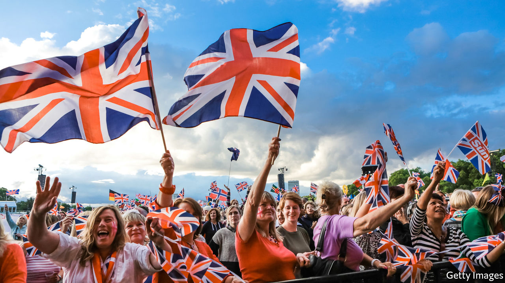

###### Bonfire of the insanities

# Tories bet on culture wars to unite disparate voters 

##### Traditional Tories and working-class converts agree on culture but little else 

 

> Feb 20th 2021 


LONG BEFORE he or any of his readers had ever heard the term, Boris Johnson cast himself as the antithesis of all that is woke. His columns in the Daily Telegraph, the house journal of the Tory Party, took aim at assaults on common sense, real or imagined. “If political correctness is not resisted, it will go on and on, becoming more and more irrational,” he wrote. Even then, he had an eye on the culture war raging across the Atlantic. He praised the counter-revolutionaries opposing a ban on British fox-hunting, noting that their protest march “was organised by an American who understands the weapons that must be used in the Kulturkampf”.


Mr Johnson has hardly changed his tune since becoming prime minister. He made clear his displeasure at the “absurd” form-filling initially required of volunteers helping with the rollout of the covid-19 vaccine and insisted last year that “Rule, Britannia!” be played at the Proms, an annual festival of music and pomp. This week, two more such sallies were enthusiastically trailed by his former employer as “a major government escalation of the ‘war on woke’”.


The first is an attempt by Gavin Williamson, the education secretary, to protect guest speakers at universities whose views cause offence. Mr Williamson plans to expand the scope of a legal duty to promote freedom of speech on campus to cover not just university authorities but also student unions, in the hope of preventing controversial talks being cancelled.


Such instances are rare—a study at King’s College London found freedom of expression had been infringed at only six of about 15,000 events over five years—but attract considerable publicity. And there is more evidence that students and academics censor their own views for fear of adverse reaction from peers. Polling for Policy Exchange, a right-leaning think-tank, found only four in ten Leave-supporting students would be comfortable expressing their views about Brexit in class.


The second concerns the past. Oliver Dowden, the culture secretary, has reportedly called a meeting to urge museum and charity bigwigs to “defend” Britain’s culture and history. The National Trust, a charity that tends historic houses and gardens, caused a fuss by highlighting the colonial ties of its properties and their original owners; other bodies are mulling the removal of statues of figures such as slave-traders who are now considered villains of the empire. Mr Dowden wants the statues to stay, arguing that confident countries do not “airbrush the history upon which they are founded”.


Such worries may seem rather small during a pandemic that has closed the museums Mr Dowden is fretting about and cancelled even the least controversial university events. Nor do most voters care about cultural issues as much as vocal lobbies on either side. In a poll for The Economist last year, more than twice as many Britons thought the empire a source of pride than one of shame. But just under half of those polled reckoned it was neither or had no opinion.


That will not prevent more skirmishes in the culture wars. Senior Tories argue that such fights help them unite two distinct types of Conservative voter: Telegraph-reading traditionalists in southern England and working-class voters in “red wall” seats in northern England and Wales who switched from Labour to the Tories in 2019. That is probably true. Paula Surridge of Bristol University has shown that Labour did particularly poorly among left-leaning voters with authoritarian views, a good proxy for cultural issues. Support for Labour among such voters dropped by 17% between 2017 and 2019, the biggest decline among any group of voters. Not all cultural issues resonate equally. Voters who did not go to university themselves are unlikely to be concerned about campus politics, says one of the new breed of Tory MP, who represents an ex-mining constituency. But they are receptive to appeals to defend British history. “There’s a huge sense of pride,” he says.


There are two problems with the strategy. Sir Keir Starmer, who replaced Jeremy Corbyn as Labour leader last spring, does not share his predecessor’s lack of enthusiasm for the national anthem and the queen. A greater danger for the Tories is that culture is just about the only topic on which their old and new voters agree. As the pandemic recedes, the government will have to make choices about the future role of the state and how to steady the nation’s finances, which cannot please both camps. How much easier, then, to put off such thorny decisions and play a little more Elgar. ■

