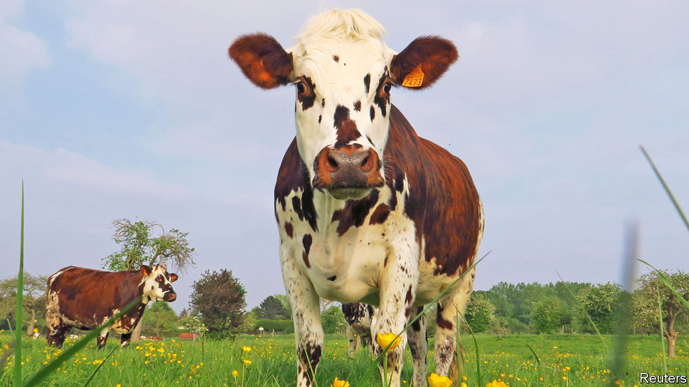

###### Culture wars

# Can Anglo-Saxon activist investors whip Danone into shape? 

##### Anglo-Saxon shareholders appear to have the backing of the yogurt-maker’s French patriarch 

 

> Feb 20th 2021 


EMMANUEL FABER used to be seen as the spiritual son of Franck Riboud, honorary chairman and former boss of Danone, whose father Antoine co-founded the French yogurt-maker. Mr Riboud handpicked Mr Faber as his successor and loyally backed his transformation of Danone into France’s first entreprise à mission, a corporate form with a defined social purpose.


In recent months the relationship has soured. According to the French press, Mr Riboud thinks Mr Faber is more interested in saving the planet than saving his firm. Danone’s share price fell by 27% in 2020 while those of rivals such as Nestlé and Unilever made gains amid pandemic larder-stocking. Its full-year results, due on February 19th, are unlikely to inspire investors’ confidence.


Danone has been hit harder by covid-19 than rivals because of its large bottled-water business. Its Evian, Badoit and Volvic brands make money mainly from sales in restaurants, bars and airports. But that is not the only problem. In 2017 Danone overpaid for WhiteWave, an American maker of health-focused fare that it bought for $12.5bn. The deal, which strained the balance-sheet but did not produce hoped-for returns, is the main reason for Danone’s current malaise, says Alan Erskine of Credit Suisse, a bank. Bruno Monteyne of Bernstein, a broker, points to years of underinvestment in brands, which face stiff competition from supermarkets’ private labels, at a time when Danone’s dairy and baby-food businesses slow as birth rates fall and people drink less milk.


Faced with these challenges, in October Mr Faber announced an overhaul of the business along more geographic lines. Perhaps 2,000 jobs will be cut. It was the fifth reorganisation on his seven-year watch.


Enough already, huffs Artisan Partners, an American investment fund which says it is Danone’s third-biggest shareholder with a 3% stake. In a meeting with board members on February 16th it demanded Mr Faber’s exit, a stop to his latest restructuring, and the sale of struggling brands such as Mizone, a Chinese vitamin drink, and the Vega range of plant-based foods.


Artisan is the latest Anglo-Saxon meddler to pile on the pressure. In November Bluebell Capital Partners, a London-based hedge fund that owns a stake in Danone, demanded that the firm boot out Mr Faber and split the role of chairman and CEO. Causeway Capital Management, an American fund, has echoed Bluebell’s call.


Mr Faber’s entourage refers to the demands, which appear to have the blessing of 65-year-old Mr Riboud, as a “revolution of gunslinger grandpas”. The activists may still succeed, and not just because they are not in fact that wizened. Helpfully, the French state is staying out of the fray; its spokesman said it had no comment. The government has no stake in Danone, but in 2005 declared it an “industrial jewel” to be defended against foreign buyers. Maybe not when they have an ally on the inside. ■

