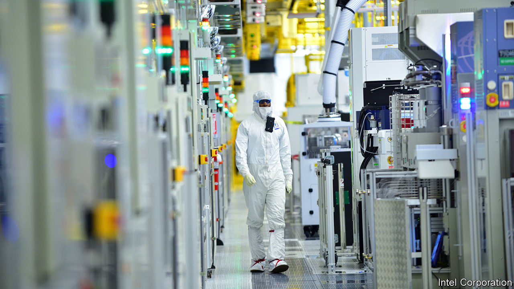
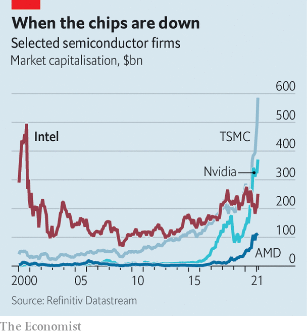

###### Hard reboot

# Can Pat Gelsinger turn Intel around? 

##### The giant chipmaker’s new boss has his work cut out 

 

> Feb 20th 2021 


“SUCCESS BREEDS complacency. Complacency breeds failure. Only the paranoid survive.” So said Andy Grove, the Hungarian emigré who helped turn Intel from a scrappy startup in the 1960s into the firm that did more than any other to put the “silicon” in Silicon Valley. They will be ringing in the ears of Pat Gelsinger, Intel’s new boss, who took over on February 15th. He takes the helm of a company that looks, from some angles, to be in rude health. With $78bn in revenue in 2020, it is the world’s biggest chipmaker by sales. It has a 93% share of the market for powerful—and lucrative—chips that go into data-centre computers, an 81% share in desktop PCs, and operating margins of around 30%.

 


Yet Intel’s share price has underperformed those of rivals. Nvidia, a firm with one-seventh of Intel’s revenues, has a market capitalisation, at $370bn, that is half as high again (see chart). The manufacturing technology on which much of Intel’s success was built has fallen behind. It has missed the smartphone revolution. Some of its big customers, such as Apple and Amazon, are turning into competitors. Mr Gelsinger inherits quite the in-tray, then.


Start with production. Chipmaking is propelled by the quest for smallness. Shrinking the components in integrated circuits, these days to tens of nanometres (billionths of a metre), improves the performance of both the components and the microchip as a whole. For decades Intel led the way, its “tick-tock” strategy promising a manufacturing revolution every other year. Now “it has lost its mojo,” says Alan Priestley of Gartner, a research firm, who worked at Intel for many years. Its “ten nanometre” chips were originally pencilled in for 2015 or 2016 but did not start trickling out until 2019—an unprecedented delay. The technology is still not mature. In July Intel said the next generation of “seven nanometre” chips would not arrive until 2022, a delay of at least six months.


Manufacturing stumbles have cost it business. AMD, its most direct rival, outsources production to Taiwan Semiconductor Manufacturing Company (TSMC), whose technology is now ahead of Intel's. That means AMD's chips are generally faster, and consume less power; its market share has more than doubled since 2019.


A second challenge is the industry’s growing specialisation—a problem for Intel’s traditional forte of general-purpose chips, especially if desktop PCs continue to stagnate. Technology giants, flush with cash and keen to extract every drop of performance for their specific purposes, increasingly design their own semiconductors. In 2020 Apple said it would drop Intel from its laptops and desktops in favour of custom-designed chips. Amazon is rolling out its “Graviton” cloud-computing processors, also designed in-house and made by TSMC. Microsoft, whose cloud business is second only to Amazon’s, is rumoured to be working on something similar.


Intel has also failed to make any headway in smartphones, the most popular computers ever made. An effort in the late 1990s to build graphics chips, which have also proved handy for artificial intelligence (AI), and to which Nvidia owes its enviable valuation, petered out. Attempts to diversify into clever new sorts of programmable or memory chips—in 2015 it paid $16.7bn for Altera, which makes them—have so far not paid off in a big way.


Mr Gelsinger has yet to say how he plans to deal with the challenges. He does not look like a revolutionary. He began working at Intel aged 18, before leaving in 2009 to preside over EMC, a data-storage firm, and for the past nine years heading VMware, a software firm. In an email to Intel’s staff after his appointment was announced he invoked its glory days, recalling being “mentored at the feet of Grove, [Robert] Noyce and [Gordon] Moore”, the last two being the firm’s founders. Like them but unlike his predecessor, Bob Swan, Mr Gelsinger is an engineer, who in 1989 led the design of a flagship chip.


His first job will be to try to turn the firm’s ailing manufacturing division around. Intel already outsources the manufacturing of some lower-end chips to TSMC. Its production woes will force it, at least temporarily, to send more business to Taiwan, perhaps including some of its pricier desktop and graphics chips. Daniel Loeb, an activist investor with a sizeable stake in Intel, sent a letter to the firm’s management in December urging it to abandon factories entirely and restrict itself to designing chips that other firms, such as TSMC, would make. On paper, that looks attractive: Intel capital expenditure in 2020 amounted to $14.2bn, almost all of it on its chip factories. AMD, meanwhile, spun out its manufacturing business in 2009, and is thriving today. Nvidia has been “fabless” since its founding in 1993.


Finding a buyer could be tricky, says Linley Gwennap, a veteran chip-industry watcher, precisely because Intel’s factories are now behind the cutting edge. Most of the world’s chipmakers, which might be tempted by the fabs, are in Asia. Since chips are a front in America’s tech war with China, politicians may veto a sale to a non-American bidder.


In any case, Mr Gelsinger has said he will ignore Mr Loeb’s suggestion. In January the new boss said that, although the firm may use more outsourcing for some products, he intends to pursue the hard, costly task of restoring Intel to its customary position at chipmaking’s leading edge. He also seems minded to pursue his predecessor’s strategy of diversifying into new products, including graphics-to-AI chips. “Our opportunity as a world-leading semiconductor manufacturer is greater than it’s ever been,” he wrote. The direction of travel, then, is not about to change. Intel’s shareholders will have to hope that Mr Gelsinger can at least get it back on the pace.■

